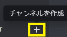
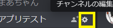
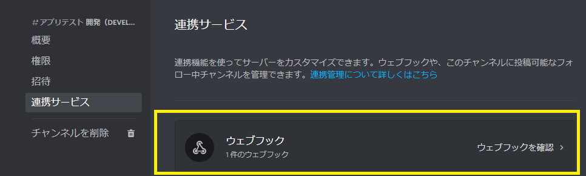
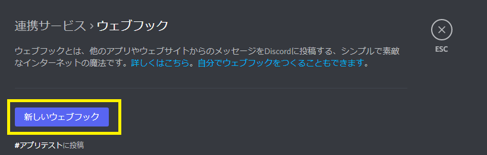
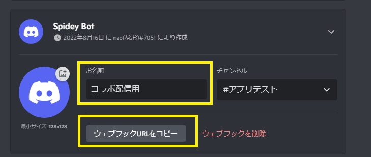
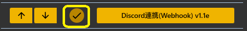
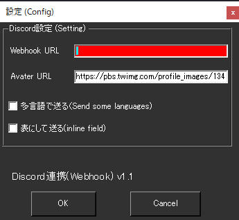
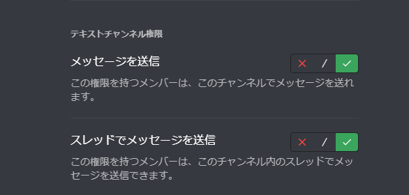
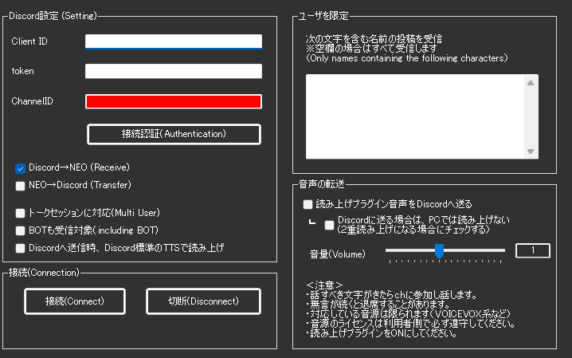
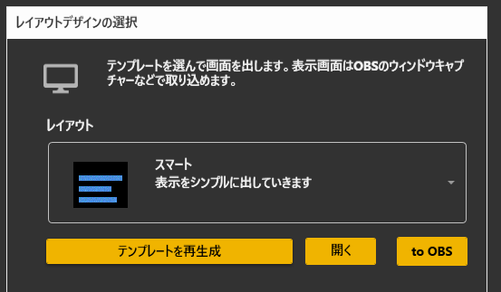

## 攻略チートシートについて

* このチートシートはテーマを絞ってガイドする「攻略本」的なものです。

## Discordをつかったコラボ配信の設定
!!! Info "前提条件"
    * 自分が管理権限をもつDiscordルームを持っている
    * 自分やコラボ相手がDiscordのアカウントを持っている
    * 自分もコラボ相手もゆかコネNEOのセットアップが終わっていること

## シナリオ
!!! Info "配信のシチュエーション"
    * 自分が配信主
    * コラボ相手を配信に招く

### 1.【配信主】やり取りをするDiscordのチャネルを作る

### 2.【配信主】チャネル設定から、WebHookの画面に移動

### 3.【配信主】WebHookのURLを新規取得する

!!! Tips
    * 名前は利用者がわかるような名前をつけましょう
    * コラボ相手が複数いる場合は、複数個のURLを発行します。（１人１つ）

### 4.【配信主】WebHookのURLをコラボ相手に教える

!!! Tips 
    * 書き込める権限を付与するものなので、取扱いに注意しましょう

### 5.【コラボ相手】ゆかコネにWebHookのURLを設定する

!!! Info
    * 相手にもらったアドレスは開くものではなく、アプリに設定するものです。開いても何も動作しません。

* チェックをONにして、設定画面を開きます。

* 手順４でもらったURLを「WebHook URL」に入れます。
* Avater URLは空欄で構いません。
* Avater URLに設定するとDiscord書き込み時本人アバターのところに絵が表示されます。

### 6.【コラボ相手】ゆかコネで音声認識させる

* この状態で、WebHookを生成したチャンネルに文字が転送されていれば、コラボ相手の設定は完了です。

!!! Notice "以下は、配信主が字幕を受け取る設定です"
    * 以下の設定は、配信主が通常、１度できれば問題ないかとおもいます。
    * 何度も行う作業ではないので、時間があるときに落ち着いて実施してください。

### 7.BOTの登録をする

* [Discordアプリケーションの登録画面](https://discord.com/developers/applications) から、BOTの登録をします。

New Application を押して、登録しましょう。

* 名前は自由にわかるようなものをつけてください。

### 8.接続設定をする

* 値を入手したら、プラグインに設定します。

* ChannelIDは、Discordの画面から取得します。

!!! Warning "この設定をしないとテキストが受信できません"
    BOTがメッセージを受信できるように、読み取り権限を設定する必要があります。この項目をONにしておいてください。
    

### 9.Discord接続認証を行う

* このボタンを押して認証ができると、通信ができるようになります。

### 10.DiscordチャンネルにBOTの読み書き権限を付与

* Discordチャンネルに読み書き権限を付与します。

!!! Info "権限の付与について"
    * 与える権限は最低限にしましょう

### 11.ゆかコネ―Discord間のやり取りルールを決める

!!! Warning
    * このルールを適当に決めると、字幕がループすることがあります。
    * いきなり本番ではなく、テストしながら感覚を身に着けてください。

|役割|意味|使いどころ|
|:---|:--|:--------|
|Receive|Discordに書かれたメッセージを字幕として取り込む|配信相手の会話を取り込む時に使います|
|Transfer|ゆかコネが受け取った字幕をDiscordに転送します|自分の発話もDiscordに乗せるときに使います|
|トークセッションに対応|複数人の発話で字幕を出すモードで動かします|コラボ配信時はON必須|
|BOTも対象|BOTユーザーの字幕を受信するかどうか|相手がBOT機能で字幕を出しているときはON|

!!! Tips "自分だけが配信主の場合"
    * ReceiveとトークセッションをONに、それ以外をOFFに。

!!! Tips "自分以外も配信で字幕をつかう場合"
    * BOTも対象以外をONに（相手もBOTを使っている場合はすべてON）。

### 12.字幕を表示

* トークセッションで字幕を表示します。

* これで設定が完了しました。
