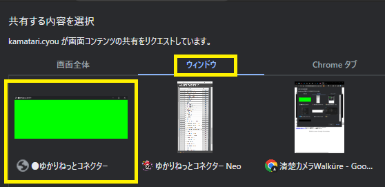
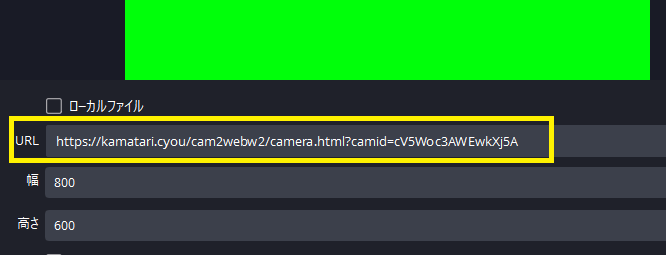
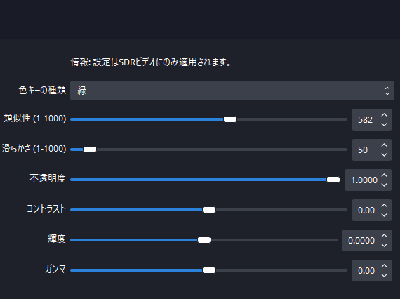

## 攻略チートシートについて

* このチートシートはテーマを絞ってガイドする「攻略本」的なものです。

## コラボ配信

!!! Info "前提条件"
    *とにかく手軽にやりたい
    *音声認識ができるところまで導入ができている

!!! Tips "少人数向きです"
    *１対１でやる場合にはとても簡単な方法です
    *この方法は共有画面が増えるほど負荷がかかるため、多人数にはあまり向いていません。

!!! Note "謝辞"
    *共有には[清楚カメラWalküre（ワルキューレ）](https://kamatari.cyou/cam2webw2/index.html)を使います
    *[漆原 鎌足](https://twitter.com/kamatari_san/status/1311958877223571461?ref_src=twsrc%5Etfw%7Ctwcamp%5Etweetembed%7Ctwterm%5E1377222378690805760%7Ctwgr%5E3521798a6a44e1507e8c56b71b1e854adee36e57%7Ctwcon%5Es3_&ref_url=https%3A%2F%2Fkamatari.cyou%2F)さん開発のサービスです。

## 1.まずは音声認識画面を出します

* 配信者、コラボ相手共に画面を用意します。

## 2. 【相手】字幕画面を取り込みます

* コラボ相手の画面を取り込みます。
* 取り込みには、[清楚カメラWalküre（ワルキューレ）](https://kamatari.cyou/cam2webw2/index.html)を使います。

## 3. 【相手】接続先を教えます

* ``URL生成`` を押すと、URLが生成されるので、このアドレスを教えます。

!!! Warning "URLについて"
    *このURLは、清楚カメラWalküre（ワルキューレ）を閉じるまで有効です
    *URLがわかると画面が受信できるので、必要な方のみに教えてください

## 4. OBSなどのブラウザ機能で取り込む

* ブラウザで指定のURLを取り込みます。

## 5. フィルタ＞カラーキーで緑背景を透過します

* 背景の色を切りぬきます。
* 類似性を右にすると色が抜けますが、やりすぎると文字が欠けます。

## 6. そのまま配信に使いましょう

* これで設定は完了です。
