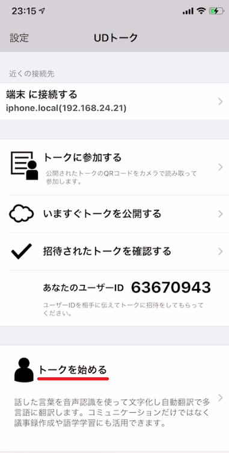
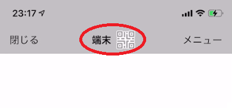
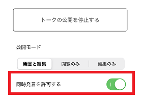
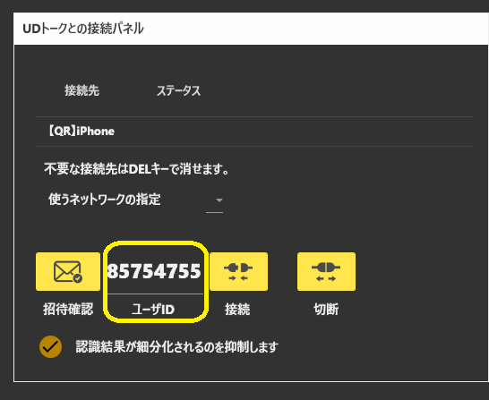
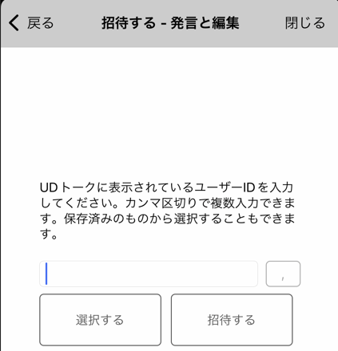
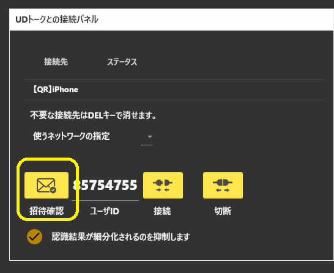
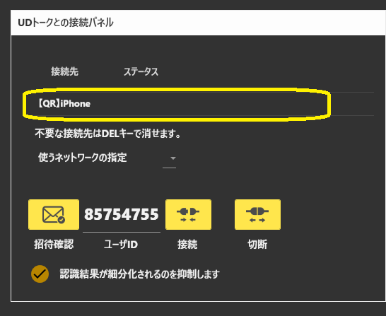

## 攻略チートシートについて

* このチートシートはテーマを絞ってガイドする「攻略本」的なものです。

## UDトークをつかったコラボ配信の設定
!!! Info "前提条件"
    * 自分が配信主である
    * 自分はゆかコネNEOのセットアップが終わっている
    * 自分も相手も、UDトークのセットアップが終わっている

!!! Notice "説明の前提条件"
    * この設定は iPhone版をベースで進めます。
    * Androidの場合は、設定手順が異なったり、一部使えない機能があります。

### 1.UDトークのトークルームを作る

* トークを始めるを押して、トークルームを作ります。

 
### 2.接続設定画面に入る

* QRのマークをおして、みんなと接続できるよう準備をします。

### 3.同時発言を許可する

!!! Notice "この設定は大事"
    * この設定をOFFにすると、複数人でしゃべることができなくなります。
    * 自動的にマイクがOFFになる現象があったら、ここを見直してください。

### 4.公開する

* 手順３の画面でトークを公開するボタンを押します。

### 5.【参加者】ユーザIDをトークルーム作成者に教える

* 番号はここにのっています。 

!!! Tips "配信主の参加について"
    配信主のゆかコネNEOも招待して参加させる必要があります。

### 6.【全員】ユーザIDを使って招待する

* 教えてもらった番号を使って招待をします

### 7.【全員】招待を確認

* 招待されたことを確認します。

!!! Notice "招待の確認について"
    * 招待の確認には時間制限があります。
    * 招待されたら、早めに招待確認を押してください。
    * 招待確認がおわって接続先が表示されたら、再招待しなくてもトークルームが閉じるまで接続可能です。

### 8.【全員】トークに接続

* 招待されたトークに接続します。

!!! Notice "トークルームについて"
    * 接続先を選んで、接続を押します。
    * 不要になった接続先は、DELキーで消すことができます。

### 9.【全員】UDトークで音声認識を実行

* 画面下の赤丸（場合によっては青もしくは緑）のボタンをおして音声認識をさせます。

### 10. 字幕を表示

* トークセッションで字幕を表示します。
* うまく受信できていれば、字幕が表示されます。

* これで設定が完了しました。

!!! Tips 顔の表示について
    * トークセッションでは、顔枠に話者の顔を表示できます。
    * ゆかコネNEOオプションの「話し手のイメージデータ」のフォルダに 話者と同じ名前の画像ファイル(PNG)を入れてください。詳細は、[オプション設定](../startup/startup_option.md#話し手のイメージデータ)を確認してください。