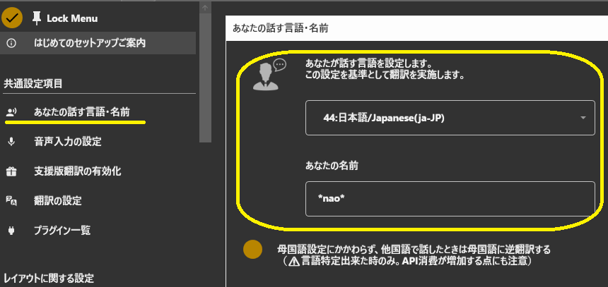
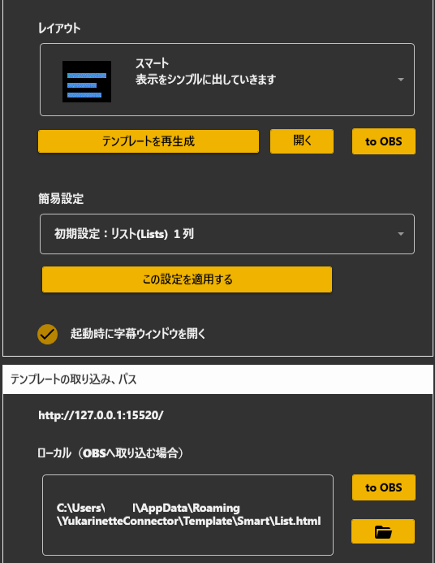
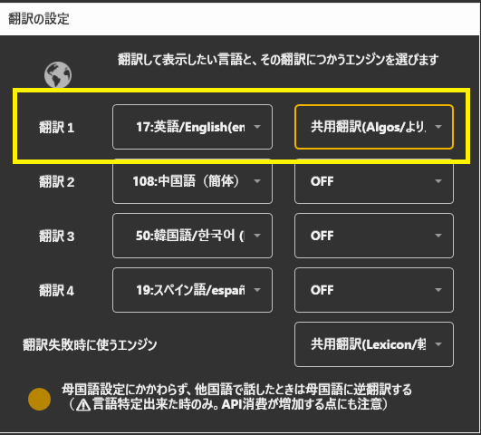
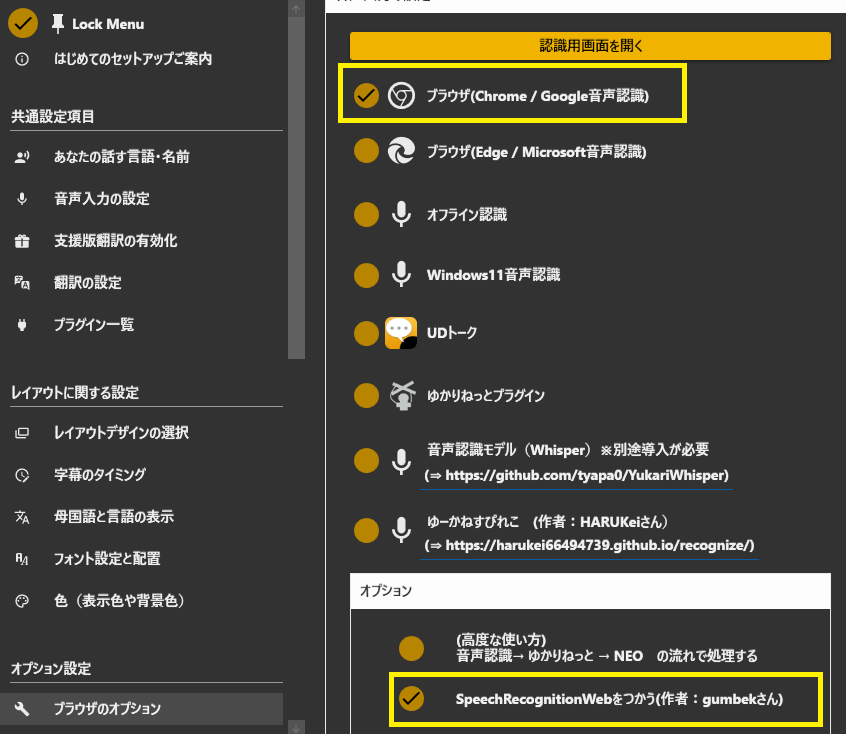
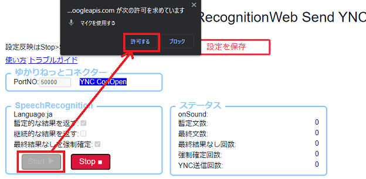

## 攻略チートシートについて

* このチートシートはテーマを絞ってガイドする「攻略本」的なものです。

## 最速で英語翻訳をする

!!! Info "前提条件"
    * 話者は日本語
    * 英語に翻訳して表示

このチートシートでは、翻訳が画面に表示されるまでがトライできるように解説しています。

## 1.母国語の設定

* あなたが話す「お使いの言語」を設定します。 写真の例では 日本語　になっています。

## 2.字幕を出すレイアウトを決めます

* 黄色の枠はどの選択でも字幕は出せるので問題ありません。ちなみに、一般的によく使われる設定は「多言語」です。
* 設定が終わったら、(A)のボタンをおすと、ブラウザが開きます。
* 配信ソフトに取り込みたい方は、(B)のところでマウスをクリックしながら移動し、OBSの配信画面上でマウスを離してください。(ドラック＆ドロップ)

## 3.言語を決める

下記のように設定します。

|設定項目    |設定値                 |
|:----------|:----------------------|
| 第1翻訳設定|17:英語                |
|翻訳エンジン|共用翻訳エンジン    |

## 4.音声認識を設定する

今回は簡単設定なので、ブラウザの音声認識を使います。

## 5.音声認識を起動する

このボタンをおして音声認識を起動します。

音声認識画面がでたら、スタートボタンをおします。マイクの許可を求める画面がでたら「許可する」をおして、音声認識できるようにします。

!!! Info "音声認識がうまくいかない場合"
    話したときに、onSoundという行に「＠」が表示されない場合は、音声がうまく入っていないので、マイクの設定を見直してください。

これで字幕が表示されました。後はこの画面を配信ソフトでウィンドウキャプチャーすれば取り込めます。お疲れさまでした。
