## 攻略チートシートについて

* このチートシートはテーマを絞ってガイドする「攻略本」的なものです。

## 配信ソフトに字幕を取り込む

このチートシートでは、配信ソフトに字幕を取り込む手順について解説しています。主にレイアウトを取り込む場合の設定です。

### 1. OBS Studio の場合

#### 1.1 使うテンプレートを選ぶ

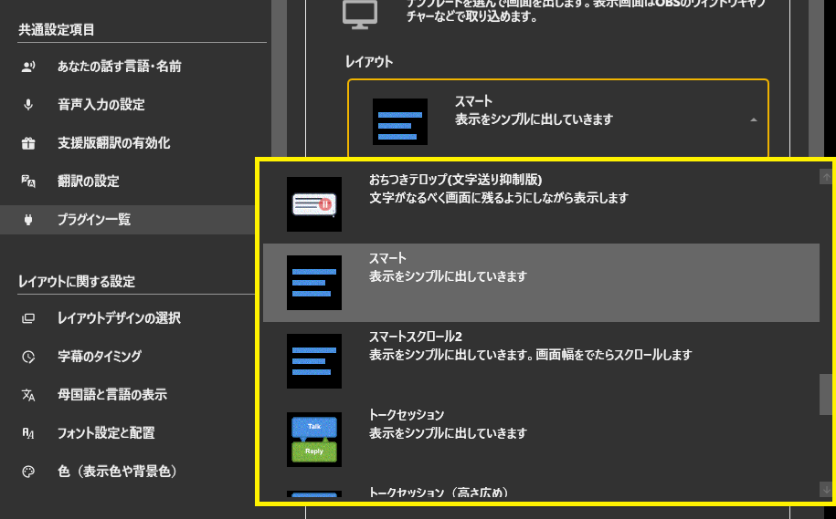

#### 1.2 テンプレートをOBSにドラッグ

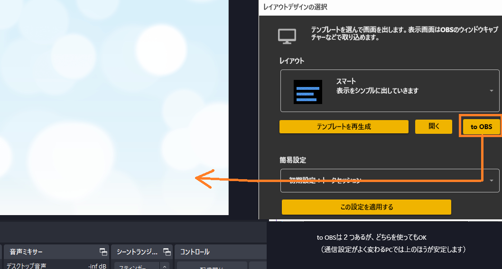

#### 1.3 追加を許可します

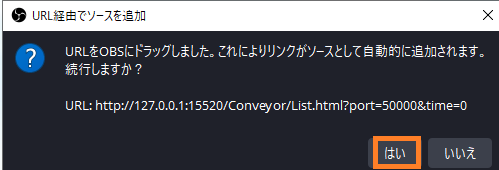

#### 1.4 一度字幕をだしてみましょう

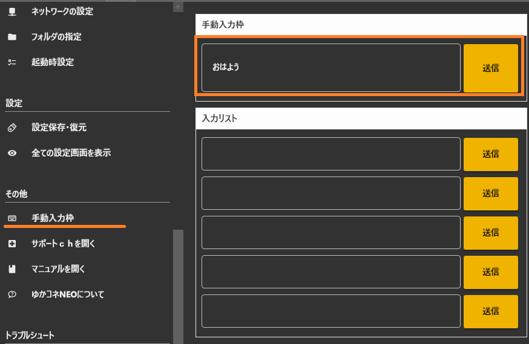

#### 1.5 画面いっぱいに出るはずです

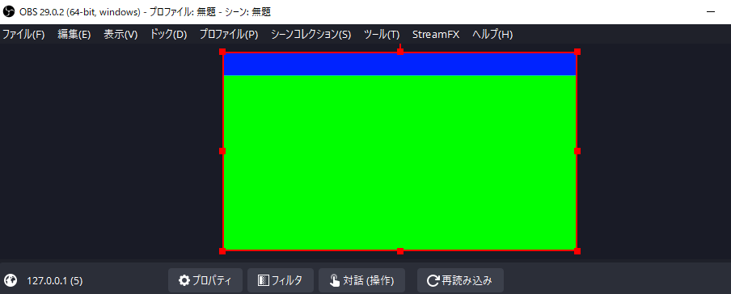

#### 1.6 凡そのサイズを決めます

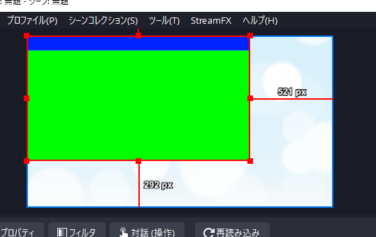

#### 1.7 プロパティを開きます

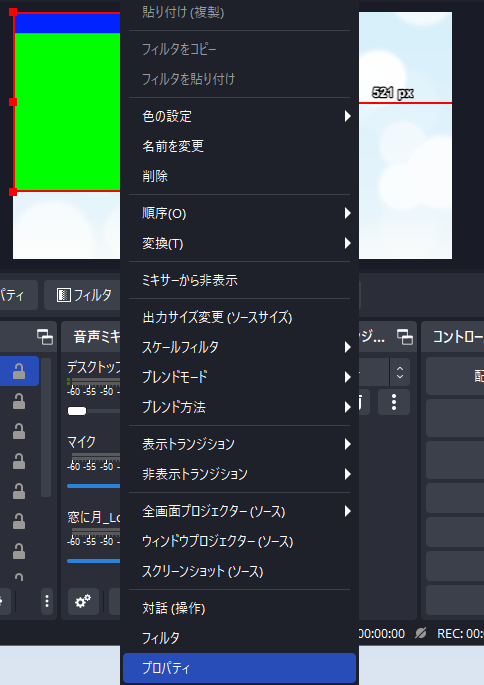

#### 1.8 サイズを変更します

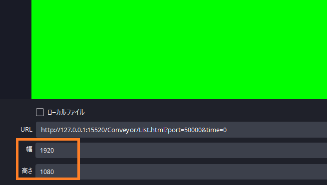

#### 1.9 フィルタを開きます

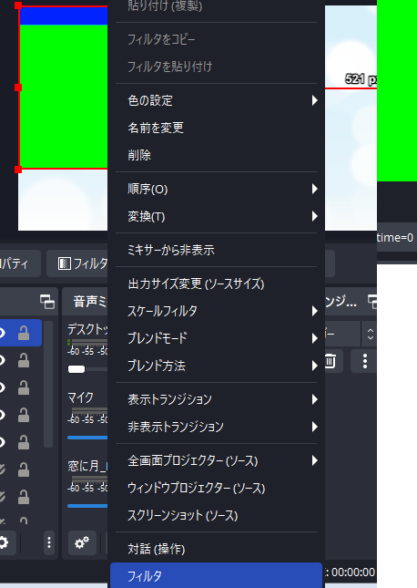

#### 1.10 カラーキーを追加します

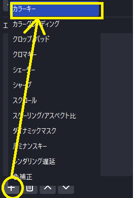

#### 1.11 名前はお好きにきめてください

#### 1.12 綺麗に背景が消えるぐらいに調整し、終了です

お疲れさまでした。

### 2. Streamlabs Desktop の場合

#### 2.1 使うテンプレートを選ぶ

#### 2.2 ソースの追加を押します

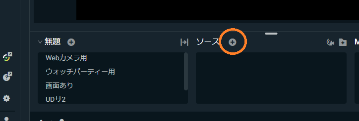

#### 2.3 ブラウザソースを追加します

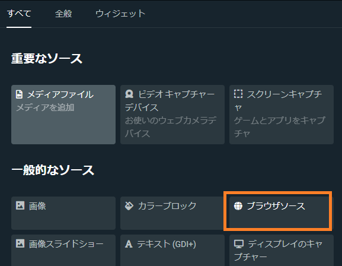

#### 2.4 名前は自分のわかりやすいものに

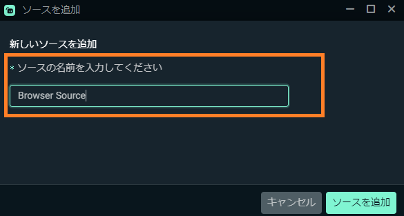

#### 2.5 表示用のアドレスをコピー&ペーストします

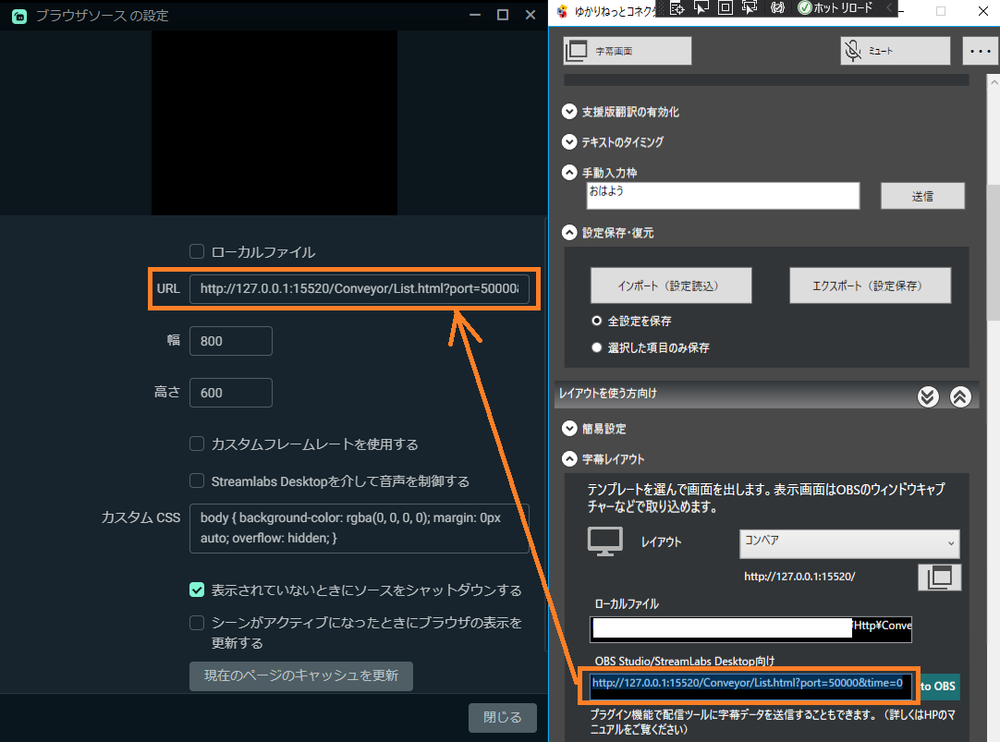

#### 2.6 サイズを変更します

* 後から変更できます。分からなければ手順を飛ばしてOKです。

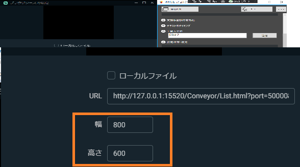

#### 2.7 一度字幕をだしてみましょう

#### 2.8 画面に出るはずです

#### 2.9 フィルタ画面を出します

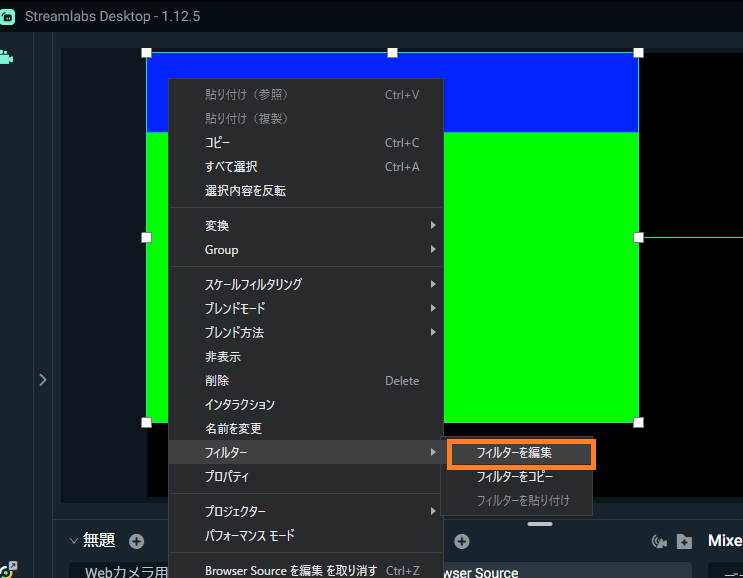

#### 2.10 フィルタを追加します

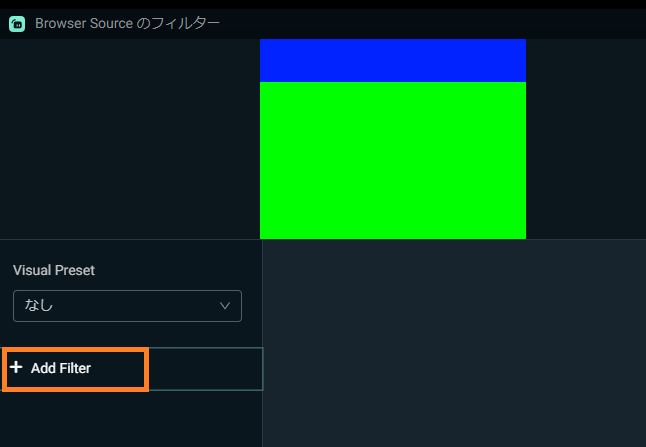

#### 2.11 カラーキーを追加します

* 名前は自分が分かりやすいものでOKです

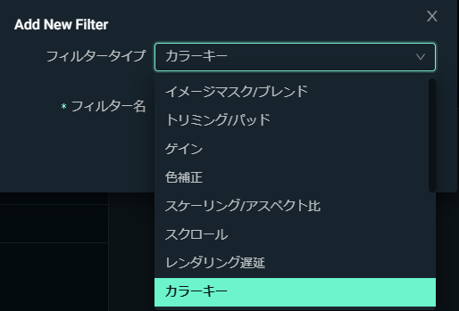

#### 2.12 綺麗に背景が消えるぐらいに調整し、終了です

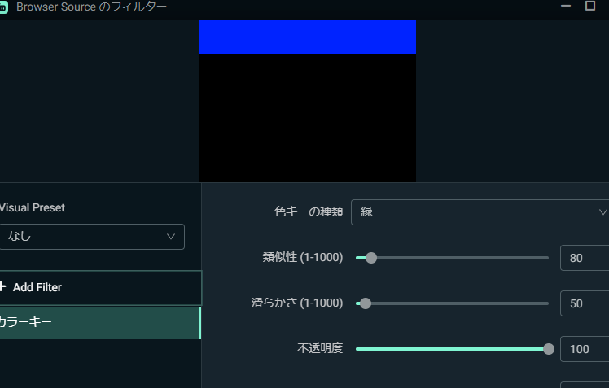

お疲れさまでした。
