## 攻略チートシートについて

* このチートシートはテーマを絞ってガイドする「攻略本」的なものです。

!!! Info "前提条件"
    * [わんコメ](https://onecomme.com/) v3.2以上を使用していること

!!! Info "謝辞"
    * わんコメ作者[アスティさん](https://twitter.com/AstieDog)に様々なご協力をいただいております

## わんコメと連携してつかう

!!! Warning "うまく動かないときのレポートについて"
    * 本件について、ゆかコネNEOの[Discord](http://discord.gg/h4r5HnR)か、[わんコメフォーラム](https://forum.onecomme.com/)で承ります。

### Case.1 コメントを翻訳

!!! Info "このケースを選ぶのは、こういうとき"
    * わんコメが受信したコメントを翻訳したい

#### 1.プラグインの有効化

* プラグインを使うチェックをONにしてください。

#### 2.わんコメを起動し連動画面をだす

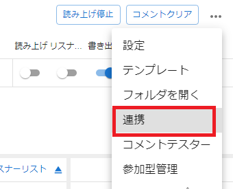

#### 3.連携をONにする

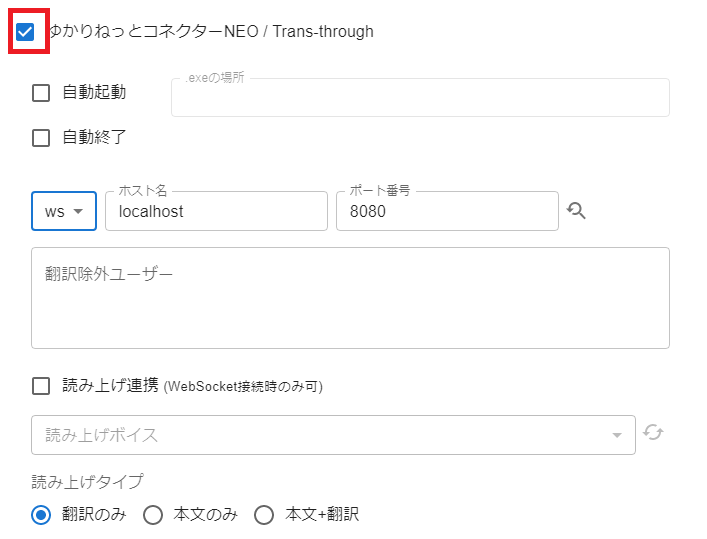

#### 4.通信をWebSocket（WS）に

!!! Tip "読み上げはHTTP/WSのみ"
    *ゆかコネNEOはHttpsに対応していません。
    *WSのほうが応答スピードが速くなります

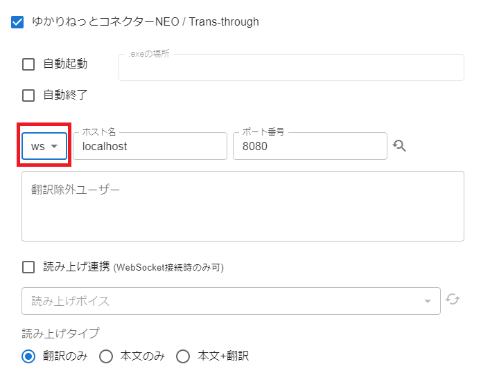

#### 5.再読み込みをおしてポートNoを取得

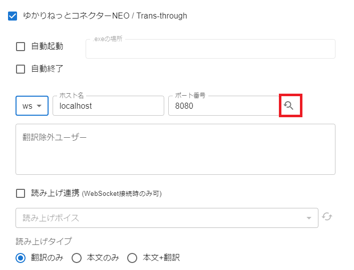

!!! Tip "ポート番号が取得できないとき"
    * ゆかコネNEOの翻訳/発話プラグイン→設定で表示される番号を入れます
    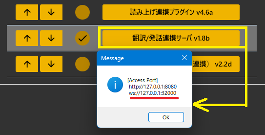

#### 6.動作テストをします

* テストボタンを押します
* うえに緑色の枠で「おはようございます => Good morning」が出れば成功です
* 確認ができたら「保存」「X」で閉じます。

!!! Tip "翻訳がうまく動作しないとき"
    *ゆかコネNEOの翻訳/発話プラグイン→設定で表示される番号を入れます
    *第１翻訳言語のエンジンが使用できるものになっていることを確認します
    *第１翻訳言語の翻訳先名が使えるものであることを確認します。

!!! Warning "翻訳先言語について"
    * 言語Noが 200番台の言語は、方言を含みます。翻訳エンジンによっては方言に対応していません。

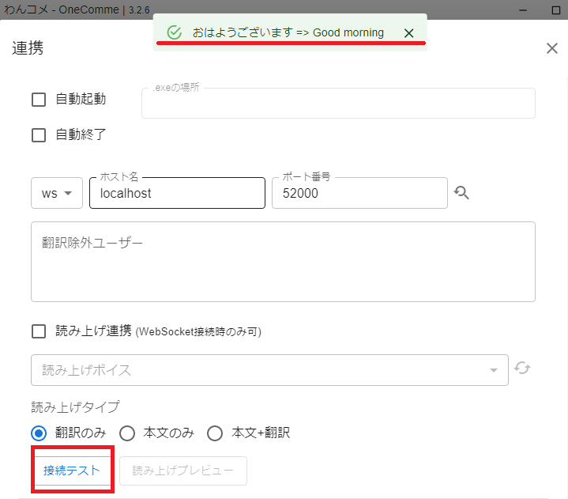

#### 7.翻訳を有効にします

* 翻訳を有効にします。

!!! Tip "話者事にも設定できます"
    *個別にも設定が可能です
    *翻訳が必要な方のみに設定すると翻訳総数を減らすことができます

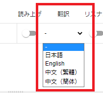

### Case.2 コメントの読み上げ

!!! Info "このケースを選ぶのは、こういうとき"
    * わんコメが受信したコメントを翻訳したい

#### 1.プラグインの有効化

* プラグインを使うチェックをONにしてください
* 読み上げプラグインと翻訳プラグインが必要です

#### 2.わんコメを起動し連動画面をだす

#### 3.連携をONにする

#### 4.通信をWebSocket（WS）に

!!! Tip "読み上げはWSのみ"
    * HTTP/HTTPSを選んでいるときは機能しません。

#### 5.再読み込みをおしてポートNoを取得

!!! Tip "ポート番号が取得できないとき"
    * ゆかコネNEOの翻訳/発話プラグイン→設定で表示される番号を入れます
    

#### 6.読み上げをONにします

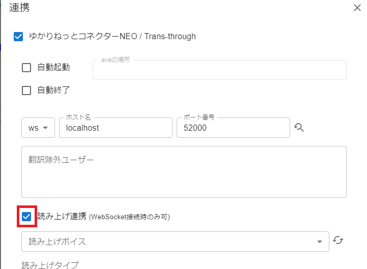

#### 7.話者リストを更新します

!!! Tip "取得がうまく動作しないとき"
    *ゆかコネNEOの翻訳/発話プラグイン→設定で表示される番号を入れます
        
    *読み上げプラグインがOnになっていることを確認します

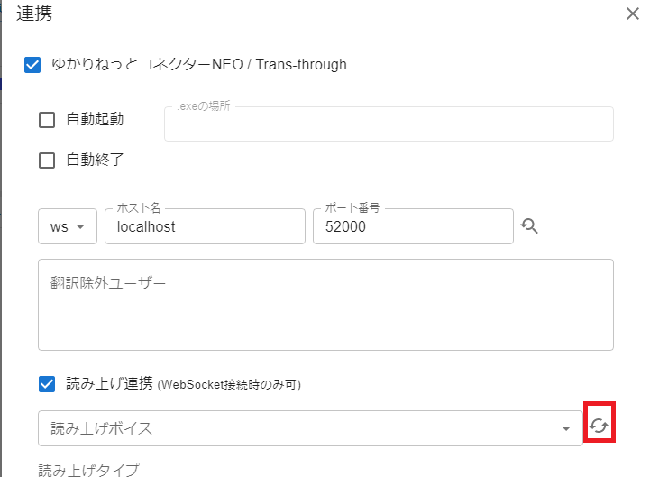

#### 8.話者を選びます

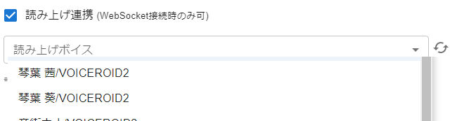

#### 9.発話テストをします

* 確認ができたら「保存」「X」で閉じます。

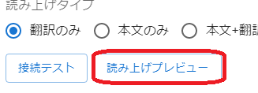

!!! Tip "そのほかの設定について"
    *読み上げに関係するいくつかの設定は、プラグイン側の設定を反映します。
    *わんコメ連動時の読み上げに関しても、辞書や正規表現などを反映します
