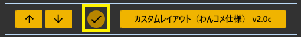
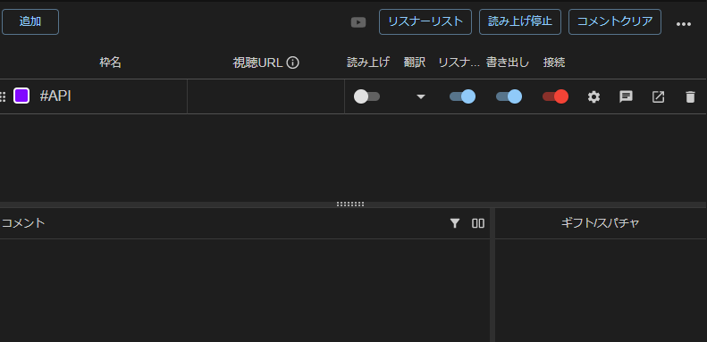
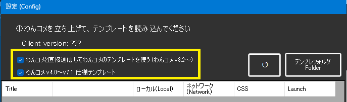
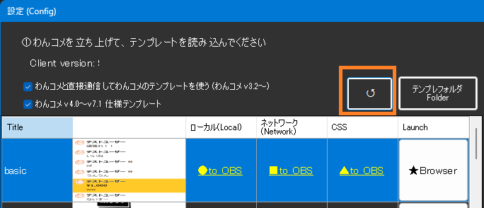
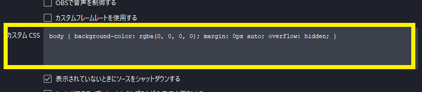

## 攻略チートシートについて

* このチートシートはテーマを絞ってガイドする「攻略本」的なものです。

!!! Info "前提条件"
    * [わんコメ](https://onecomme.com/) v3.2以上を使用していること

!!! Info "謝辞"
    * わんコメ作者[アスティさん](https://twitter.com/AstieDog)に様々なご協力をいただいております

## わんコメのテンプレートを使って字幕をだす

### 1.プラグインの有効化

* プラグインを使うチェックをONにしてください。

### 2.わんコメを起動する

### 3.ブラグイン設定画面で設定をします

### 4.テンプレートを読みこみます

* リロードを押します。
* わんコメに登録されているテンプレート一覧がでます。

### 5.CSSを定義します

* デザインを設定します
* Defaultをおすと、ゆかコネ設定画面の配色設定をつかうようになります。

!!! Tip "画面のカスタムができます"
    * 翻訳に改行をいれたり、表示のスタイルを変えたりする場合は、このCSS欄を加工してください

### 6.レイアウトを選びます

* ブラウザで表示する場合は★を、OBSに取り込む場合は■、▲をつかいます。

* OBSに取り込む場合は、■をOBS上にドロップした後、設定画面のカスタムCSS枠に▲をドロップします。
（それにより設定が反映されます）

* これで設定は完了です。