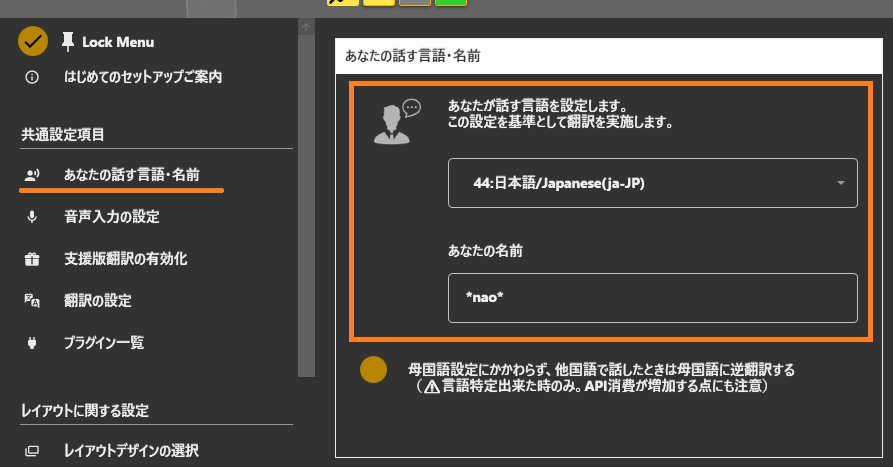
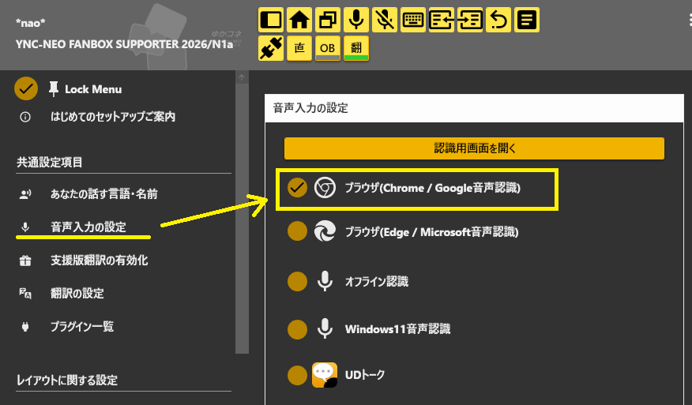
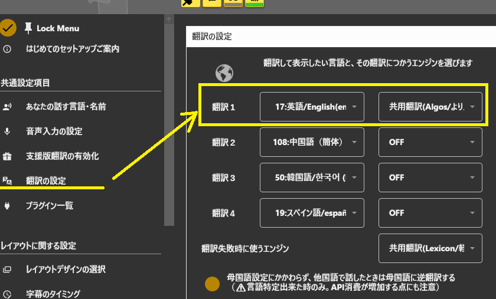
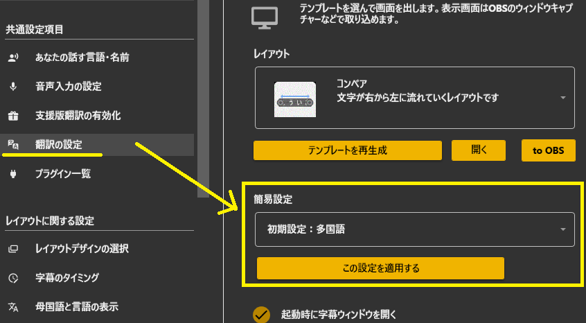
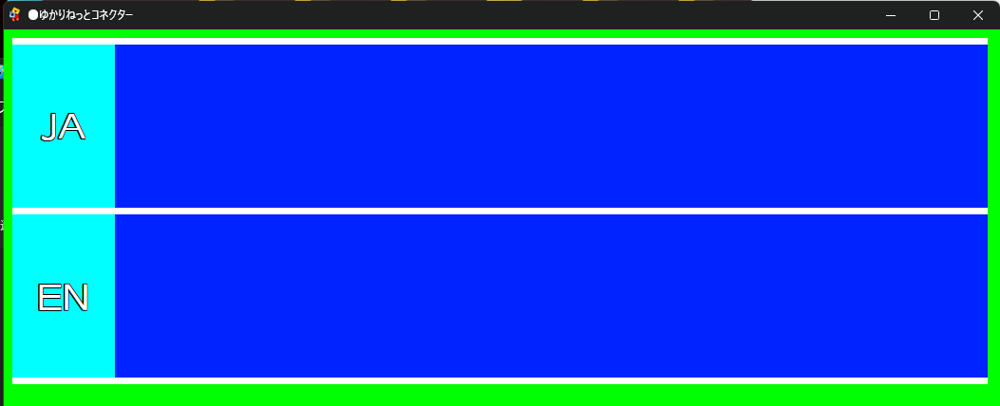
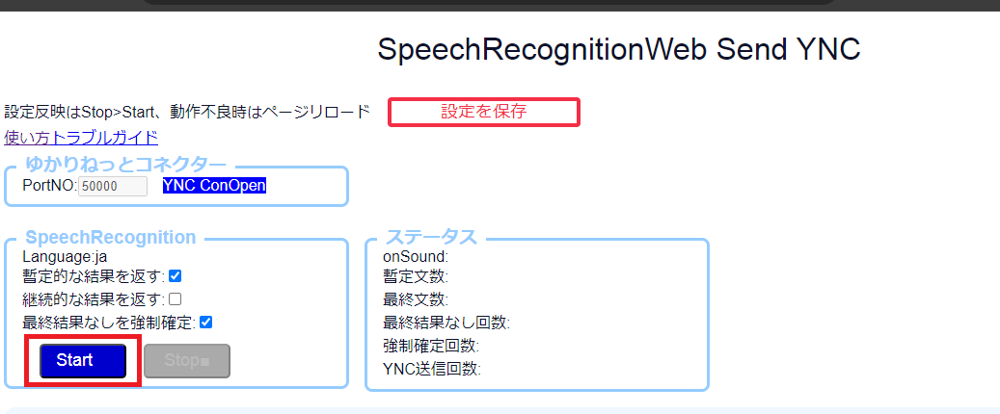
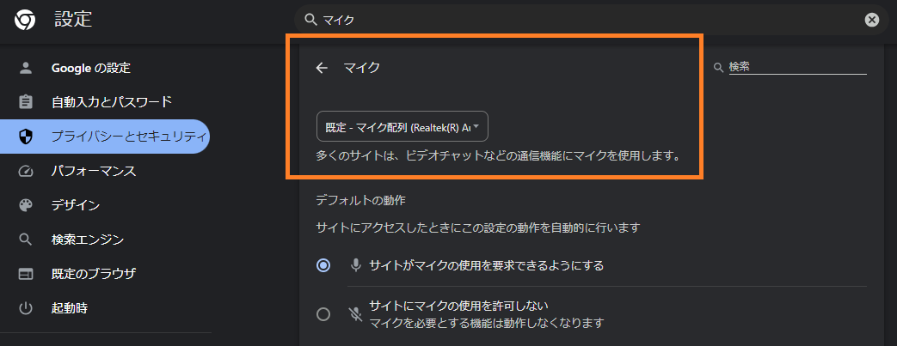
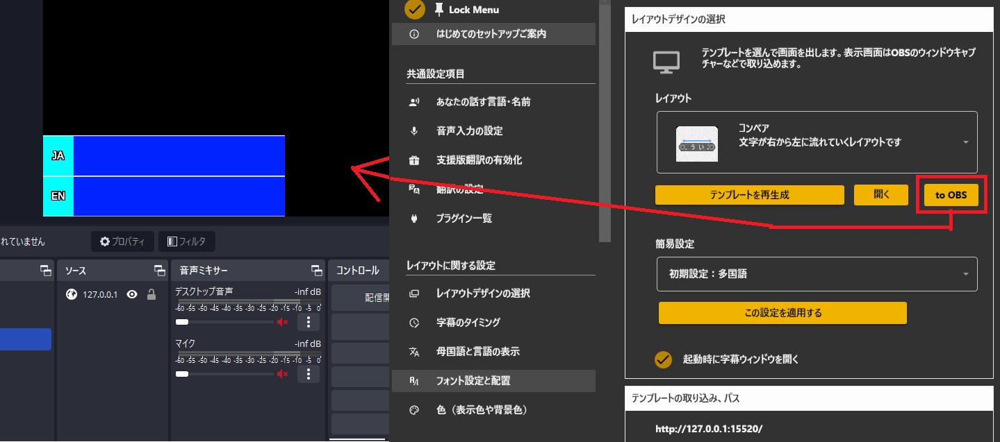

## 攻略チートシートについて

* このチートシートはテーマを絞ってガイドする「攻略本」的なものです。

## はじめてつかうとき

### 1.ゆかりねっとコネクターNEOを立ち上げます

### 2.まずはプロフィールを決めます

* 名前と自分が話す言語を決めます。

### 3.音声認識の種類を決めます

* 簡単なのはブラウザ音声認識です。

### 4.翻訳の種類を決めます

* すぐ使えるのは無料の「共用翻訳サーバ」です。

### 5.レイアウトをきめます

* よく使われるのは「多言語」レイアウトです。

このボタンをおすと、画面が出てきます。

### 6.音声認識を出しましょう

このボタンをおすと、画面が出てきます。

音声認識画面がでたら、Startをおしましょう。

この状態で話し始めると音声認識がはじまります。もしうまく認識しない場合は、ブラウザのマイク設定を変更します。

!!! Tip "ブラウザについて"
    デフォルトでは Microsoft Edge を使うように設定されています。オプション画面で Google Chrome に変更できます

### 7.字幕を取り込みましょう

OBSボタンの上にマウスを置き、クリックしたままOBS画面の上にドラックしましょう。

これにより画面に取り込まれます。
あとは、画面設定をかえたり、フィルタ⇒カラーキーで緑色を消すなどし、画面にフィットさせて字幕を設置しましょう。

この方法が使えない場合は、OBSにウィンドウキャプチャを追加し、字幕画面を取り込むようにしましょう

!!! Tip "設定について"
    設定はアプリ終了時に記憶され、次回立ち上げ時に自動的に復元されます。