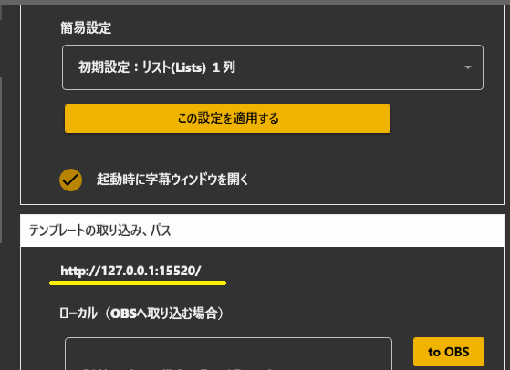
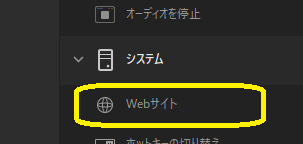
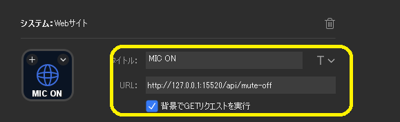

## 攻略チートシートについて

* このチートシートはテーマを絞ってガイドする「攻略本」的なものです。

## SteamDeckで制御する
!!! Info "前提条件"
    * SteamDeckを導入している
    * 連携のためのツールを入れている

## 基本的な設定

* まずは、ゆかりねっとコネクターでURLを確認します。

* つぎに、やりたいことを決めます。下記にかいてある「やりたいこと」には、URLがかいてあります

!!! Tips "制御用のアドレスについて"
    * パソコンで起動しているアプリが占有しているなどで使えない場合は番号が変わるときがあります。
    * うまく動かないときは、番号を確認してください。

* そのURLを、StreamDeckのWebサイト機能に設定して使います。

## 1.認識のON/OFFを操作する

!!! Notice "動作確認について"
    * うまく設定できていれば、指示を出したときゆかりねっとコネクターNEO上部のマイクの色が変わります。

|音声認識結果|URL|
|:----------|:--|
|受け取る	 |http://127.0.0.1:15520/api/mute-off|
|受け取らない| http://127.0.0.1:15520/api/mute-on|

## 2.定型文をいれる

!!! Notice "動作確認について"
    * うまく設定できていれば、ボタンを押したときに文字が出ます。

* たとえば、StreamDeckを操作したら「あいうえお」と表示されるようにするには、下記URLを設定します。

|URL|
|:--|
|http://localhost:15520/api/input?text=あいうえお|

## 3.翻訳１～４の翻訳をOFFに

!!! Notice "動作確認について"
    * うまく設定できていれば、ボタンを押したとき、その言語の表示が消えます。

* たとえば、StreamDeckを操作したら「あいうえお」と表示されるようにするには、下記URLを設定します。

|URL|
|:--|
|http://localhost:15520/api/setTranslationParam?slot=1&engine=off|

|パラメータ|意味|
|:--|:--|
|slot|翻訳の番号（１～４）|

## 4.翻訳１～４の翻訳設定をする

!!! Notice "動作確認について"
    * うまく設定できていれば、ボタンを押したとき、言語設定を変えられます

* たとえば、StreamDeckを操作したら翻訳１を英語にして、DeepL Pro翻訳にする場合

|URL|
|:--|
|http://localhost:15520/api/setTranslationParam?slot=1&engine=deeplpro&language=en|

|パラメータ|意味|
|:--|:--|
|slot|翻訳の番号（１～４）|
|languages|言語名|
|engine|翻訳エンジンの種類|

* 詳しい選択肢は、[API設定](../tech/tech_api_neo.md#翻訳表示設定の変更)を参照してください