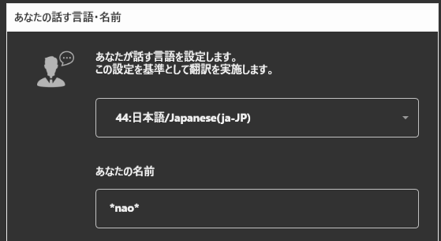
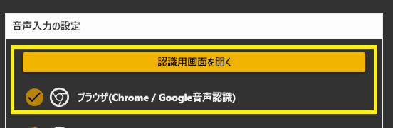
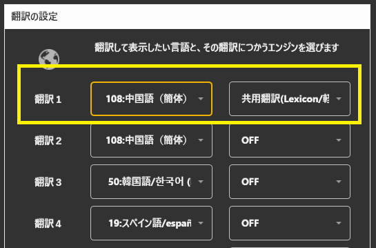
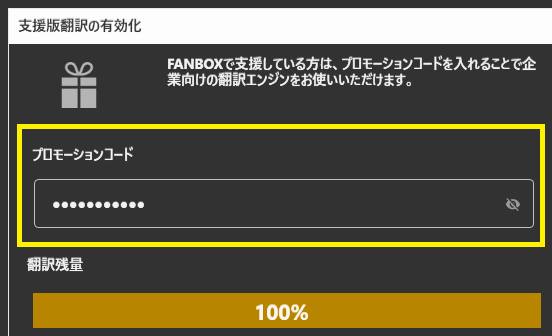
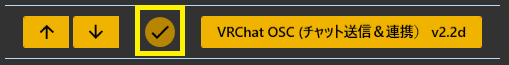
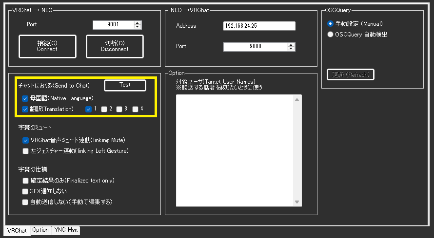
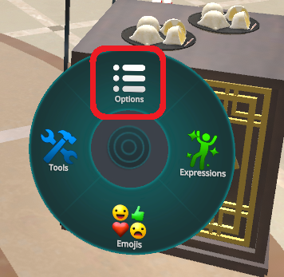
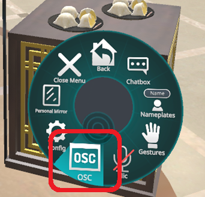
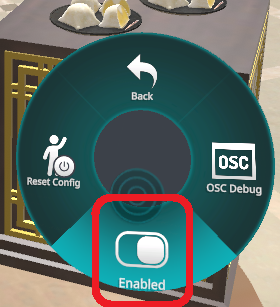

## 攻略チートシートについて

* このチートシートはテーマを絞ってガイドする「攻略本」的なものです。

## VRChatのチャットにメッセージを送る

!!! Info "前提条件"
    * VRChat OSCプラグイン v1.3b以上がうごいていること

### 1.話す言語と自分の名前を決めます。
 

### 2.音声認識の種類を決めます

!!! Info "機能限定"
    * マイク入力のデバイス選択はブラウザの設定画面で　行います

### ３.音声認識の種類を決めます

* 支援版翻訳の場合は、支援していないと使えません。

### 4.プロモーションコードをいれます

* 支援版翻訳の場合は、コードを入れることでアクティベートされます。
* 　おためし翻訳コードをお持ちの方は、ここに入れてください
* 　無料の翻訳エンジンを使う場合には、追加の設定（ＡＰＩキーや翻訳エンジン設定）を行う必要があります。

### 5.OSCプラグインを有効にする

### 6.VRChat を起動する

* VRChatはVRモードでもデスクトップモードでも構いません
* 最新版にアップデートして試してください
* ゆかりねっとコネクターNEOが動いているPCで起動させます

### 7.送信を有効にする

* Openを押します。
* VRChat枠にある「Ｎａｔｉｖe」と「Translate1」をONにします
* ゆかりねっとコネクターNEOの翻訳１の設定をしましょう。

!!! Info "機能限定"
    * 2022/12現在、多国語表示ができています。　
    * 文字が長くなると後ろが切れてしまうことがあります。

### 8.VRChat側の設定を変える

* リングメニューでOSC機能をＯＮにしてください

!!! Info "機能設定"
    * VRChatメインメニューの設定で、ＣｈａｔＢｏｘの表示位置を設定できます
    * 見え方のカスタマイズは、個々に見る方が設定をします。(文字サイズや位置など）

### 9.音声認識をする

* 認識すると、翻訳結果がVRChatで表示されます

