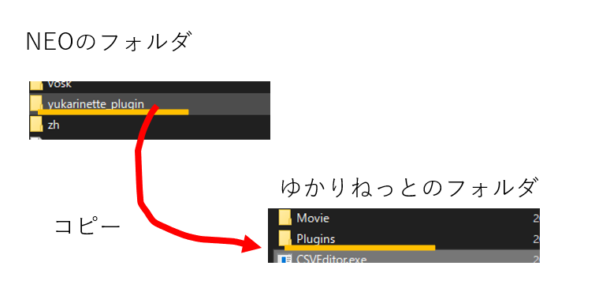
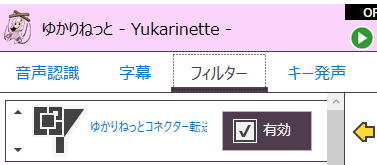
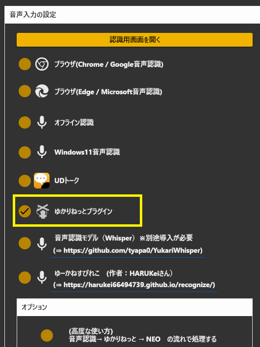
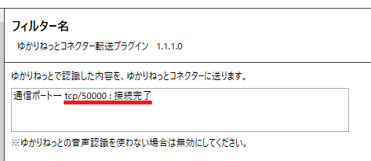
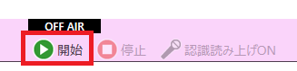
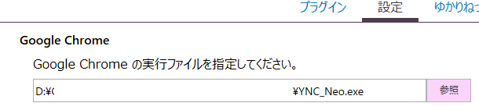

## 攻略チートシートについて

* このチートシートはテーマを絞ってガイドする「攻略本」的なものです。

## ゆかりねっととつなぐ

!!! Info "前提条件"
    * [ゆかりねっと](http://www.okayulu.moe/) v1.0.8 がうごいていること 
    ※音声認識し字幕を表示するだけであれば、ゆかりねっとコネクターNEOだけで実現できます。 
    　その場合は、この連携設定は不要です。

!!! Info "謝辞"
    * 連携先ソフトウェアの開発者は[おかゆぅ様](http://www.okayulu.moe/)です。

!!! Warning "うまく動かないときのレポートについて"
    * 本件について、おかゆぅ様に直接問い合わせをしないでください。

!!! Danger "Caseの選定"

    * Case1、Case2「どちらか１つ」をえらんでください。
    * 両方設定すると、字幕がループしうまく動かない原因になります

### Case.1 ゆかりねっとの音声認識をつかってNEOを連携

!!! Info "このケースを選ぶのは、こういうとき"
    * ゆかりねっとの音声認識を優先して使いたい
    * 今の構成を崩したくない

* ゆかりねっとの音声認識結果をゆかりねっとコネクターNEOに流すには、プラグインが必要です。
* プラグインをゆかりねっとに入れます。

* ゆかりねっとを起動し、プラグインを有効化します。

* ゆかりねっとコネクターNEOを起動し、音声入力を選択します。

* うまくつながれば接続完了になります

!!! Warning "うまく動かないとき"
    * PC内の他のアプリが通信ポートをふさいでいることがあります。
    * 再起動したり、常駐ソフトを終了させてみると改善することがあります。

* ゆかりねっとの音声認識をONにします

* これで、発話するたびにNEOの方で翻訳・表示が行われます

### Case.2 NEOの音声認識をつかってゆかりねっとを連携

!!! Info "このケースを選ぶのは、こういうとき"
    * ゆかりねっとコネクターNEOの音声認識を優先して使いたい
    
* ゆかりねっとを起動します。

* ゆかりねっとのブラウザ設定欄にゆかりねっとコネクターNEOを指定します

* ゆかりねっとの音声認識をONにします

* このタイミングでゆかりねっとコネクターNEOが起動します。

* その後、音声入力元の設定をします。

* 設定が終わったら、音声認識をONにします

*これで、発話するたびにNEOの方で翻訳・表示が行われます
