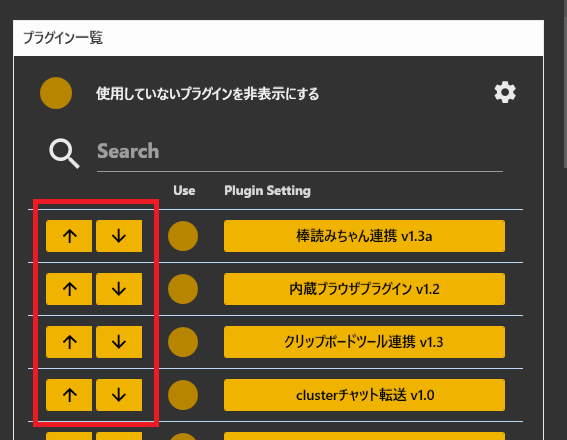
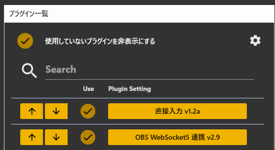

## 1. プラグインとは

* 標準機能にない処理ができるようになるオプション機能です
* 初期インストール状態でもかなりの機能が用意されています

!!! Info "プラグインの利用について"
    * プラグインを使うことで機能を拡張することができます
    * 不要なプラグインをOFFにすると動作が軽くなります

## 2. 処理順

* プラグインの処理は上から順に実行されます。
* 順番の入れ替えは、ボタンで実施します。

!!! Tips "使用例"
    * 辞書プラグイン、読み上げプラグインを使う場合は、通常は辞書プラグインを上にします。
    * 逆にした場合、読み上げに辞書が反映されなくなります
    

## 3. インストール方法

* インストール先フォルダの plugins の中にフォルダごと入れてください

!!! Info "ロード対象のファイル"
    * フォルダと同じDLLがある場合はそのファイルをロードします
    * フォルダと同じDLLがない場合はすべてのDLLをロードしようとします

!!! Warning "セキュリティについて"
    * 信頼できるルートで入手したプラグインをご利用ください
    * OSによってはセキュリティによりロードできない場合があります。（プロパティより解除処理をしてください)

## 4. アンインストール方法

* インストール先フォルダの plugins の中にフォルダごと入れてください

!!! Info "ロード対象のファイル"
    * フォルダと同じDLLがある場合はそのファイルをロードします
    * フォルダと同じDLLがない場合はすべてのDLLをロードしようとします

