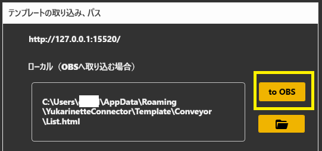

## ダウンロードする前に

!!! Info "更新履歴について"
    
    - 更新詳細については、[履歴](./qa/history.md)をご確認ください。

!!! Note "アップデートタイミングについて"
    
    - 更新は、配信直前などを避けて、再調整などができる「ゆとりのある時」に実施してください。
    - うまくいかない場合は[再インストール](qa/reinstall.md)をお試しください。

!!! Warning "バージョンアップ後に支援翻訳できなくなった場合"
    
    - 内部認証が正しく行えない場合に翻訳ができないことがあります。再認証をお試しください。

!!! Warning "導入に関する注意"
    
    - 支援モードで利用する方は[FANBOXにある新しいキーの取得](https://nmori.github.io/yncneo-Docs/support/support_howto/#2)が必要です。支援者の方は、FANBOXページから新しいキーを入手してください。
    - 暫くアップデートをしていない方は、新規インストールのほうがトラブルが少ない可能性があります。
    
## 安定版

### v2.2.0 ：[ダウンロード](https://machanbazaar.com/wp-content/uploads/2024/11/YNCneo_v2.2.0.zip)

## 最新版

### v2.2.7 ：[ダウンロード](https://machanbazaar.com/wp-content/uploads/2024/12/YNCneo_v2.2.7.zip)

- リカバリーが必要な場合は[こちら](qa/before_help.md)をご確認ください。

- [更新履歴](qa/history.md)

- [再インストール方法](qa/reinstall.md)

## 旧バージョン（サポート外）

!!! Warning "導入に関する注意"
    
    - バージョン1 とバージョン2 は仕組みが大きく異なるので、バージョンを戻す場合には上書きインストールせず、設定を含めてアンインストールしてから導入してください。

!!! Warning "サポート終了"
    
    - 速めにv2.2へバージョンアップをお願いします。

### v2.1.130 ：[ダウンロード](https://machanbazaar.com/wp-content/uploads/2024/08/YNCneo_v2.1.130.zip)

- 読み上げに失敗するケース、Discord読み上げ、Twitchなど一部プラグインがうまく動かない問題の修正

### v2.1.0 ：[ダウンロード](https://machanbazaar.com/wp-content/uploads/2023/12/YNCneo_v2.1.0.zip)

### v2.0.197：[ダウンロード](https://drive.google.com/file/d/1lEHHf9QymS474DBiNWCDCctwSBVHXHJg/view?usp=sharing&que=YNCneo_v2.0.197.zip)

### v1.9594：[ダウンロード](https://machanbazaar.com/wp-content/uploads/2022/08/YNCneo_v1.9594.zip)

## 補足情報

!!! Note "アップデート後表示がうまくいかない場合"
    - 表示がうまくいかない場合はテンプレートを再生成してみてください
    

!!! Note "再起動するたび表示レイアウトが表示されなくなる場合"
    - 取り込む場合はこちらのボタンからフォームを取り込んでみてください
    

!!! Warning "インストールについて"
    
    - バージョン1 とバージョン2 は仕組みが大きく異なるので上書きインストールで混ぜないでください。

!!! Warning "アップデートに間が空いた場合"
    
    - 変更が大きい場合は上書きインストールすると不整合が起きる場合があります。その場合は一度消してから導入してください。

!!! Warning "インストール先について"
    
    - インストール先として「ゆかりねっと」のフォルダを選ばないようにしてください。ゆかりねっとが干渉で起動しなくなります。別フォルダにすることで問題なく動きます。

!!! Info "わんコメ連携について"
    
    - ゆかコネNEO v2.1は、わんコメv4.0～に対応しています。

