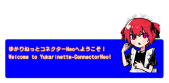

# ゆかりねっとコネクターNEOとは
{ align=left }
ゆかりねっとコネクターNeoは、リアルタイムに音声→母国語→多国語に翻訳ができるコミュニケーションツールです。

従来より設定項目を極力絞り、応答性も素早くした軽量設計になっています。

プラグインという形をとっているので、必要な機能のみONにすることで、拡張性と素早さのバランスがとれるようになっています。

もちろん、プラグインを使わなくても上記の翻訳は可能ですし、翻訳させない使い方でもOK。読み上げやDiscordへの文章転送だけに使うことも可能です。

!!! Warn "このドキュメントについて"
    現在執筆中であり、表示できないページが混在しています。

