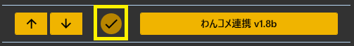
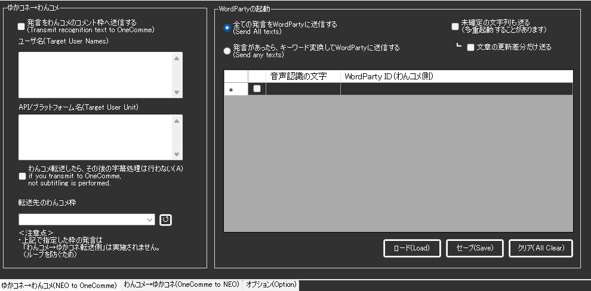
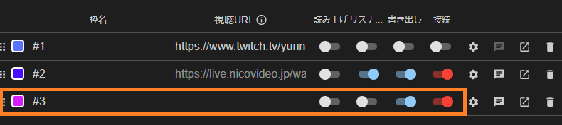
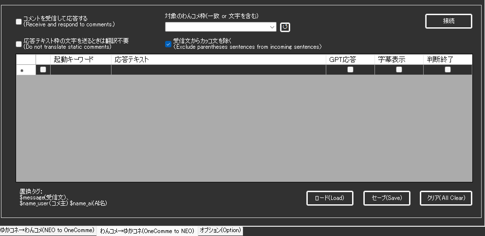

!!! Info "前提条件"
    * [わんコメ](https://onecomme.com/) v5.0以上を使用していること

## このプラグインで出来ること

* わんコメに字幕データを送信できます

!!! Tips "謝辞"
    * この機能の実現のために、[わんコメ](https://onecomme.com/)作者[アスティ](https://twitter.com/AstieDog)さんの許諾と技術支援をうけています。

!!! Tips "使いどころ"

    * 他のプラグインと併用すると便利に使えます。たとえば、Discordプラグインと連動させれば、Discordから受信したチャットをわんコメに統合表示できます。
    * コメントの内容次第で、GPTプラグインに応答させることができます。

## 有効化

* プラグインを使うチェックをONにしてください。

## 設定

|設定|意味|
|:--|:---|
|ユーザ名|処理対象のユーザ名をいれます。名前にこの文字が含まれれば処理されます。|
|API/Platform|処理対象のプラットフォーム名をいれます。プラットフォーム名にこの文字が含まれれば処理されます。（プラグインなどによって名前は異なります。わんコメの字幕右下に表示されるプラットフォーム名を参考にしてください。）|
|転送したら～|わんコメに表示さえできれば良いケースでチェックします。字幕を転送したら、ゆかコネ側の表示処理は一切中止します|
|わんコメ設定|わんコメに依頼する作業内容を指示します|

!!! Info "わんコメ枠について
    
    わんコメ側での設定を先に行う必要があります。URLを入力していない枠を設定し、書き出しと接続をONとすることで通信準備が完了します。

## プラットフォームの指定

* リストは上から順に評価され、該当した場合に応答テキストを処理します。
* 一度条件が成り立つと、それより下の条件は評価しません。
* GPT送付にチェックを打つとGPTプラグインでAI応答させます。チェックが入っていない場合は字幕として表示されます。
* 起動キーワードには正規表現がつかえます。
* コメントを入れた人の名前は $name 、コメント文自体は $message で置き換えが出来ます。

## 制約・仕様

* わんコメのバージョンが古い場合はうごきません。
