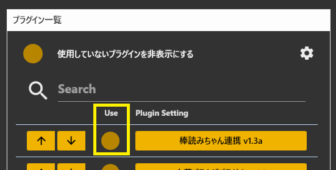
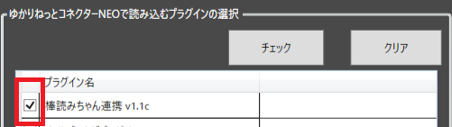

## 1. プラグインの有効化・無効化

ゆかりねっとコネクターNEOのメニューで登録します

* チェックを打つことで有効化します。
* チェックを外すことで無効化します。

## 2. プラグイン自体の有効化・無効化

メンテナンスツールをつかって登録します

* チェックを打つことでゆかりねっとコネクターNEOにロードされます
* チェックを外すことでゆかりねっとコネクターNEOにロードされなくなります
* 設定結果は次回ゆかりねっとコネクターNEO起動時に反映されます

## 2. プラグインの特性について

!!! Info "プラグインは上から順に処理されます"

!!! Info "プラグインはチェックを有効になっているものが発話ごとに処理されます"
    * チェックを最小限にすると動作が快適になります。
    
!!! Info "前のプラグインの影響をうけます"
    * たとえば辞書の適用結果は、辞書プラグインの下にあるプラグインに適用されます

!!! Info "表示タイミングの影響をうけます"
    * 表示タイミングの時間が経過すると、プラグイン側にデータを非表示にするよう指示されます。
    * 文字を消さずに維持したい場合は、表示タイミングを最大値にしてください。

!!! Info "プラグイン自体をロードしないようにできます"
    * メンテナンスツールをつかうことで、ロード対象から除外できます。
    * ロード対象から除外されると、メモリが節約され起動時の動作が速くなります。
    * 一度除外しても、メンテナンスツールをつかえば戻すことが可能です。

