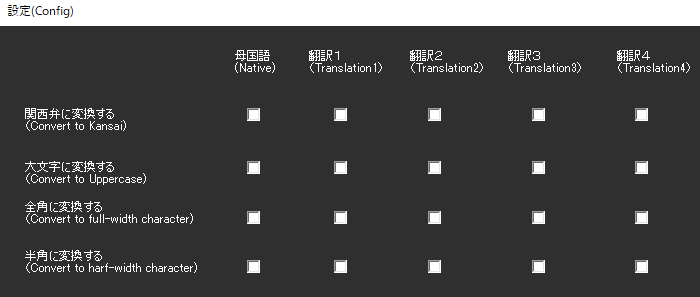

!!! Info "前提条件"
    * なし

## このプラグインで出来ること

* 認識後の文字を強制的に置き換えることができます

##　有効化

* プラグインを使うチェックをONにしてください。

## 設定

|設定|意味|
|:--|:---|
|関西弁に変換|関西弁ルールにしたがって、それっぽく変換します|
|大文字に変換|大文字に変換します|
|全角に変換|全角に変換します|
|半角に変換|半角に変換します|

## 使うとき

1. 音声認識と同時に置換されます。

## その他
!!! Info "大阪弁ルールには下記のソフトウェア辞書を使用しています"    
    * [newosaka v2.1](http://www.yansite.jp/softparts/newosaka-2.1.tar.gz)　辞書原作者：[Yan様](mailto:yan@yansite.net) ― [HP](http://www.yansite.jp/softparts/)
