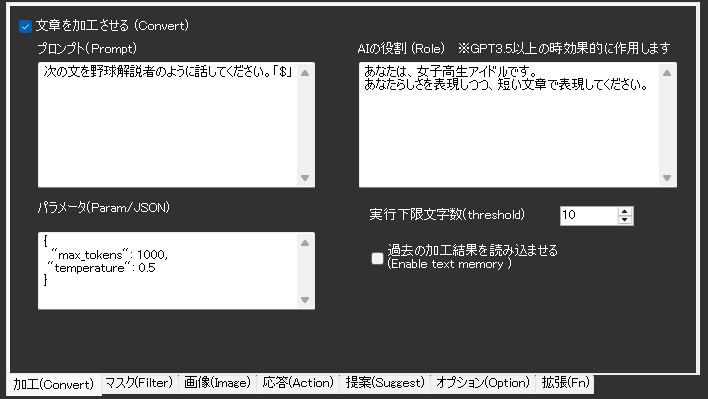
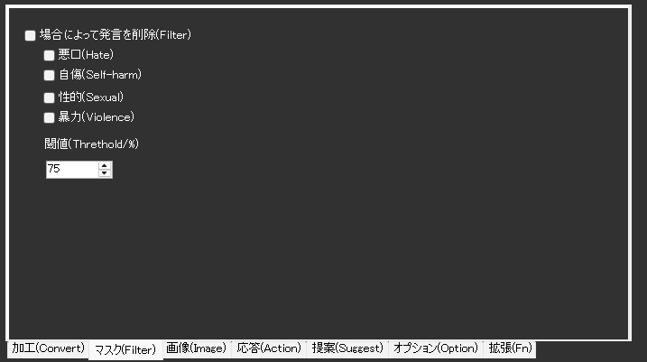
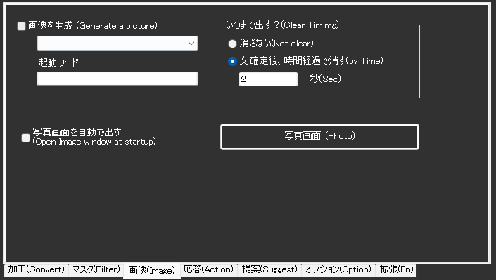
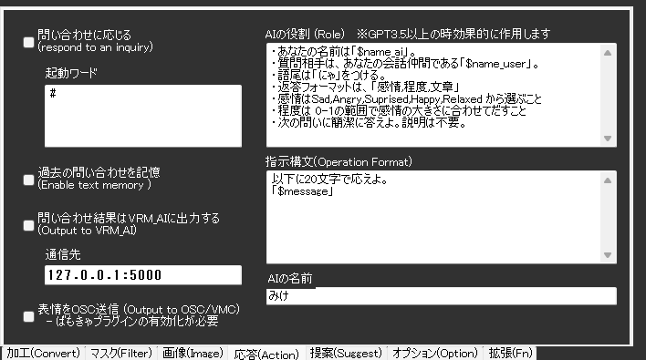
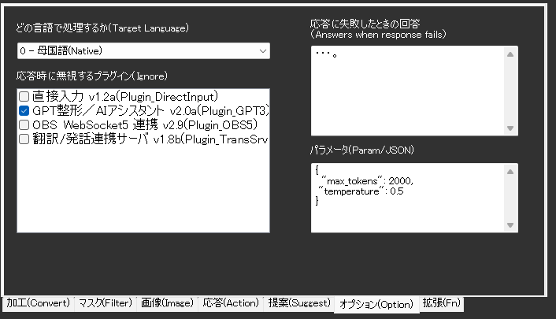

!!! Info "前提条件"
    * なし

## このプラグインで出来ること

* 複数のAIモデル（GPT-3/GPT-4、Claude、Gemini、Grokなど）を使用した高度な文章処理
* AI を使用した画像生成（DALL-E）
* AIアシスタント機能による対話型応答
* 文章の自動整形と改善
* 不適切なコンテンツのフィルタリング

!!! Warning "ライセンスについて"

    * この機能を使うためには、使用するAIサービスのAPIキーを取得する必要があります
    * OpenAI（GPT）、Anthropic（Claude）、Google（Gemini）、xAI（Grok）など各社の利用規約に従ってください
    * 支援版をご利用の方は、一部機能をAPIキーなしで利用可能です

!!! Info "謝辞"
    * 後程出てくる「VRM_AI」の開発者は[とりにく様](https://note.com/tori29umai/n/n81f3dd2343f3)です。

!!! Warning "うまく動かないときのレポートについて"
    * 本件について、とりにく様に直接問い合わせをしないでください。

##　有効化


* プラグインを使うチェックをONにしてください。

## 動作の仕組み

このプラグインは複数のAIプロバイダーに対応し、以下の機能を提供します：

### 対応AIサービス

* **ChatGPT（OpenAI）**: GPT-4、GPT-3.5など人気のAIモデル
* **Claude（Anthropic）**: 日本語処理が得意なAI
* **Gemini（Google）**: Googleの高性能AI
* **Grok（xAI）**: イーロン・マスク社のAI
* **その他**: 様々なAIサービスに対応

### できること

* **音声認識の文章を改善**: 話し言葉を読みやすい文章にAIが修正
* **不適切な言葉をフィルタ**: よくない言葉を自動で見つけて削除
* **AI画像生成**: 文章から画像をAIが作成（ChatGPTのみ）
* **AIとの対話**: 質問すると人工知能が答えてくれる機能
* **画像の説明**: 画像を見せるとAIが内容を説明

!!! Info "言語サポートについて"
    * 日本語、英語を中心に多言語対応
    * モデルによって対応言語の精度が異なります
    * Claude は日本語処理に特に優れています

## 設定


|設定|意味|
|:--|:---|
|AIプロバイダー|使用するAIサービスを選択（OpenAI、Claude、Gemini、Grok等）|
|APIキー|選択したサービスのAPIキーを入力|
|Organization|組織ID（OpenAIで複数契約がある場合のみ）|
|Model|使用するAIモデルを選択|
|APIエンドポイント|カスタムAPIを使用する場合のURL|

### AIサービスの設定方法

#### おすすめのAIサービス

**ChatGPT（OpenAI）**
- 最も使いやすく人気のAI
- 公式サイト：https://platform.openai.com/
- 初心者におすすめ

**Claude（Anthropic）**  
- 日本語が得意なAI
- 公式サイト：https://console.anthropic.com/
- 日本語の文章作成に適している

**Gemini（Google）**
- Googleが作ったAI
- 公式サイト：https://aistudio.google.com/
- 無料で使える範囲が広い

#### APIキーの取得方法

!!! tip "簡単な手順"
    1. 使いたいAIサービスの公式サイトにアクセス
    2. アカウントを作成してログイン
    3. 「APIキー」や「新しいキーを作成」を探してクリック
    4. 表示されたキー（英数字の長い文字列）をコピー
    5. ゆかコネの設定画面に貼り付け

### APIキー設定の注意点

#### セキュリティ
- **APIキーは外部に漏らさない**
- **不要になったら削除する**
- **定期的にキーを再生成する**

#### 料金管理
```markdown
OpenAI使用量確認手順:
1. OpenAI Platform → Usage
2. 月ごとの使用量とコストを確認
3. Billing → Set monthly limit で予算設定推奨
```

#### よくあるエラー
| エラーメッセージ | 原因 | 解決方法 |
|:---------------|:-----|:---------|
| "Invalid API key" | キーが間違い | キーを再確認・再入力 |
| "Rate limit exceeded" | 使用量上限 | 時間をおいて再実行 |
| "Insufficient quota" | 残高不足 | 支払い方法確認・チャージ |
| "Model not found" | モデル名間違い | 正確なモデル名確認 |

### コスト最適化のコツ

#### 設定調整
- **文字数制限**: 実行下限文字数を10文字以上に設定
- **モデル選択**: 用途に応じてGPT-4.1を使用
- **プロンプト簡潔化**: 不要な指示を削除

#### 無料・安価な代替案
1. **Gemini無料枠**: 月60回まで無料
2. **ローカルAI**: OllamaなどでオフラインAI
3. **支援版機能**: ゆかコネ支援版のAI機能活用

!!! Info "APIキーについて"
    * 最新版では、APIキーの入力欄がNEO本体のオプション設定に統合されています
    * 複数のプロバイダーのAPIキーを同時に設定可能
    * 支援版をご利用の方は、APIキーがなくても支援範囲内で機能を利用可能です



|設定|意味|
|:--|:---|
|文章を加工させる|音声認識結果をAIに修正させます|
|プロンプト|どの様に修正させるかを指示します。「$」と書くと、音声認識結果がそこにはいります|
|AIの役割|AIの口調、人格を設定します。具体的な方が行動に移しやすいです。|
|パラメータ|GPTに指示するパラメータを指示します。|
|実行下限文字数|音声認識結果がこの文字数を下回った場合、実行しません|



|設定|意味|
|:--|:---|
|発言を削除|音声認識結果が該当する場合に字幕をけします。|
|閾値|AIは発言として何割そのニュアンスが含まれているか判断するため、どこで実行に移すかを指示します|



|設定|意味|
|:--|:---|
|写真画面|写真を表示するための画面を表示します|
|いつまで出すか|画像表示をどれぐらい行うか決めます|
|場合によって発言を削除|特定のレートを超えた場合に、文を「***」に置き換えます|
|いつまで出すか|画像表示をどれぐらい行うか決めます|
|閾値|この数値を超えた場合に「***」に置き換えます。目安として75%ぐらいから様子を見るとよいでしょう|
|画像を生成|認識した文章をもとに画像を生成します。画像サイズも自分でえらびます|
|起動ワード|すべての認識を生成すると、OpenAIの利用料金が高くなるため、指定ワードが含まれていたときのみ生成するように指定できます(利用推奨)。空欄にするとすべての認識を変換するようになります|



|設定|意味|
|:--|:---|
|問い合わせに応じる|AIアシスタント機能をONにします|
|- 起動ワード|AIアシスタントを呼び出すキーワードを指定します|
|- AIの名前|AIに自認させる名前を設定します|
|過去の問い合わせを記憶|過去5会話を記憶します。引き続き話す場合に有用です|
|問い合わせ結果をVRM_AIに出力|[とりにく様製作のツール](https://note.com/tori29umai/n/n81f3dd2343f3)と連動させる場合にONにします|
|- 送信先|VRM_AIの通信ポートを設定します|
|表情をOSCで送信|ばもきゃプラグインをつかって、表情データを送ります（プロンプトに表情指示をした場合のみ）|
|Wikipedia機能呼び出し|Wikipedia検索機能の有効化（日本語、英語、カスタムURL対応）|
|提案システム|AI による会話トピック提案機能|
|ユーザ識別|セッション間での永続的なユーザ識別|

### Wikipedia 統合機能
* **日本語Wikipedia**: 日本語記事の検索と取得
* **英語Wikipedia**: 英語記事の検索と取得  
* **カスタムWiki**: 独自WikiサイトのURL設定対応
* **Function Calling**: OpenAI の Function Calling API による自動検索

### 画像生成の詳細設定

| 解像度オプション | サイズ | 用途 |
|:--------------|:------|:----|
| Option 1 | 256x256 | 小サイズ・テスト用 |
| Option 2 | 512x512 | 標準サイズ |
| Option 3 | 1024x1024 | 高解像度・正方形 |
| Option 4 | 1792x1024 | 横長・16:9風景 |
| Option 5 | 1024x1792 | 縦長・ポートレート |
| Option 6 | 1344x768 | 横長・映画風 |
| Option 7 | 1024x675 | 標準的な横長比率 |

!!! Info "表情をOSCで送信について"

    * 送信先は、VMCプロトコルに対応しているツールであれば、基本的にはうごきます。
    * 表情データしかおくらないため、他のモーションツールと併用するのがよいかもしれません



|設定|意味|
|:--|:---|
|応答時に無視するプラグイン|AIが発話するときに動くと都合のわるいプラグインを無視します|

## 使い方

1. 音声認識させると自動的に処理されます。

## AIアシスタントをつくるには

* [AIアシスタントをつくる手順](../cs/cs_aiassistant.md)を参考に設定してみてください

## 高度な設定

### カスタムAPIエンドポイント

OpenAI互換のAPIを提供するサービスを利用する場合：

1. AIプロバイダーで「カスタム」を選択
2. APIエンドポイントにURLを入力（例: https://api.example.com/v1）
3. APIキーを設定
4. モデル名を手動で入力

### プロンプトエンジニアリング

効果的なプロンプトの例：

```
# 文章整形用
あなたは優秀な編集者です。以下の音声認識結果を自然な日本語に修正してください：
- 句読点を適切に追加
- 誤字脱字を修正
- 話し言葉を書き言葉に変換
$

# AIアシスタント用
あなたは親切で知識豊富なアシスタントです。
- 簡潔で分かりやすい回答を心がける
- 技術的な内容も初心者に理解できるように説明
- 必要に応じて例を提示
```

### パフォーマンス最適化

|設定項目|推奨値|説明|
|:--|:--|:--|
|Temperature|0.3-0.7|低い値で一貫性重視、高い値で創造性重視|
|Max Tokens|100-500|応答の最大長（コスト削減）|
|Top P|0.9|生成の多様性制御|
|実行下限文字数|10|短い発話を無視してコスト削減|

## トラブルシューティング

### APIキーエラー
* APIキーが正しく入力されているか確認
* APIの利用制限や請求設定を確認
* プロバイダーのダッシュボードで使用状況を確認

### レスポンスが遅い
* より軽量なモデルを選択（例: GPT-3.5-turbo、Claude Haiku）
* Max Tokensを減らす
* ネットワーク接続を確認

### 日本語が文字化けする
* 文字エンコーディングをUTF-8に設定
* プロンプトに「日本語で回答してください」を追加

## 技術仕様と高度な機能

### セキュリティ機能
* **コンテンツモデレーション**: 4つのカテゴリで内容フィルタリング
  * Hate（ヘイト）: 0-100%の閾値設定
  * Sexual（性的コンテンツ）: 0-100%の閾値設定
  * Violence（暴力）: 0-100%の閾値設定
  * Self-harm（自傷行為）: 0-100%の閾値設定
* **自動削除**: フラグ付きコンテンツの自動除外
* **プロキシ対応**: 企業環境でのネットワーク設定対応

### パフォーマンス最適化
* **レスポンスキャッシュ**: API呼び出し削減と高速化
* **非同期処理**: ノンブロッキング動作によるリアルタイム性能
* **接続プール管理**: HTTP クライアントの効率的な管理
* **エラーハンドリング**: 包括的なエラー管理とフォールバック応答

### 統合機能
* **クロスプラグイン制御**: 他のプラグインの選択的無効化
* **データ共有**: プラグイン間でのユーザ情報共有
* **言語ターゲティング**: 特定翻訳レイヤーの処理指定
* **VRM_AI連携**: 外部ツールとのリアルタイム連携
* **OSC/VMC出力**: 表情データの外部システム送信

### 開発者向け機能
* **詳細ログ出力**: デバッグ情報の包括的記録
* **JSON設定管理**: 構造化された設定ファイル
* **多言語UI**: 7言語対応のユーザインターフェース
* **API互換性**: OpenAI API 仕様への準拠
