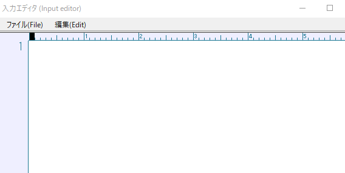

!!! Info "前提条件"
    * 特になし

## このプラグインで出来ること

* メモ帳ベースで入力受け付けます

!!! Info "こういう時に使おう"
    * 原稿を用意して、その通りに発話したり表示したいときに使いましょう

##　有効化

* プラグインを使うチェックをONにしてください。

## 設定

* ウィンドウが出ます。
* カーソル行でF1キーを押すと送信できます。
