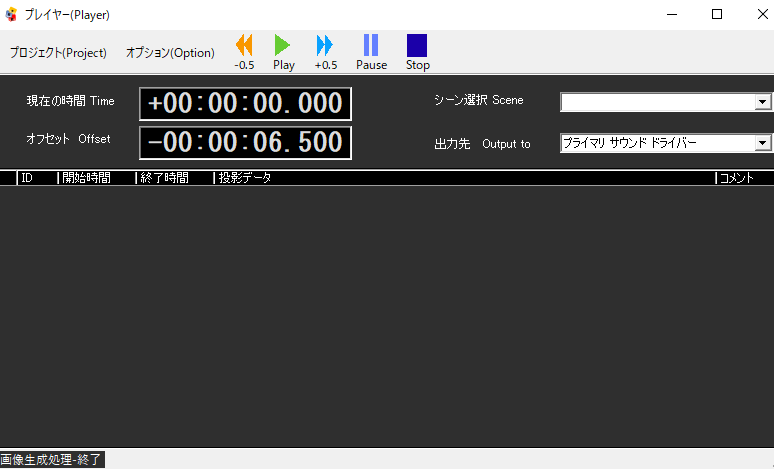

!!! Info "前提条件"
    * なし

## このプラグインで出来ること

* 指定されたタイミングにあわせて、歌詞をだします
* 音源ファイルがあれば、同時に音楽を再生します
* 4つの字幕形式に対応（OXK, OXC, STL, SRT）
* パッケージファイルによる歌詞と音楽の一括管理
* DirectSound による高品質オーディオ再生
* リアルタイムタイミング調整とオフセット制御
* IPtalk スライドファイルとの連携
* 外部API による再生制御

##　有効化


* プラグインを使うチェックをONにしてください。

## 使い方

1. SRTやSTLといった字幕ファイルを読みこみます。
2. 音声の出力先を選びます 
3. オフセットで字幕タイミングを調整します。

!!! Note "字幕ファイルと同じ場所に音源(wav/mp3)があれば音源として読み込まれます"
!!! Info "SRTやSTLを作るには、インターネットに公開されている製作ソフト（例：[おこ助](https://okosuke.jp/product/community/)）をつかいます"

## 設定



|設定|意味|
|:--|:---|
|現在の時間|再生時間を指定します|
|オフセット|音楽と字幕の位置をだすためにずらす設定です|
|シーン選択|特殊なケースで使います（一般的には特に使いません）|
|出力先|音楽を出力する先を指定します|

## 対応ファイル形式

### 字幕ファイル形式

| 形式 | 拡張子 | 説明 | 用途 |
|:-----|:-------|:-----|:-----|
| OXK | .oxk | おこ助（Okosuke）カラオケ字幕 | 日本のカラオケアプリ用 |
| OXC | .oxc | おこ助コメント形式 | コメント付き字幕 |
| STL | .stl | 標準字幕形式 | 一般的な字幕制作 |
| SRT | .srt | SubRip字幕形式 | 動画プレイヤー標準 |

### パッケージファイル
* **拡張子**: .mpf
* **内容**: 字幕データと音楽ファイルの組み合わせ
* **利点**: 一つのファイルで歌詞と音楽を完全管理

## 高度な機能

### タイミング制御システム

#### 再生制御
* **Play/Pause/Stop**: メニューバーからの操作
* **タイムオフセット**: ±5秒ボタンでの微調整
* **手動時刻設定**: マスク付き入力での精密指定
* **デフォルトオフセット**: -6.5秒（設定可能）

#### RTC（リアルタイムクロック）モード
* **機能**: システム時刻との同期再生
* **用途**: ライブ配信での時刻同期演出
* **設定**: RTC counting チェックボックス

#### 自動削除機能
* **動作**: 指定時間経過後の字幕自動消去
* **設定**: Delete on time-up オプション
* **用途**: 字幕の残像防止

### 音響システム

#### DirectSound統合
* **デバイス検出**: 利用可能な音響デバイスの自動列挙
* **デバイス選択**: ドロップダウンでの出力先選択
* **設定保存**: 選択したデバイスの永続化
* **品質**: DirectSoundによる高品質再生

#### 音楽ファイル対応
* **対応形式**: WAV, MP3
* **自動検出**: 字幕ファイルと同名の音楽ファイルを自動関連付け
* **同期再生**: 字幕タイミングに合わせた音楽開始

### 表示カスタマイズ

#### フォント・色設定
* **フォント選択**: コンテキストメニューからのフォントダイアログ
* **背景色**: `mnu_BackDlg` による背景色変更
* **前景色**: `mnu_ForeDlg` による文字色変更
* **設定保存**: 色・フォント設定の永続化

#### タイムライン表示
* **機能**: 時間軸の表示/非表示切り替え
* **用途**: 編集時の時間把握
* **設定**: Hide timeline オプション

### データ管理

#### 歌詞データグリッド
表示される情報：
* ID, 開始時刻, 終了時刻, テキスト, 有効フラグ
* メッセージタイプ, WAVファイル, OXKデータ, 画像送信フラグ
* ジャンプタグ, コメント, ユニークID

#### 行操作
* **ダブルクリック**: 該当時刻への同期
* **送信制御**: 行単位または単発送信の切り替え
* **編集機能**: リアルタイムでの内容変更

### 外部API制御

#### ファイル読み込み
* **コマンド**: `load`
* **パラメータ**: `file` - 読み込むファイルのパス
* **自動判別**: 拡張子による形式自動判定

```javascript
// 使用例：SRTファイルの読み込み
plugin.onCommand({
  "target": "Plugin_LyricAssist",
  "command": "load",
  "file": "C:\\music\\song.srt"
});
```

#### 再生制御
| コマンド | 機能 | 使用例 |
|:---------|:-----|:-------|
| `play` | 再生開始 | リモート再生開始 |
| `pause` | 一時停止 | 外部からの停止 |
| `stop` | 停止 | 再生終了 |

### 連携機能

#### IPtalk統合
* **機能**: IPtalkスライドファイルのインポート
* **用途**: プレゼンテーション字幕の活用
* **形式**: IPtalk専用フォーマット対応

#### HTML出力
* **機能**: 字幕データの自動HTML変換
* **用途**: Web表示、アーカイブ作成
* **形式**: 標準HTMLテーブル形式

### 実用例

#### ライブ配信での楽曲演出
1. 楽曲のSRTファイルを準備
2. 楽曲と同名のWAVファイルを配置
3. タイミング調整してライブ演出

#### カラオケ配信
1. OXKファイルで歌詞とタイミングを作成
2. DirectSoundで高品質音源出力
3. リアルタイムでの歌詞表示

#### プレゼンテーション支援
1. IPtalkファイルをインポート
2. API制御で外部システムと連携
3. タイムライン表示で進行管理

### トラブルシューティング

#### 音楽が再生されない
* DirectSoundデバイスの選択を確認
* 音楽ファイルの形式（WAV/MP3）を確認
* ファイルパスに日本語や特殊文字が含まれていないか確認

#### タイミングがずれる
* オフセット値の調整
* RTC モードの適切な設定
* システムの音声遅延設定を確認

#### 字幕が表示されない
* ファイル形式が対応しているか確認
* 文字エンコーディング（UTF-8推奨）を確認
* データグリッドでの有効フラグを確認
