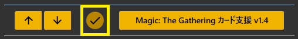
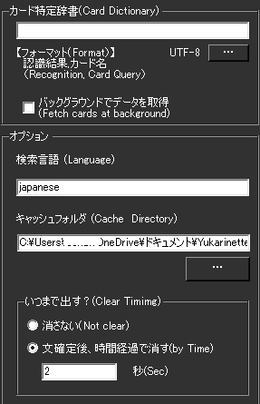
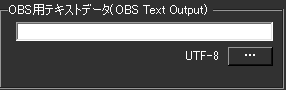

!!! Info "前提条件"
    * 基本的には [MTGA自動実況ツール](https://github.com/poslogithub/binary-dist/tree/main/mtga-commentary-automation)の併用を想定しています。

## このプラグインで出来ること

* [MTG ARENA](https://mtg-jp.com/mtgarena/)のゲーム自動実況に応じて、カードを表示できます。

!!! Info "謝辞"
    * MTGA自動実況ツールの開発者は[ぽｓ様](https://twitter.com/poslog)です。
    * ぽｓ様のご提案・ご協力により本システムは実現しております。

!!! Warning "うまく動かないときのレポートについて"
    * 本件に関し、MTG ARENAサイドへのお問い合わせはご容赦ください。

##　有効化

* プラグインを使うチェックをONにしてください。

## 準備順序
1. [MTGA自動実況ツール](https://github.com/poslogithub/binary-dist/tree/main/mtga-commentary-automation)を入れる
2. カード特定辞書が生成されるため、説明に従って``CardDictionary.csv``を指定する

## 設定

|設定|意味|
|:--|:---|
|カード特定辞書|キーワードとカード名を紐づける辞書を指定します|
|検索言語|カードを探すときに使う言語を指定します|
|キャッシュフォルダ|写真をストックしておく場所を指定します|
|いつまで出す？|表示時間を指定します|

!!! Info "カードについて"
    * 検索した結果ローカルに保存されていないカードについては、MTGカードデータベースより取得されます
    * カード画像を好みのものに差し替えたい場合はキャッシュフォルダの同カード名の画像ファイルを上書きしてください

* OBS用テキストデータは、OBSに直接データを取り込みたい方向けです。

* OBSのテキストソース側で生成されるファイルをしていすると字幕として表示されます

|ファイル名|内容|
|:----|:----|
|Flavor.txt|カードのフレイバー（解説）|
|Explan.txt|カードの説明|
|name.txt|カード名|
|type.txt|カードタイプ|

