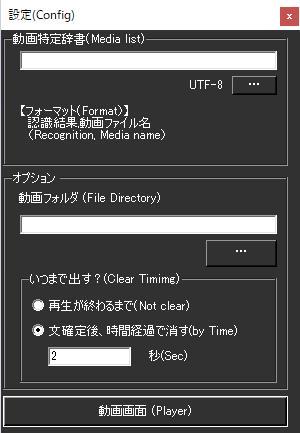

!!! Info "前提条件"
    * なし

## このプラグインで出来ること

* 言葉に反応して動画を再生できます。
* 40種類以上のメディアフォーマット対応
* 自動ループ再生機能
* プレイリスト対応（M3U, WPL, ASF）
* Windows Media Player統合
* 再生時間制御とクリア設定
* ファイル自動検出システム

##　有効化


* プラグインを使うチェックをONにしてください。

## 設定



|設定|意味|
|:--|:---|
|動画特定辞書|何に反応して読み上げるかを定義します|
|動画フォルダ|再生したい動画ファイルの置き場を指定します|
|いつまでだす？|再生状況を指定します|
|動画画面|動画を再生する画面を出します|

!!! Info "対応メディア"
    * Windowsメディアプレーヤが再生できるものに対応しています。(MPEG、MP4など)
    * コーデックによっては再生がうまくいかないものがあります。

## 対応メディア形式（完全版）

### 動画形式
| 拡張子 | 形式名 | 説明 |
|:-------|:-------|:-----|
| .mp4 | MPEG-4 | 最も一般的な動画形式 |
| .avi | Audio Video Interleave | Windows標準動画形式 |
| .wmv | Windows Media Video | Microsoft独自形式 |
| .mov | QuickTime Movie | Apple QuickTime形式 |
| .mkv | Matroska Video | オープンソース動画コンテナ |
| .flv | Flash Video | Adobe Flash動画形式 |
| .webm | WebM | Web動画標準形式 |
| .mpeg, .mpg | MPEG Video | 標準動画圧縮形式 |
| .3gp | 3GPP | 携帯電話動画形式 |
| .m2ts | MPEG-2 Transport Stream | Blu-ray動画形式 |

### 音声形式
| 拡張子 | 形式名 | 説明 |
|:-------|:-------|:-----|
| .mp3 | MPEG Audio Layer 3 | 最も一般的な音声形式 |
| .wav | Wave Audio File | Windows標準音声形式 |
| .wma | Windows Media Audio | Microsoft独自音声形式 |
| .ogg | Ogg Vorbis | オープンソース音声形式 |
| .flac | Free Lossless Audio Codec | 無損失音声圧縮 |
| .aac | Advanced Audio Coding | 高効率音声圧縮 |
| .m4a | MPEG-4 Audio | iTunes標準音声形式 |

### プレイリスト・特殊形式
| 拡張子 | 形式名 | 説明 |
|:-------|:-------|:-----|
| .m3u | M3U Playlist | 標準プレイリスト形式 |
| .wpl | Windows Media Player Playlist | WMP専用プレイリスト |
| .asf | Advanced Systems Format | Microsoft ストリーミング形式 |
| .ifo, .vob | DVD Video | DVD動画ファイル |

## 高度な機能

### 自動ループ再生
* **機能**: ファイル名に "loop" が含まれる場合、自動的にループ再生
* **例**: `background_loop.mp4` → 自動ループON
* **用途**: BGM、効果音、背景動画の連続再生

### 再生制御オプション

#### クリアモード
| モード | 説明 | 設定 |
|:------|:-----|:-----|
| 最後まで再生 | メディア終了まで表示継続 | "Play until end" |
| 時間制限再生 | 指定時間後に自動停止 | 秒数設定 |

#### ウィンドウ管理
* **リサイズ対応**: メディアプレーヤーウィンドウのサイズ変更
* **アスペクト比保持**: 動画の縦横比を自動調整
* **フルスクリーン対応**: ダブルクリックでフルスクリーン切り替え

### ファイル検出システム

#### 自動スキャン機能
* **対象**: 指定された動画フォルダ内の全メディアファイル
* **リアルタイム更新**: フォルダ内容変更の自動検出
* **拡張子判別**: 40種類以上の拡張子を自動認識

#### 辞書連携
* **CSV形式**: "認識キーワード, ファイル名" 形式
* **相対パス**: 動画フォルダからの相対パスで指定
* **マッチング**: 上から順次判定、最初にマッチした項目で実行

### 技術実装詳細

#### Windows Media Player統合
* **ActiveX**: AxWMPLib.AxWindowsMediaPlayer使用
* **コーデック対応**: システムインストール済みコーデックを活用
* **ハードウェア支援**: GPUアクセラレーション対応

#### ネットワーク対応
* **プロキシ検出**: システムプロキシ設定の自動適用
* **タイムアウト**: 10秒のHTTP接続タイムアウト
* **ストリーミング**: HTTP/HTTPSストリーミング再生対応

### 動画特定辞書の作り方

!!! Info "編集方法"
    * Excel もしくは メモ帳で実施します。

=== "Case1:Excelの場合"

    

    1. Excelでデータを作ります。

    2. CSVファイルとして保存します。

    
    
=== "Case2:メモ帳の場合"

    1. 下記のようなファイルを作ります。

    ``` js
    おはよう,goodmorning.mp4
    ```
    2. CSV（UTF8エンコード)で保存します。

    


## 使うとき

1. 音声認識をすれば自動的に再生されます。

## 特性等

* 上から順番に条件判定します。
* 条件が一致したら、その行で判断を終了します。

