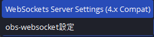
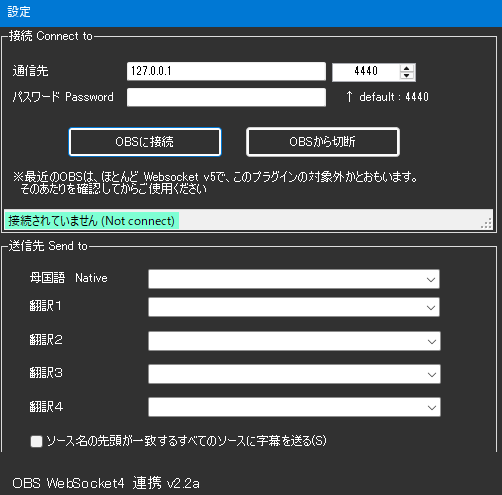
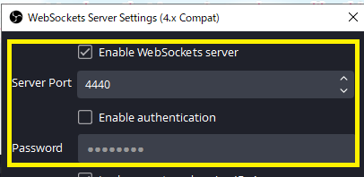
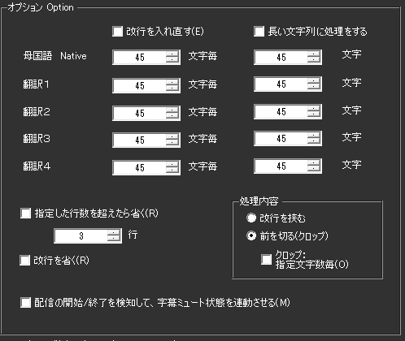
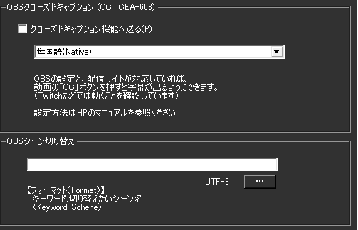
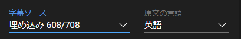

!!! Info "このプラグインを使う前に"
    * OBS Studio と OBS WebSocket 4.9.1が必要です
    * OBS WebSocket 5（最新版）では動作しません。必ず4.9.1を使ってください

## このプラグインで出来ること

* OBS Studioに直接字幕を表示できます（テキストソース自動更新）
* 原文＋4言語の翻訳字幕を同時表示
* 長い文章を自動で改行・分割
* 話者ごとに異なる場所に字幕表示
* 配信中の字幕ON/OFF切り替え
* 自動でOBSのシーンを切り替え

##　有効化


* プラグインを使うチェックをONにしてください。

!!! Warning "OBS WebSocket 5の環境ではこのプラグインは使えません"
    * OBS WebSocket 5 (OBS v28～)の環境で通信を開始するとフリーズします
    * OBSの通信仕様が大きく変わったためです。バージョンを確認して使ってください。
    * このプラグインの対象となるOBSの設定画面はこちら側です

    

## 設定



### 基本接続設定

|設定|詳細説明|設定例|重要度|
|:--|:---|:---|:---|
|通信先|**IPアドレス:ポート番号**で指定<br>・同じPC: `127.0.0.1:4444`<br>・別PC: `192.168.1.100:4444`<br>・ポート番号はOBS設定で確認|`127.0.0.1:4444`|★★★|
|パスワード|OBSで設定したパスワードと一致させる<br>・空欄の場合は認証なし<br>・設定推奨（セキュリティ向上）|`mypassword123`|★★☆|

### 字幕送信設定

|設定|詳細説明|設定例|注意点|
|:--|:---|:---|:---|
|母国語|原文を送るOBSテキストソース名<br>**重要**: 大文字小文字、全角半角を正確に|`日本語字幕`|ソース名は完全一致必須|
|翻訳1-4|各翻訳結果を送るソース名<br>・使わない場合は空欄でOK|`English_Sub`|英語ソース名は半角推奨|
|話者名追加|チェックすると「ソース名+話者名」で動的ソース作成<br>・例: `配信者` → `配信者田中`、`配信者佐藤`|チェックON/OFF|話者が多い場合に便利|

### ポート番号の確認方法

#### OBS側での確認手順
1. OBS Studio を開く
2. `ツール` → `WebSocket サーバー設定`
3. 表示されたポート番号を確認
4. ゆかコネの設定に入力

#### よくあるポート番号
| OBSバージョン | デフォルトポート | 備考 |
|:-------------|:---------------|:-----|
| OBS v27以前 | 4444 | WebSocket v4.9.1 |
| OBS v28以降 | 4455 | **非対応** |
| カスタム設定 | 任意 | OBS設定で変更可能 |

!!! Top "OBS側の設定"
     

    * ポート番号やパスワードなどはOBS側の設定とNEOの設定を一致させてください。
    * 設定値は自分で決めて一致させる形で構いません。


!!! Tip "ソース名の先頭が一致するすべてのソースに送付"
    * シーンをいくつかに分けていて複数のソースに字幕を送る場合に使用します。
    
    === "設定例"
        * ``日本語1`` ``日本語2``というソースがあり、すべてに送る場合
            * 母国語に ``日本語``と指定
            * ソース名の先頭が一致するすべてのソースに送付をONに


!!! Note "送信先は存在するソース名を設定してください"
    * 「ソース名が設定されているが以前OBSから返答された名前がない場合」は、<br>
    　なんどか「ほんとにソース名がないのか」を問い合わせするようにしています。 <br>
    　その場合、通信負荷がかかるため、必ず存在する名前を設定してください。
    * PCにかかる負荷が高い場合は、"ソース名の先頭が一致するすべてのソースに送付"を使わず<br>
    　OBS側で「コピー(参照)」をうまく使ってみてください。
    　




|設定|意味|
|:--|:---|
|書き出し先|配信ソフトに読み込ませるためのテキストファイルを置く場所を指定します|
|改行を入れなおす|文字数毎に改行を入れます|
|長い文字列に処理をする|指定した文字列を超えた場合にクロップ処理をします|
|指定した行数を超えたら省く|処理した結果指定行数を超えたら、末尾の「指定した行数」を表示します|
|改行を省く|処理を始める前に、最初に改行を省きます|
|処理内容|条件に当てはまる場合に改行を入れるか、省く（クロップ）するかを選びます|
|字幕ミュート状態を連動|配信をONにしたときに字幕ミュートを解除し、配信OFFと同時に字幕をミュートします|

!!! Tip "字幕のミュートについて"
    * 配信後に字幕が見えていると都合が悪い場合に使います。<br> 例）配信＋Discord画面共有などをしている場合
    * 意図せず認識結果が他者に見えることを防止します




|設定|意味|
|:--|:---|
|クローズドキャプション|OBSにクローズドキャプション信号として字幕をおくります|
|OBSsシーン切り替え|特定のキーワードが含まれていたらシーンを切り替える指示をだします|

!!! Tip "クローズドキャプションについて"
    * 配信サイトが対応している場合に機能します。
    * 現段階で対応が確認できているのは ``YouTube``や``Twitch``になります。
    * YouTubeの場合は、配信設定の字幕のところで 「608/607」を有効にします。
    
    * Twitchの場合は、特に設定不要で反映されます。
    * 字幕が表出するタイミング、維持する時間などは配信サイトに一任されます。

## よくある問題と解決方法

### 接続エラー

| 症状 | 原因 | 解決方法 | チェック項目 |
|:---|:---|:---|:---|
| **「接続できません」エラー** | ポート番号違い | OBS設定画面でポート確認 | ✓ WebSocket有効化<br>✓ ポート番号一致<br>✓ OBS起動中 |
| **「認証エラー」表示** | パスワード不一致 | パスワード再確認・再設定 | ✓ パスワード大文字小文字<br>✓ OBS側設定確認 |
| **「タイムアウト」エラー** | OBSが応答しない | OBSを再起動 | ✓ OBSの負荷状態<br>✓ プラグイン競合 |

### 字幕表示の問題

| 症状 | 原因 | 解決方法 | 確認方法 |
|:---|:---|:---|:---|
| **字幕が表示されない** | ソース名間違い | ソース名の完全一致確認 | OBSソース名をコピペで設定 |
| **一部の字幕のみ表示** | テキストソース未作成 | OBSで必要なテキストソース作成 | ソースリストで存在確認 |
| **文字化けする** | フォント問題 | OBSテキストソースのフォント変更 | 日本語対応フォント選択 |
| **字幕が重複表示** | 複数接続 | ゆかコネプラグイン重複確認 | 他のOBS連携プラグイン無効化 |

### パフォーマンスの問題

| 症状 | 原因 | 解決方法 |
|:---|:---|:---|
| **OBSがフリーズ** | WebSocket過負荷 | 「話者名追加」機能をOFF |
| **字幕更新が遅い** | ネットワーク遅延 | ローカル接続確認（127.0.0.1） |
| **CPU使用率が高い** | 頻繁な更新処理 | 更新間隔を調整・不要ソース削減 |

### 設定確認チェックリスト

#### OBS側の確認
- [ ] WebSocketサーバーが有効になっている
- [ ] ポート番号が正しい（通常4444）
- [ ] パスワード設定が一致している（設定している場合）
- [ ] テキストソースが存在している
- [ ] ソース名が正確（大文字小文字・全角半角含む）

#### ゆかコネ側の確認  
- [ ] プラグインが有効になっている
- [ ] 通信先IPアドレスが正しい
- [ ] ポート番号がOBSと一致している
- [ ] ソース名がOBSと完全一致している
- [ ] 他のOBS連携プラグインと競合していない

### OBSシーン切り替え設定の作り方

!!! Info "編集方法"
    * Excel もしくは メモ帳で実施します。

=== "Case1:Excelの場合"

    ||A|B|
    |:-|:-|:-|
    |1|これで今日の配信はおしまい|終了シーン|
    
    1. Excelでデータを作ります。

    2. CSVファイルとして保存します。

    
    
=== "Case2:メモ帳の場合"

    1. 下記のようなファイルを作ります。

    ``` js
    これで今日の配信はおしまい,終了シーン
    ```
    2. CSV（UTF8エンコード)で保存します。

    

## 高度な機能

### 多言語字幕システム

#### 5チャンネル構成
| チャンネル | デフォルト名 | 用途 |
|:-----------|:-------------|:-----|
| 母国語 | "日本語" | 原文表示 |
| 翻訳1 | "英語" | 第1翻訳言語 |
| 翻訳2 | (設定可能) | 第2翻訳言語 |
| 翻訳3 | (設定可能) | 第3翻訳言語 |
| 翻訳4 | (設定可能) | 第4翻訳言語 |

#### 複数ソース対応
* **前方一致送信**: ソース名の先頭一致で複数ソースに同時送信
* **話者名追加**: `ソース名+話者名` での動的ソース生成
* **参照コピー最適化**: OBS側の参照コピー機能との連携推奨

### テキスト処理システム

#### スマート分割機能
* **自然言語境界**: 単語境界での適切な分割
* **文字数制限**: 1-300文字の可変制限設定
* **行数制御**: 1-300行の表示行数制限
* **クロッピング方式**: 
  - 先頭削除（"…"付与）
  - 末尾表示（指定行数維持）

#### 改行処理オプション
* **改行除去**: 全改行の一括削除
* **改行再挿入**: 指定文字数での自動改行
* **スマート整形**: 自然な区切りでの改行

### 自動シーン切り替え

#### CSV辞書システム
* **キーワード検出**: 発言内容による自動シーン変更
* **形式**: "検出キーワード, 切り替えシーン名"
* **例**: "配信終了, 終了画面"

#### 実行タイミング
* **即座切り替え**: キーワード検出と同時に実行
* **優先順位**: CSVファイルの上から順に判定

### クローズドキャプション

#### CEA-608対応
* **YouTube**: 配信設定で "608/607" を有効化
* **Twitch**: 自動対応（設定不要）
* **配信サイト制御**: タイミング・表示時間は各サイトに依存

### ストリーミング連動

#### 字幕ミュート機能
* **配信開始**: 字幕ミュート自動解除
* **配信終了**: 字幕ミュート自動適用
* **用途**: Discord画面共有等での意図しない表示防止

### 技術実装詳細

#### WebSocket v4統合
* **プロトコル**: OBS WebSocket v4.9.1対応
* **接続管理**: 自動再接続機能
* **ソース検出**: GDI+/FreeType2テキストソース対応

#### パフォーマンス最適化
* **存在確認**: ソース名の効率的な検証
* **通信負荷軽減**: 存在しないソースの問い合わせ最小化
* **マルチスレッド**: 非同期テキスト処理

### 実用例

#### 多言語配信
```
母国語: "こんにちは皆さん"
翻訳1: "Hello everyone" 
翻訳2: "Hola a todos"
翻訳3: "Bonjour tout le monde"
```

#### シーン切り替え設定
```csv
"ゲーム開始", "ゲーム画面"
"休憩します", "休憩画面"  
"配信終了", "エンディング"
```

#### 話者別ソース
- 設定: ソース名 "配信者", 話者名追加 ON
- 結果: "配信者田中", "配信者佐藤" 等に自動分散

### トラブルシューティング

#### 接続できない
* **ポート番号**: OBS設定との一致確認（4440/4444）
* **パスワード**: OBS WebSocket設定の確認
* **バージョン**: WebSocket v4対応の確認

#### テキストが表示されない
* **ソース名**: 正確なOBSソース名の設定
* **テキスト形式**: GDI+またはFreeType2テキストソース使用
* **文字数制限**: 制限値の適切な設定

## 使うとき
* プラグイン画面で「OBSに接続」をおします。
* 音声認識と同時に字幕が転送されます。
