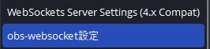

!!! Info "前提条件"
    * [OBS Studio v28](https://github.com/obsproject/obs-studio/releases/download/)以降を使用していること
    
!!! Tip "OBS WebSocketについて"
    * OBS Studio v28からは、デフォルトでWebSocket機能が備わっています。

## このプラグインで出来ること

* OBS Studioの字幕レイアウトを直接書き換えることで字幕をきれいに表示できます
* **AI要約生成機能**（GPT-4.1-mini統合）
* ブラウザソース用CSS動的スタイリング
* 5チャンネル多言語字幕対応
* 配信自動開始・停止検出
* 要約の多言語ローテーション表示
* 外部APIによる拡張制御

##　有効化


* プラグインを使うチェックをONにしてください。

!!! Warning "OBS WebSocket 4の環境ではこのプラグインは使えません"
    * OBSの通信仕様が大きく変わったためです。バージョンを確認して使ってください。
    * このプラグインの対象となるOBSの設定画面はこちら側です

    

## 設定


|設定|意味|
|:--|:---|
|通信先|字幕を送付したいOBSを指定します。<br>※ポート番号はバージョンによって``4440``・``4444``・``4455``とばらつきがあるのでOBSで確認してください|
|パスワード|パスワードを設定していれば入れます|
|送信先|指定した文字列を超えた場合にクロップ処理をします|
|ソース名＋…|話者毎にテキストを分ける場合に指定します|

!!! Top "OBS側の設定"
     

    * ポート番号やパスワードなどはOBS側の設定とNEOの設定を一致させてください。
    * 設定値は自分で決めて一致させる形で構いません。
    * v2.1.109以降、パスワードが空欄の場合は自PCにはいっているOBSのパスワードが自動入力されます。

!!! Tip "ソース名の先頭が一致するすべてのソースに送付"
    * シーンをいくつかに分けていて複数のソースに字幕を送る場合に使用します。
    
    === "設定例"
        * ``日本語1`` ``日本語2``というソースがあり、すべてに送る場合
            * 母国語に ``日本語``と指定
            * ソース名の先頭が一致するすべてのソースに送付をONに


!!! Note "送信先は存在するソース名を設定してください"
    * 「ソース名が設定されているが以前OBSから返答された名前がない場合」は、<br>
    　なんどか「ほんとにソース名がないのか」を問い合わせするようにしています。 <br>
    　その場合、通信負荷がかかるため、必ず存在する名前を設定してください。
    * PCにかかる負荷が高い場合は、"ソース名の先頭が一致するすべてのソースに送付"を使わず<br>
    　OBS側で「コピー(参照)」をうまく使ってみてください。
    　


|設定|意味|
|:--|:---|
|書き出し先|配信ソフトに読み込ませるためのテキストファイルを置く場所を指定します|
|改行を入れなおす|文字数毎に改行を入れます|
|長い文字列に処理をする|指定した文字列を超えた場合にクロップ処理をします|
|指定した行数を超えたら省く|処理した結果指定行数を超えたら、末尾の「指定した行数」を表示します|
|改行を省く|処理を始める前に、最初に改行を省きます|
|処理内容|条件に当てはまる場合に改行を入れるか、省く（クロップ）するかを選びます|
|字幕ミュート状態を連動|配信をONにしたときに字幕ミュートを解除し、配信OFFと同時に字幕をミュートします|

!!! Tip "字幕のミュートについて"
    * 配信後に字幕が見えていると都合が悪い場合に使います。<br> 例）配信＋Discord画面共有などをしている場合
    * 意図せず認識結果が他者に見えることを防止します


|設定|意味|
|:--|:---|
|クローズドキャプション|OBSにクローズドキャプション信号として字幕をおくります|
|OBSsシーン切り替え|特定のキーワードが含まれていたらシーンを切り替える指示をだします|

!!! Tip "クローズドキャプションについて"
    * 配信サイトが対応している場合に機能します。
    * 現段階で対応が確認できているのは ``YouTube``や``Twitch``になります。
    * YouTubeの場合は、配信設定の字幕のところで 「608/607」を有効にします。
    
    * Twitchの場合は、特に設定不要で反映されます。
    * 字幕が表出するタイミング、維持する時間などは配信サイトに一任されます。

### OBSシーン切り替え設定の作り方

!!! Info "編集方法"
    * Excel もしくは メモ帳で実施します。

=== "Case1:Excelの場合"

    ||A|B|
    |:-|:-|:-|
    |1|これで今日の配信はおしまい|終了シーン|
    
    1. Excelでデータを作ります。

    2. CSVファイルとして保存します。

    
    
=== "Case2:メモ帳の場合"

    1. 下記のようなファイルを作ります。

    ``` js
    これで今日の配信はおしまい,終了シーン
    ```
    2. CSV（UTF8エンコード)で保存します。

    

## 高度な機能

### AI要約生成システム

#### GPT-4.1-mini統合
* **自動要約**: 配信内容の定期的なAI要約生成
* **カスタムフォーマット**: "【$title】$summary" 形式
* **多言語対応**: 要約の自動翻訳機能
* **タイマー設定**: 1-120分間隔での定期実行

#### 要約設定
| 設定項目 | 説明 | デフォルト |
|:---------|:-----|:----------|
| 要約間隔 | 自動要約の実行間隔（分） | 5分 |
| 対象行数 | 要約対象とする最新N行 | 10行 |
| ローテーション | 多言語要約の循環表示 | 有効 |
| 配信連動 | 配信開始・停止との自動連動 | 有効 |

### CSS スタイリング機能

#### ブラウザソース対応
* **動的CSS注入**: `{ync.text}` プレースホルダーによる動的スタイリング
* **ソース別設定**: 各字幕ソースに個別のCSSテンプレート
* **リアルタイム更新**: テキスト変更に合わせたスタイル適用

#### CSSテンプレート例
```css
/* 基本スタイリング */
.subtitle {
  color: white;
  background: rgba(0,0,0,0.7);
  font-size: 24px;
  padding: 10px;
}

/* 動的テキスト */
.content::before {
  content: "{ync.text}";
}
```

### 配信自動連動

#### ストリーミング検出
* **開始検出**: OBS配信開始の自動検知
* **終了検出**: 配信停止の自動検知  
* **字幕制御**: 配信状態に応じた字幕表示制御
* **要約自動化**: 配信終了時の最終要約生成

### 外部API制御

#### 拡張コマンド
| コマンド | パラメータ | 機能 |
|:---------|:----------|:-----|
| `SetScene` | sceneName | 指定シーンに切り替え |
| `StartReplayBuffer` | - | リプレイバッファー開始 |
| `StopReplayBuffer` | - | リプレイバッファー停止 |
| `SetSourceText` | sourceNo, text | 特定ソースにテキスト設定 |

#### API使用例
```javascript
// シーン切り替え
plugin.onCommand({
  "target": "Plugin_OBS5",
  "command": "SetScene", 
  "sceneName": "ゲーム画面"
});

// 特定ソースにテキスト設定
plugin.onCommand({
  "target": "Plugin_OBS5",
  "command": "SetSourceText",
  "sourceNo": "1",
  "text": "カスタムメッセージ"
});
```

### 技術実装詳細

#### WebSocket v5統合
* **プロトコル**: OBS WebSocket v5対応（ポート4455）
* **自動構成**: OBS接続の自動セットアップ
* **改良された接続管理**: より安定した接続・再接続処理

#### AI統合機能
* **GPTモデル**: GPT-4.1-mini使用
* **プロンプト最適化**: 配信内容要約用の特化プロンプト
* **メモリ管理**: 会話履歴の自動クリーンアップ（50項目制限）

#### パフォーマンス最適化
* **マルチタイマー**: 複数の独立したタイマーシステム
* **非同期処理**: UIブロッキングを避けた背景処理
* **自動復旧**: API失敗時の適切な回復処理

### 実用的な活用例

#### AI要約配信
1. **設定**: 5分間隔での自動要約
2. **実行**: GPT-4による内容要約
3. **表示**: 要約を専用ソースで表示
4. **多言語**: 翻訳版要約のローテーション

#### 高度なブラウザソース
```css
/* グラデーション字幕 */
.subtitle {
  background: linear-gradient(45deg, #ff6b6b, #4ecdc4);
  -webkit-background-clip: text;
  -webkit-text-fill-color: transparent;
}

/* アニメーション付きテキスト */
@keyframes slideIn {
  from { transform: translateX(-100%); }
  to { transform: translateX(0); }
}

.subtitle {
  animation: slideIn 0.5s ease-out;
}
```

#### 配信自動化
* **開始時**: 要約タイマー自動スタート
* **配信中**: 定期的な内容要約生成
* **終了時**: 最終要約の自動生成・表示

### トラブルシューティング

#### AI要約が生成されない
* **APIキー**: OpenAI APIキーの設定確認
* **要約間隔**: 適切な間隔設定（1-120分）
* **対象行数**: 十分な対話履歴の存在確認

#### CSS が適用されない
* **ブラウザソース**: ソースタイプの確認
* **プレースホルダー**: `{ync.text}` の正確な記述
* **CSS文法**: 有効なCSS記述の確認

#### 接続が不安定
* **ポート設定**: OBS WebSocket v5のポート（4455）確認
* **パスワード**: OBS設定との一致確認
* **自動構成**: 自動設定機能の利用検討

## 使うとき
* プラグイン画面で「OBSに接続」をおします。
* 音声認識と同時に字幕が転送されます。
