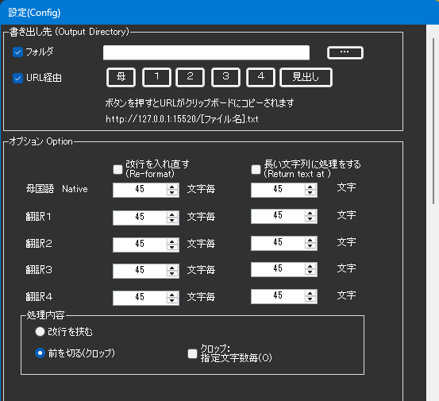
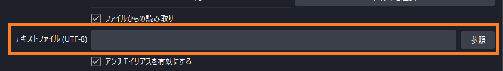

!!! Info "前提条件"
    * なし

## このプラグインで出来ること

* テキスト読み込み対応の配信ソフトで字幕を表示できます

!!! Info "OBS Studioの場合"
    * この方法よりもOBS WebSocketを使う方が負荷を下げられます

##　有効化

* プラグインを使うチェックをONにしてください。

## 設定

|設定|意味|
|:--|:---|
|書き出し先|配信ソフトに読み込ませるためのテキストファイルを置く場所を指定します|
|改行を入れなおす|文字数毎に改行を入れます|
|長い文字列に処理をする|指定した文字列を超えた場合にクロップ処理をします|
|指定した行数を超えたら省く|処理した結果指定行数を超えたら、末尾の「指定した行数」を表示します|
|改行を省く|処理を始める前に、最初に改行を省きます|
|処理内容|条件に当てはまる場合に改行を入れるか、省く（クロップ）するかを選びます|
|ソース名＋…|話者毎にテキストを分ける場合に指定します|

## 使うとき

* 音声認識と同時にファイルが生成されます。

|ファイル名|意味|
|:--|:---|
|Native.txt|母国語|
|Translate1.txt|翻訳語１|
|Translate2.txt|翻訳語２|
|Translate3.txt|翻訳語３|
|Translate4.txt|翻訳語４|

* これらのファイルを配信ソフトで読み込みます。

!!! Info "話者毎に分ける場合"
    * ゆかりねっとコネクターNEOが認識している名前毎にファイルが分かれます  例）``Native_nao.txt``
    * このファイルを読み込むことで話者毎の表示が実現できます
    * 話者の名前には、ファイル禁則文字を使わないでください 例）``*``や``￥``など
    