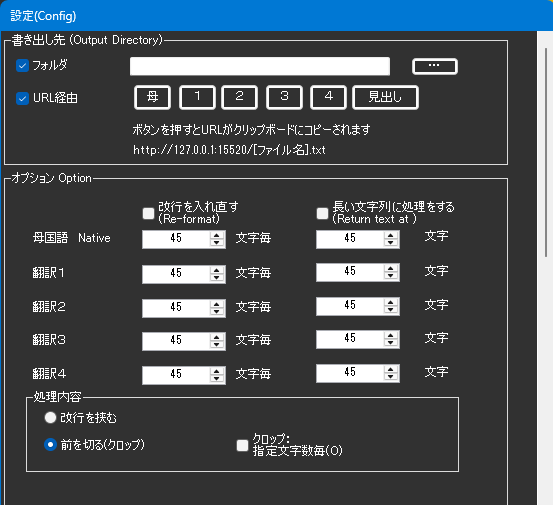
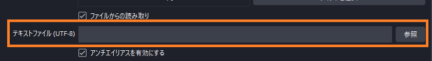

!!! Info "前提条件"
    * なし

## このプラグインで出来ること

* テキスト読み込み対応の配信ソフトで字幕を表示できます
* 字幕をテキストファイルとして書き出します
* 書き出した内容を、ゆかコネNEOのWebサーバ経由でも取得できます

!!! Info "OBS Studioの場合"
    * この方法よりもOBS WebSocketを使う方が負荷を下げられます

##　有効化


* プラグインを使うチェックをONにしてください。

## 設定



|設定|意味|
|:--|:---|
|書き出し先|配信ソフトに読み込ませるためのテキストファイルを置く場所を指定します|
|改行を入れなおす|文字数毎に改行を入れます|
|長い文字列に処理をする|指定した文字列を超えた場合にクロップ処理をします|
|指定した行数を超えたら省く|処理した結果指定行数を超えたら、末尾の「指定した行数」を表示します|
|改行を省く|処理を始める前に、最初に改行を省きます|
|処理内容|条件に当てはまる場合に改行を入れるか、省く（クロップ）するかを選びます|
|ベース名＋…|話者毎にテキストを分ける場合に指定します|
|ファイル名の指定|ツールでファイル名が指定されているときは、これで名前を合わせます|
|要約を書き出す|会話の要約を ``Summary.txt`` に書き出します|
|要約フォーマット|要約の書き方を指定します（既定 ``【$title】$summary``）|
|脚注を書き出す|脚注を ``Footnote.txt`` に書き出します|
|HTTPで公開する|ファイルの内容をゆかコネNEOのWebサーバからも取得できるようにします|
|書き出し先を使わない|ファイルの書き出しを止めて、HTTP経由だけで使います|

!!! Info "要約フォーマットで使えるパラメータ"
    |パラメータ|意味|
    |:--|:--|
    |``$title``|要約の見出し|
    |``$summary``|要約の本文|

## 使うとき

* 音声認識と同時にファイルが生成されます。

* 標準ファイル名と内容は以下の通りです。

|ファイル名|意味|
|:--|:---|
|Native.txt|母国語|
|Translate1.txt|翻訳語１|
|Translate2.txt|翻訳語２|
|Translate3.txt|翻訳語３|
|Translate4.txt|翻訳語４|
|Summary.txt|会話の要約（「要約を書き出す」がONのとき）|
|Footnote.txt|脚注（「脚注を書き出す」がONのとき）|

* これらのファイルを配信ソフトで読み込みます。


!!! Info "話者毎に分ける場合"
    * ゆかコネNEOが認識している名前毎にファイルが分かれます<br> 例）``Native_nao.txt``
    * このファイルを読み込むことで話者毎の表示が実現できます
    * 話者の名前には、ファイル禁則文字を使わないでください<br>例）``*``や``￥``など

## HTTP経由で読み込む

* 「HTTPで公開する」をONにすると、同じ内容をゆかコネNEOのWebサーバからも取得できます。
* ファイルを経由しないので、配信ソフトのブラウザソースから直接読み込めます。

```
<ベースURL>/Native.txt
<ベースURL>/Translate1.txt
```

* ベースとなるアドレスは、プラグインの設定画面に表示されています。
* 話者ごとに分ける設定にしている場合は ``<ベースURL>/Native_nao.txt`` のようになります。
* 「書き出し先を使わない」をONにすると、フォルダへのファイル出力を止めてHTTPだけで使えます。書き込みが頻繁に起きるのを避けたい場合に向いています。

!!! Info "ほかのパソコンから読み込む場合"
    既定では同じパソコンの中からしか接続できません。ほかの端末から読みたい場合は「ネットワークの設定」画面の設定が必要です。詳しくは [オプション設定](../startup/startup_option.md) をご覧ください。
