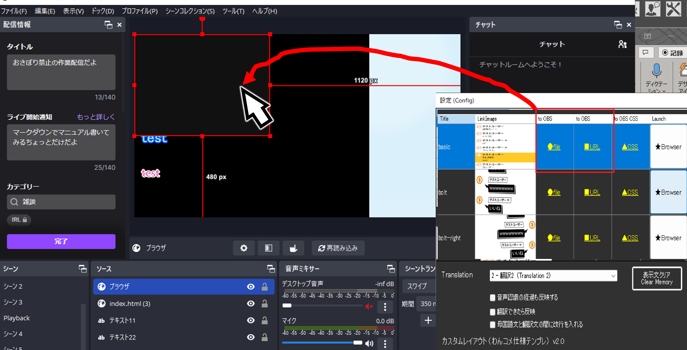
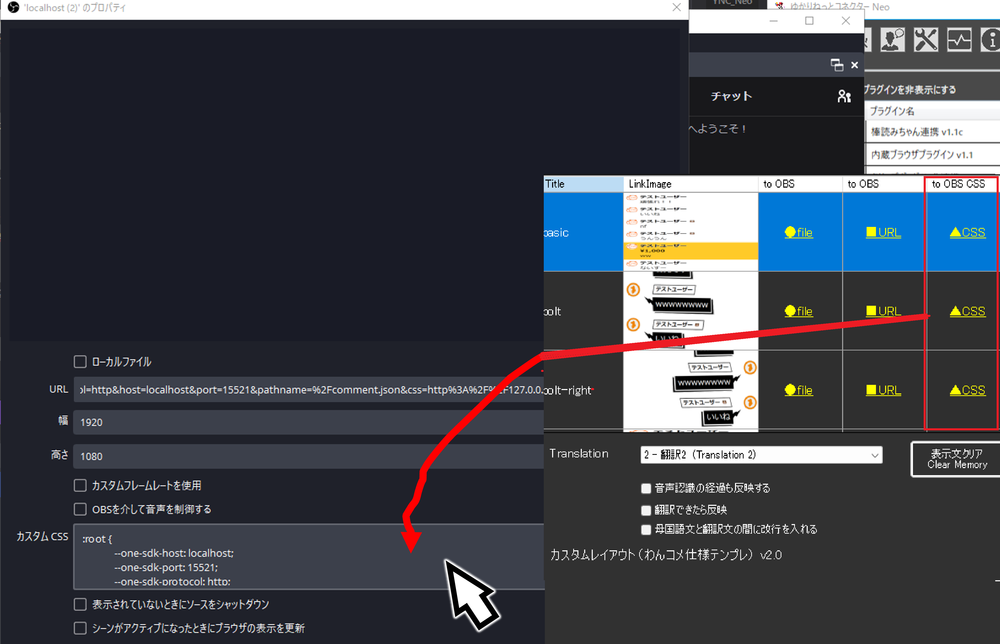
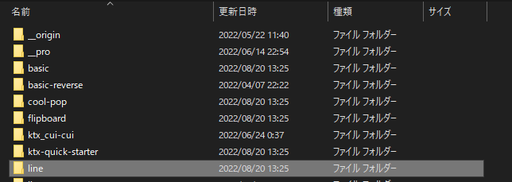

!!! Info "前提条件"
    * [わんコメ](https://onecomme.com/) v3.2以上を使用していること

## このプラグインで出来ること

* わんコメのテンプレートをつかって字幕を出します。

!!! Tips "謝辞"
    * この機能の実現のために、わんコメ作者アスティさんの許諾と技術支援をうけています。

##　有効化

* プラグインを使うチェックをONにしてください。

## 使い方

### 連携で動かす場合
* わんコメを立ち上げます。

!!! warning "使用途中でわんコメを終了させないでください"
    * わんコメは連動してうごいています。途中で終了すると表示が正常にできなくなります。

!!! Success "わんコメ　Pro版について"
    * Pro版をご利用の方は、この機能もPro版の「動作が速いテンプレート」が利用できます。

* プラグインの画面をだします。

!!! Tips "表に何も表示されない場合"
    * 「わんコメのテンプレートを直接使う」のチェックがONか確認します
    * リロードボタン（丸まった矢印のボタン）を押します

* 「to OBS」の ●file もしくは ■URLをOBSにドラック＆ドロップします。

* 「to OBS CSS」を CSS枠 にドラック＆ドロップします。

* その後、音声認識すると、わんコメのレイアウトをつかった字幕が表示されます。

### 単独で動かす場合
!!! Success "こちらのモードは、わんコメの起動は不要です"
    * こちらのモードであれば、単独で動くためわんコメの起動は不要です。

* まず、テンプレートフォルダを開きます

* ここにテンプレートを入れてください。

* プラグインのリスト一覧に表示されれば、あとは前述の方法で設定すれば使えます。

!!! Tips "動作に必要なファイル"
    * ``__origin`` と ``__pro`` は必須です。
    * 上記２つのファイルは、ご自身が使用中のわんコメフォルダからコピーしてください。
    * 上記２つのファイルは、他人からもらうことはできません。（わんコメをインストールし入手してください）
    * テンプレート自体はネット上で公開されているものがあるのでご活用ください

## その他

!!! Tips "音声認識の経過を表示する場合"
    * 「音声認識の経過も反映する」をONにします。

!!! info "このプラグインにはAPIがあります"
    * このプラグインを有効にすると、[わんコメ仕様API](../tech/tech_api_plugin_oc.md)の機能を使えます。

