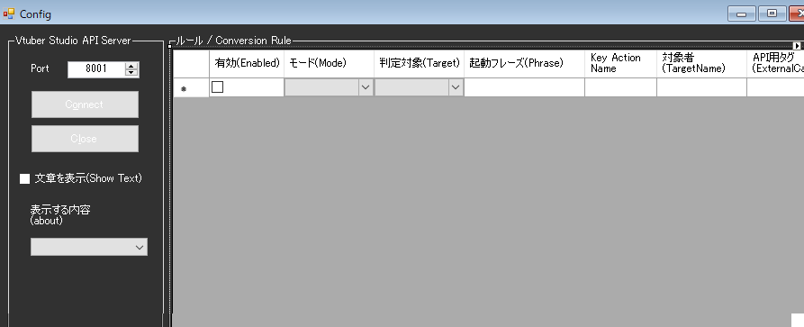

!!! Info "前提条件"
    * [Vtube Studio](https://store.steampowered.com/app/1325860/VTube_Studio/?l=japanese)が動作することが必要です
    * APIの有効化が必要です

## このプラグインで出来ること

* 音声認識の結果にあわせて、キーバインドアクションを起動できます

##　有効化

* プラグインを使うチェックをONにしてください。

## 設定

|設定|意味|
|:--|:---|
|Port|Vtube Studioと接続する通信ポート番号を指定します。デフォルトは　``8001`` です。|

## ルール

* ルールは、条件に一致したときにそのデータを送付することができる「仕掛け」です
* 条件成立したときにアバターにアクションを起こさせることができます。

|設定|意味|
|:--|:---|
|有効(Enabled)|この条件を有効化します|
|モード(Mode)|条件の判断モードを指定します|
|対象|対象にする言語を決めます（母国語、翻訳１～４）|
|起動フレーズ|判断に使う起動キーワードです|
|Key Action|Vtube Studioに設定しているキーバインドの設定名を入れます |
|対象者|話者名に指定文字が含まれているときに反応します。空欄の場合は全員が対象です|
|APIタグ|APIから呼び出すときにつかうタグ名です|

## 使い方
1. Vtube Studioを起動します
2. Vtube StudioのAPI機能をONにします
3. Openをおして通信を開始します
4. Vtube Studio側に許可ダイアログがでますので、許可をしてください
5. 音声認識させると、条件成立次第キーバインドアクションが実行されます

