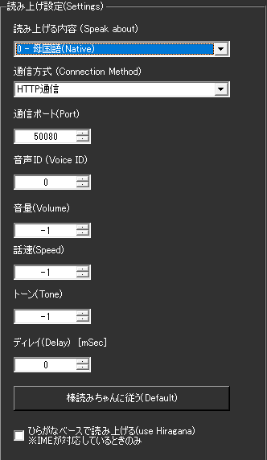

!!! Info "前提条件"
    * 棒読みちゃんの通信ポートがひらいていること
    * 棒読みちゃんが起動していること

## このプラグインで出来ること

* 棒読みちゃんをつかって音声認識結果を読み上げできます。

##　有効化

* プラグインを使うチェックをONにしてください。

## 設定

### 読み上げ設定

|設定項目|説明|設定値|デフォルト|
|:--|:---|:---|:---|
|読み上げる内容|何を読み上げさせるか選択|原文のみ/翻訳のみ/両方|原文のみ|
|通信方式|棒読みちゃんとの通信方法|HTTP/TCP|HTTP推奨|
|ポート|棒読みちゃんの通信ポート|数値|50001|
|音声ID|使用する音声の種類|数値|0（デフォルト音声）|
|音量|再生音量|0-100 または -1|50 （-1で棒読みちゃん設定優先）|
|話速|読み上げ速度|0-200 または -1|100 （-1で棒読みちゃん設定優先）|
|トーン|音声のトーン（高さ）|0-200 または -1|100 （-1で棒読みちゃん設定優先）|
|ディレイ|読み上げ開始の遅延時間|ミリ秒|0|

### 特殊機能

#### 棒読みちゃんに従う（Defaultボタン）
* 全ての音声設定を棒読みちゃんのデフォルト値に一括設定
* 音量・話速・トーンが全て -1 に設定される
* 棒読みちゃん側の設定で音声を統一制御したい場合に便利

#### ひらがなベースで読み上げ
* **チェック時**: IME辞書で漢字を全てひらがなに変換してから送信
* **UDトーク併用時**: 認識時のひらがな読みを直接使用
* 読み間違いの軽減に効果的

## 使うとき

1. 棒読みちゃんを立ち上げます。
1. ゆかコネNEOで音声認識をしましょう。
1. 文章が確定すると同時に棒読みちゃんで読み上げが行われます。
