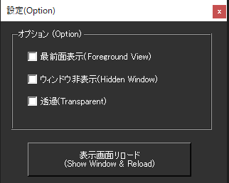

!!! Info "前提条件"
    * 特になし

## このプラグインで出来ること

* 字幕レイアウトを表示できます
* この機能は、内蔵するブラウザを使うことで全面表示や省エネによる字幕停止などを避けるために使います。

!!! warning "ゆかりねっとコネクターNEOの中でブラウザが動くため、少し負荷がかかります"

##　有効化

* プラグインを使うチェックをONにしてください。

## 設定

|設定|意味|
|:--|:---|
|最前面表示|ウィンドウを全面に持っていきます|
|ウィンドウ非表示|ウィンドウ枠を消します|
|透過|背景を透過します|

## 使うとき

* 起動時にウィンドウが表示されます。特に設定せずとも画面がでます。
* ウィンドウを閉じた場合は設定画面から再表示してください
