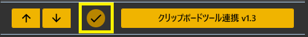
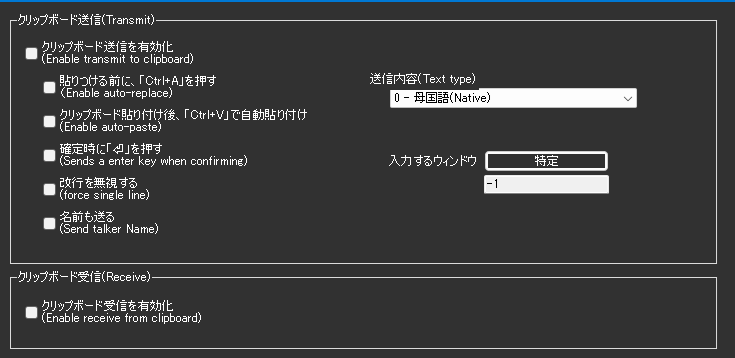

!!! Info "前提条件"
    * Windwosのクリップボードにアクセスできる場合のみ使用可能

## このプラグインで出来ること

* **音声認識結果のクリップボード転送**：確定したテキストを自動的にクリップボードに送信
* **高度な自動入力機能**：特定のアプリケーションに直接テキストを自動入力
* **双方向クリップボード連携**：クリップボードからゆかコネNEOへの受信も可能
* **話者名付き転送**：認識したテキストに話者名を自動付加
* **ウィンドウ指定機能**：対象アプリケーションを指定した確実な入力

##　有効化



* プラグインを使うチェックをONにしてください。

## 設定



### 送信設定

#### 基本設定
|設定項目|説明|選択肢|
|:--|:---|:---|
|クリップボード送信|音声認識結果をクリップボードに送信|有効/無効|
|送信内容|送信するテキストの種類|母国語/翻訳1-4/母国語+翻訳1|

#### 自動化オプション
|設定項目|説明|効果|
|:--|:---|:---|
|自動貼り付け|クリップボード転送後、Ctrl+Vを自動実行|対象アプリに即座に貼り付け|
|全選択してから貼り付け|貼り付け前にCtrl+Aを実行|既存テキストを完全置換|
|確定時にエンター送信|テキスト確定時に⏎キーを送信|チャット等での自動送信|
|改行を無視|改行文字を削除して1行にまとめる|単行入力欄での利用に最適|
|名前も送る|話者名をテキストに付加|「話者名／\r\n[内容]」形式で送信|

#### 対象ウィンドウ指定
* **「特定」ボタン**: 入力対象のウィンドウを選択
* **ハンドル表示**: 選択されたウィンドウのハンドル番号を表示
* **フォアグラウンド化**: 指定ウィンドウを自動的に前面に表示

### 受信設定
|設定項目|説明|
|:--|:---|
|クリップボード受信|クリップボードからゆかコネNEOへのテキスト取り込み|

## 高度な使用例

### 1. ライブ配信でのコメント自動入力
```
設定：
- 送信内容：母国語
- 自動貼り付け：有効
- 確定時にエンター送信：有効
- 対象ウィンドウ：配信ソフトのコメント欄を指定
```

### 2. 翻訳結果の文書作成
```
設定：
- 送信内容：母国語+翻訳1
- 名前も送る：有効
- 全選択してから貼り付け：無効（追記モード）
- 対象ウィンドウ：テキストエディタを指定
```

### 3. チャットアプリケーション連携
```
設定：
- 送信内容：翻訳1
- 自動貼り付け：有効
- 確定時にエンター送信：有効
- 改行を無視：有効（チャット用）
```

### タイミング制御
* クリップボード設定後の待機：50ms
* ウィンドウフォーカス後の待機：250ms
* 段階的なキー送信で確実な入力を実現

## トラブルシューティング

### 自動入力が失敗する場合
1. **ウィンドウ指定の確認**：「特定」ボタンで正しいウィンドウを選択
2. **アプリケーション権限**：管理者権限で実行が必要な場合あり
3. **入力フォーカス**：対象アプリがアクティブになっているか確認

### クリップボードが更新されない場合  
1. **Windows設定**：クリップボード履歴が有効になっているか確認
2. **他アプリとの競合**：クリップボード管理ツールとの競合を確認
3. **権限問題**：セキュリティソフトによるクリップボードアクセス制限
