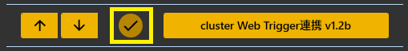
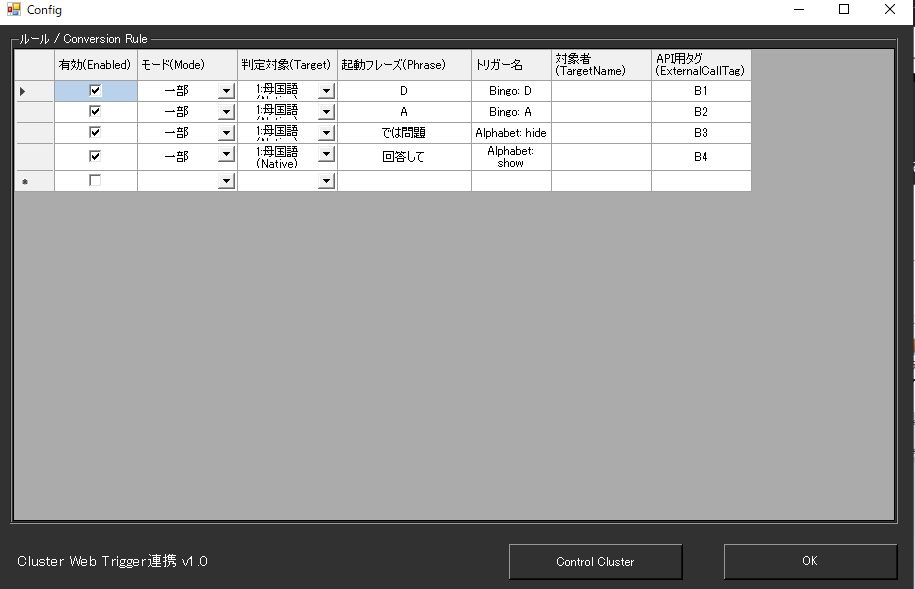
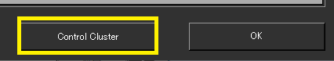
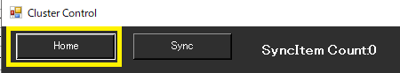
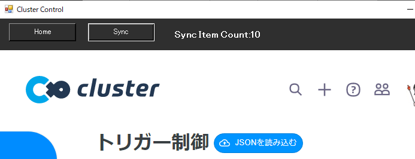
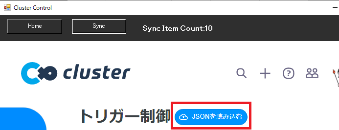
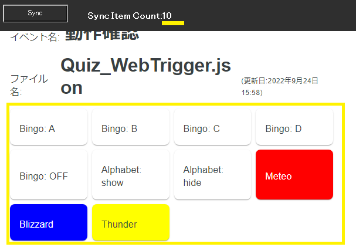
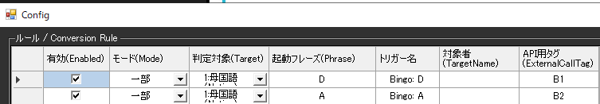
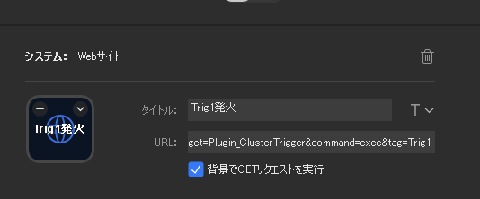

!!! Info "前提条件"
    * cluster イベントの設定が必要です。
    * ワールドにWebTriggerギミックがあることが必要です。
    * WebTriggerの管理ページを開けることが必要です。
    * 使用するための JSONファイルが必要です。

!!! Warning "この機能について"
    * cluster公認の機能ではありません。
    * 何か問題・課題がある場合は、ゆかコネDiscordのサポートフォーラムに質問してください。

## このプラグインで出来ること

* clusterのWebトリガーボタンを音声認識や翻訳された言葉をキーワードに発火できます
* APIをつかえば、StreamDeckなどのツールからも呼び出せます

##　有効化

* プラグインを使うチェックをONにしてください。

## 設定

### 基本設定

|設定項目|説明|機能|
|:--|:---|:---|
|ルール|音声認識結果に基づくWebトリガー発火条件を設定|ルールテーブルでの詳細管理|
|Control Cluster|cluster Web管理画面を内蔵ブラウザで表示|同期・管理・テスト機能|

### Control Cluster 画面の詳細機能

#### 管理ボタン
* **Homeボタン**: cluster.muのイベント管理ページを表示
* **Syncボタン**: ワールドのWebトリガーと設定を同期
* **SyncCountラベル**: 同期されたトリガー数を表示

#### 高度な機能
* **内蔵ブラウザ**: CEF（Chromium）ベースでcluster管理画面を直接表示
* **スクリーンショット機能**: `/api/screenshot`でブラウザ画面を画像取得
* **リアルタイム同期**: Webトリガーボタンとゆかコネのルールを自動同期

## ルール

* ルールは、条件に一致したときにそのデータを送付することができる「仕掛け」です

|設定|意味|
|:--|:---|
|有効(Enabled)|この条件を有効化します|
|モード(Mode)|条件の判断モードを指定します|
|対象|対象にする言語を決めます（母国語、翻訳１～４）|
|起動フレーズ|判断に使う起動キーワードです|
|トリガー名|発火するWebトリガーの名前を設定します|
|対象者|話者名に指定文字が含まれているときに反応します。空欄の場合は全員が対象です|
|APIタグ|APIから呼び出すときにつかうタグ名です|

!!! Info "パラメータの記述"
    * 発話がきっかけで呼び出される場合は、トリガー名の中に下記パラメータが使えます

    |パラメータ|意味|
    |:--------|:---|
    |{talker}|発話者名|

## 使い方

1. Clusterでイベントを作ります。
2. ゆかコネNEOの画面からコントロール画面に入ります。

3. コントロール画面で「HOME」ボタンを押します。

4. ClusterのWebTrigger画面を出します

5. ワールドに対応する JSONファイルを読み込みます

6. 読み込んだら、同期をとります。

    同期がとれると、「Sync Item Count」の数が更新されます。表示されているトリガーの数と同じ数字になっていれば、同期がとれています。

7. 発火条件を入力します。

8. 音声認識などをさせて、発火状態を確認してください。

## StreamDeckと連動させるとき

!!! info "このプラグインにはAPIがあります"
    * このプラグインを有効にすると、[clusterウェブトリガープラグインAPI](../tech/tech_api_plugin.md#clusterウェブトリガープラグイン)の機能を使えます。

StreamDeckのアプリケーションに、下記のように設定することで、ボタンによる発火が可能になります。

設定例：
``http://localhost:15520/api/command?target=Plugin_ClusterTrigger&command=exec&tag=Trig1``

