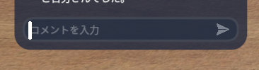

!!! Info "前提条件"
    * clusterデスクトップアプリが必要です

!!! Warning "この機能について"
    * cluster公認の機能ではありません。
    * 何か問題・課題がある場合は、ゆかコネDiscordのサポートフォーラムに質問してください。

## このプラグインで出来ること

* 音声認識結果をclusterチャットに送付することができます。

## 有効化

* プラグインを使うチェックをONにしてください。

## 設定

|設定|意味|
|:--|:---|
|送信内容|どの内容を送るかを指定します||

## 使い方

* clusterをデスクトップモードで起動し、チャット画面にカーソルを合わせてください。

* その状態で音声認識をさせると、自動的に転送されます。

!!! Tips "転送について"
    音声認識確定時に送られます。clusterアプリがアクティブになっていないときは転送が行われません。またチャット入力画面にカーソルがない場合は、音声認識された内容によってはキャラクターが意図しない動きをすることがあります。

