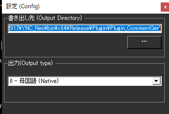

!!! Info "前提条件"
    * [HTML5コメントジェネレータ](https://www.kilinbox.net/2016/01/HCG.html) もしくは [HTML5コメントジェネレータ改](http://twinstraycat.kagome-kagome.com/commegene/commentgenerator_kai) を使用していること

## このプラグインで出来ること

* HTML5コメントジェネレータを使って字幕を表示できます。

##　有効化

* プラグインを使うチェックをONにしてください。

## 設定

### 書き出し先設定

|設定項目|説明|操作|
|:--|:---|:---|
|出力ディレクトリ|comment.xmlを出力するフォルダパス|テキスト入力またはフォルダ選択|
|フォルダ選択ボタン（…）|ディレクトリを参照選択|ダイアログでフォルダを選択|

!!! Info "書き出し先について"
    * 指定したフォルダに `comment.xml` を出力します
    * 既存ファイルは自動的に上書きされます（通常問題なし）
    * コメントジェネレータと同じフォルダを指定してください

### 出力タイプ設定

|設定項目|モード番号|説明|用途|
|:--|:---|:---|:---|
|母国語 (Native)|0|音声認識した原文のみ|日本語配信|
|翻訳1 (Translation 1)|1|翻訳1の結果のみ|単一言語配信|
|翻訳2 (Translation 2)|2|翻訳2の結果のみ|単一言語配信|
|翻訳3 (Translation 3)|3|翻訳3の結果のみ|単一言語配信|
|翻訳4 (Translation 4)|4|翻訳4の結果のみ|単一言語配信|
|両方 (Native + Translation 1)|5|母国語と翻訳1を同時出力|バイリンガル配信|
|読み上げAPI (Speech API)|6|音声合成用テキスト|読み上げ連携|

### 動作について

#### 自動更新機能
* **リアルタイム更新**: 音声認識結果が1秒ごとに字幕ファイルに反映
* **履歴管理**: 過去の音声認識結果から最新40件を自動管理
* **配信対応**: OBSなどの配信ソフトでそのまま表示可能
    
## 使い方
1. コメントジェネレータを入手します
1. CommentGenerator.html　を　配信ソフトなどで読み込みます
    * 具体的には、OBSのブラウザソースの設定でファイルを指定します
1. ゆかコネNEOで音声認識をすると表示されます
