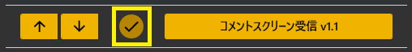
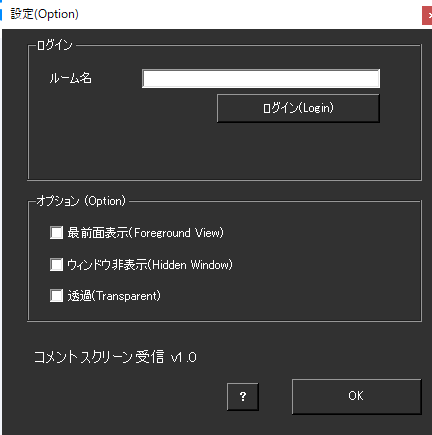

!!! Info "前提条件"
    * なし

## このプラグインで出来ること

* [コメントスクリーン](https://www.commentscreen.com/)のコメントをゆかコネに自動転送
* リアルタイムでコメントを音声認識画面に表示
* 内蔵ブラウザでコメントスクリーンを表示
* ウィンドウの表示カスタマイズ（最前面・透過・フレーム非表示）
* 配信画面への字幕オーバーレイとして活用可能

!!! note "コメントスクリーンについて"
    * [コメントスクリーン](https://www.commentscreen.com/)は無料で使えるコメント表示サービス
    * URLを共有するだけで視聴者がコメントを投稿できる
    * パスワード付きルームにも対応

!!! Warning "この機能について"

    * CommentScreen社公認の機能ではありません。
    * 何か問題・課題がある場合は、ゆかコネDiscordのサポートフォーラムに質問してください。
    * 本件に関して、CommentScreen社にサポートを求めないでください。

!!! note "この機能について"
    * わんコメ連携プラグインをつかうことで、わんコメ画面に転送ができます。

##　有効化

* プラグインを使うチェックをONにしてください。

## 設定

### 接続設定

|設定項目|詳細説明|設定例|効果|
|:--|:---|:---|:---|
|ルーム名|CommentScreenのトークルーム名を入力 ・URLの最後の部分のみ ・例：`https://www.commentscreen.com/comments/room123`の場合は「room123」|`room123`|指定ルームに自動接続|
|ログインボタン|入力したルーム名で接続を開始 ・パスワードが必要な場合は入力画面表示|ボタンクリック|内蔵ブラウザでルームを表示|

### ウィンドウカスタマイズ

|設定項目|詳細説明|用途・効果|配信での活用|
|:--|:---|:---|:---|
|最前面表示|ウィンドウを常に最前面に固定 ・他のアプリケーションより前面に表示 ・配信中にコメントを見逃さない|配信中の常時監視|★★★|
|ウィンドウ非表示|ウィンドウの枠（タイトルバー）を非表示 ・スッキリした表示 ・画面キャプチャに余計な要素が映らない|画面キャプチャ最適化|★★☆|
|透過|背景を透過表示 ・コメント以外の背景が透明 ・OBSでクロマキー不要|OBSオーバーレイ用|★★★|

### 便利な機能

#### 自動コメント取得
* コメントスクリーンに投稿されたコメントを自動でゆかコネに転送
* 新しいコメントが投稿されると即座に音声認識画面に表示
* ブラウザ画面を見ながらコメントを確認できる

## 制約・仕様

* コメントスクリーンのチャットルームにパスワードがかかっている場合は、パスワード入力が必要です。
* ブラウザ画面に表示されないものは表示されません。
* 一番最初に入室したタイミングで受信したものは行の並びが逆になることがありますが現段階では仕様です。

## 使い方手順

### 初回設定
1. **コメントスクリーンでルームを作成**
   - [コメントスクリーン](https://www.commentscreen.com/)にアクセス
   - 「新しいルーム作成」をクリック
   - ルーム名を決定（任意の文字列）
   - パスワード設定（必要に応じて）

2. **ゆかコネ側の設定**
   - プラグインを有効化
   - ルーム名を入力（URLの末尾部分のみ）
   - 必要に応じてウィンドウカスタマイズを設定

3. **接続開始**
   - 「ログイン」ボタンをクリック
   - パスワード設定している場合はパスワード入力
   - 内蔵ブラウザでコメントスクリーンが表示される

### 配信での活用

#### 基本的な使い方
1. **コメントルームのURLを視聴者に共有**
2. **視聴者がコメントを投稿**
3. **リアルタイムでゆかコネに転送される**
4. **音声合成で自動読み上げ（PlayVoiceプラグイン使用時）**

#### 配信画面への組み込み
- **透過設定ON**: OBSでウィンドウキャプチャしてオーバーレイ
- **最前面表示ON**: 配信中にコメントを確認
- **フレーム非表示**: 見た目をスッキリさせる

## よくある問題と解決方法

### 接続エラー

| 症状 | 原因 | 解決方法 |
|:---|:---|:---|
| **「ルームが見つかりません」** | ルーム名が間違い | コメントスクリーンURLの末尾部分を正確に入力 |
| **ブラウザが表示されない** | ネットワークエラー | インターネット接続を確認 |
| **パスワード入力画面が出ない** | ルーム設定問題 | コメントスクリーン側でパスワード設定確認 |

### コメント取得の問題

| 症状 | 原因 | 解決方法 |
|:---|:---|:---|
| **コメントがゆかコネに転送されない** | ブラウザ表示エラー | プラグインを再起動 |
| **一部コメントのみ取得** | ページ読み込み不完全 | ブラウザウィンドウを更新（F5） |
| **古いコメントが逆順表示** | 初回接続時仕様 | しばらく待つと正常な順序になる |

### 表示の問題

| 症状 | 原因 | 解決方法 |
|:---|:---|:---|
| **透過が効かない** | Windows設定 | Windowsのテーマ設定確認 |
| **最前面表示されない** | 他アプリの設定 | 他の最前面アプリを確認 |
| **文字が読みづらい** | フォント・色設定 | コメントスクリーン側で文字設定調整 |

### 設定確認チェックリスト

#### コメントスクリーン側
- [ ] ルームが正常に作成されている
- [ ] ルームURLが正しく共有されている
- [ ] パスワード設定が正しい（設定している場合）
- [ ] 文字色・背景色が見やすく設定されている

#### ゆかコネ側
- [ ] プラグインが有効になっている
- [ ] ルーム名が正確に入力されている
- [ ] インターネット接続が正常
- [ ] 他のプラグインとの競合がない

## わんコメ連携について

### 連携のメリット
- **わんコメの高機能な表示**とコメントスクリーンの手軽さを両立
- **複数のコメントソース**を統合表示
- **フィルタリング機能**でコメント管理

### 連携手順
1. **わんコメプラグインを有効化**
2. **ComScrプラグインも同時に有効化** 
3. **両方のプラグインでコメントを受信**
4. **わんコメ画面で統合表示される**
