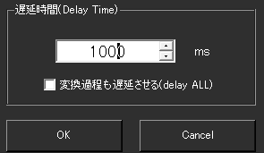

!!! Info "前提条件"
    * なし

## このプラグインで出来ること

* 表示を遅らせることができます
* 読み上げ音声に合わせて字幕のタイミングを調整できます
* 配信の遅延に合わせて表示タイミングを調整できます

##　有効化

* プラグインを使うチェックをONにしてください。

## 設定

|設定|意味|
|:--|:---|
|遅延時間|表示を遅らせる時間をミリ秒で指定します（スライダーで調整可能）|
|変換過程を遅延させる|変換過程を遅延させます。確定のみ表示ではないかたはこちらを使うとよいですが、全体的な動作が遅延するので相性問題があります。|
|ヘルプボタン|オンラインヘルプへのアクセス（？マーク）|

### 設定可能な範囲

|項目|値|
|:--|:---|
|遅延時間|0秒～30秒（スライダーで細かく調整可能）|
|更新タイミング|リアルタイム（0.1秒ごとに確認）|

## 使うとき
* 遅延時間を設定しプラグインを使うチェックをONにするだけで遅延が反映されます。

!!! Warning "プラグインの位置について"
    * 遅延プラグインの後が遅れていきます。
    * 一般的には発話プラグインより後ろ側に遅延プラグインを置きます。

## よくある質問

### 字幕が表示されない場合
- 遅延時間が長すぎる可能性があります。短く設定してみてください
- プラグインが有効（チェックON）になっているか確認してください

### 音声と字幕のタイミングが合わない場合
- スライダーで遅延時間を細かく調整してください
- 読み上げプラグインがある場合は、このプラグインを読み上げプラグインより後に配置してください

### 配信での使い方
- 配信ソフトの遅延時間を確認して、それに合わせて遅延時間を設定してください
- YouTube Live、Twitch等、プラットフォームによって遅延時間が異なります