!!! Info "前提条件"
    * BOT App登録するためには Discord アカウントが必要です。

## このプラグインで出来ること

* 音声認識結果をDiscordチャットチャネル転送することができます
* Discordチャットチャネルの会話を音声認識として取り込むことができます

## 有効化

* プラグインを使うチェックをONにしてください。

## 設定

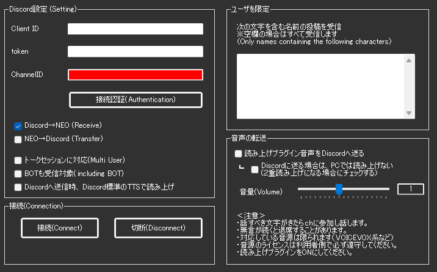

|設定|意味|
|:--|:---|
|Client ID|Discord BOTのIDを入れます。|
|token|Discord BOTを作成したときに生成されたトークンをいれます|
|ChannelID|転送先となるチャットを決めます(Discordで取得できます)|

!!! Warning "これらの設定について"
    * 設定を知っていれば、誰でもアクセスできるため取扱いにご注意ください

!!! Info "接続認証について"
    * クライアントID、トークを入力したら接続認証をおします
    * 設定が正しければ、チャットへのアクセスが許可されます

|設定|意味|
|:--|:---|
|Discord→NEO|チャットの会話を取り込みます。|
|NEO→Discord|音声認識の結果を転送します|
|トークセッションに対応|個体識別をします(コラボ配信などはONにします）|
|BOTも受信対象|チェックを外すとBOTのデータは受信しなくなります|
|次の文字を含む文字の投稿を受信|受信対処者をフィルタします(部分一致)|

## Discord側のBot設定について

### 1.BOTの登録をする

* [Discordアプリケーションの登録画面](https://discord.com/developers/applications) から、BOTの登録をします。

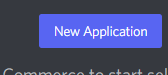

New Application を押して、登録しましょう。

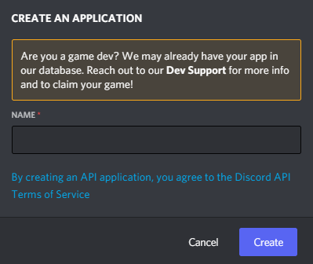

* 名前は自由にわかるようなものをつけてください。

### 2.アクセス権の設定をする

* Discordのアクセス権を設定

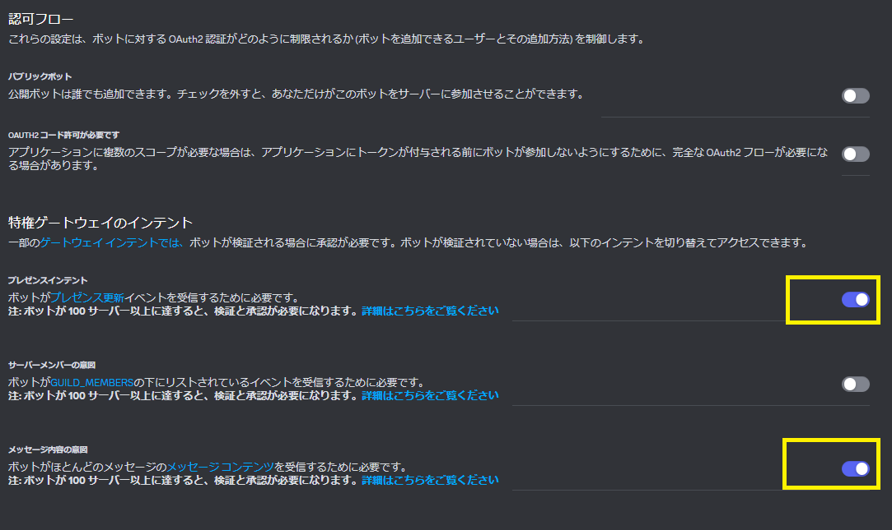
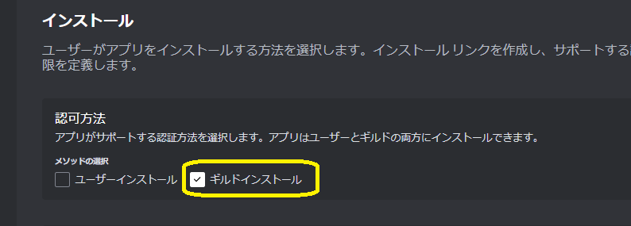

### 3.接続に必要な設定を得る

* ツールに設定する値を取得

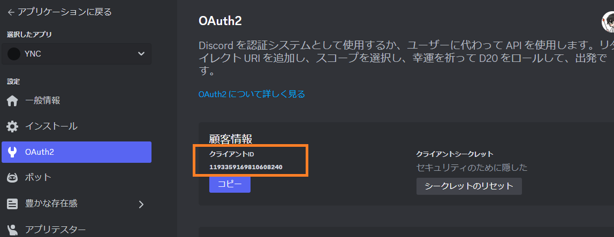

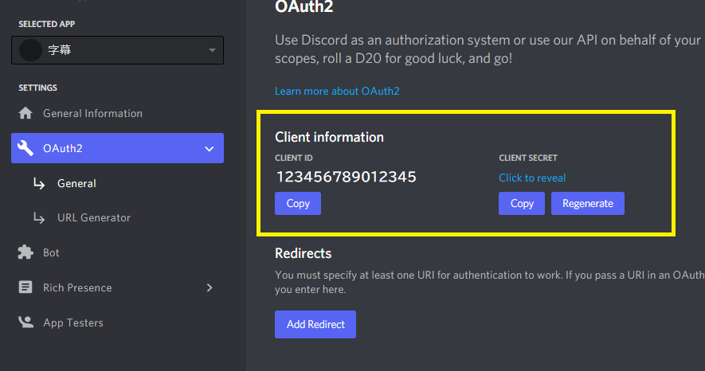

* 値を入手したら、プラグインに設定します。

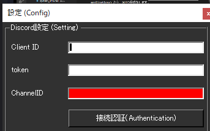

!!! Info "その他のページについて"
    下記の設定は変更せずに、そのままの状態でOKです

    * OAuth2ページのすべて
    * Botページの「Bot Permissions」

* ChannelIDは、Discordの画面から取得します。
* ChannelIDは、カテゴリーではなく個別のチャンネルを指定してください。

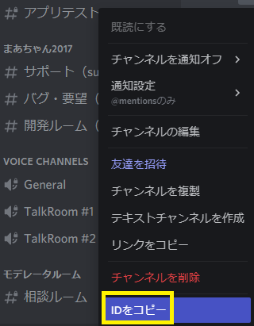

!!! Warning "この設定をしないとテキストが受信できません"
    BOTがメッセージを受信できるように、読み取り権限を設定する必要があります。この項目をONにしておいてください。
    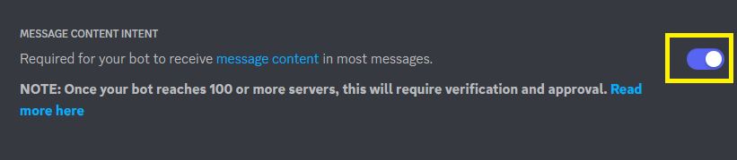

### 4.Discord接続認証を行う

* このボタンを押して認証ができると、通信ができるようになります。

### 5.DiscordチャンネルにBOTの読み書き権限を付与

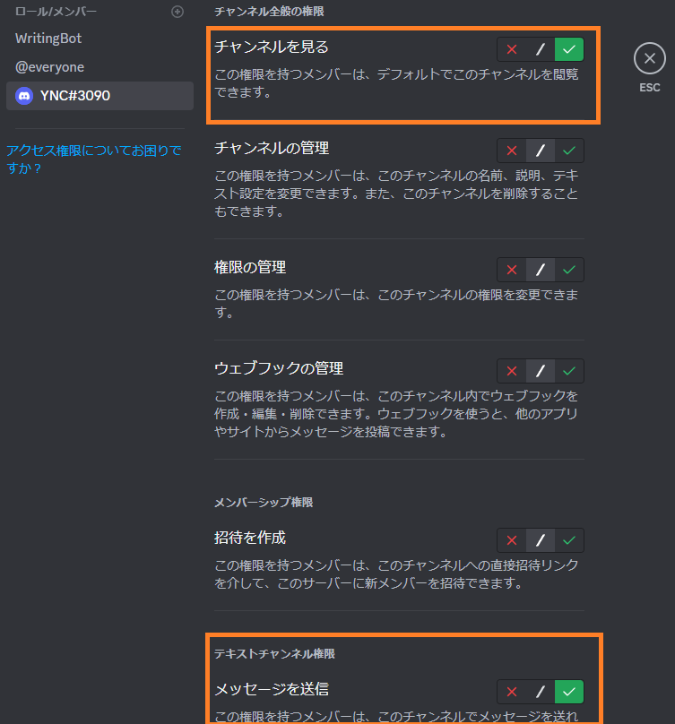

* Discordチャンネルに読み書き権限を付与します。

!!! Info "権限の付与について"
    * 与える権限は最低限にしましょう

!!! Info "読み上げ音声を流したい場合"
    * ボイスチャンネルの参加、発言についてもONにしてください

## 具体的な使い方

* [実践的なチートシート](../cs/cs_colab_discord.md) をなぞらえてみてください

## 特筆する注意点

* BOTの設定では、必ずContents Intent の権限付与をしてください。この設定をしないと、テキストを受信できないことがあります。
 

* Discord側でBotにアクセス権を与えてください。アクセス権がないと読み書きができずBotが動きません。
