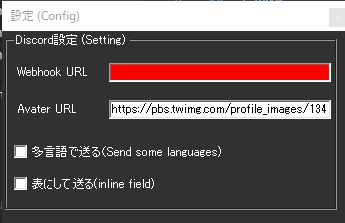

!!! Info "前提条件"
    * Webhook URL登録するためには Discord アカウントが必要です。

## このプラグインで出来ること

* 音声認識結果をDiscordチャットチャネル転送することができます

##　有効化

* プラグインを使うチェックをONにしてください。

## 設定

|設定|意味|
|:--|:---|
|Webhook URL|WebHookのアドレスを入れます。|
|Avater URL|風呂フィール画像がある場所を指定します|
|多言語で送る|翻訳も一緒に送ります|
|表にして送る|見やすい形に整形しておくります|

!!! Info "Avater URLについて"
    * インターネット側からアクセスできる場を指定してください
    * 画像は 100 x 100 程度でお願いします

## 具体的な使い方
* [実践的なチートシート](../cs/cs_colab_discord.md) をなぞらえてみてください