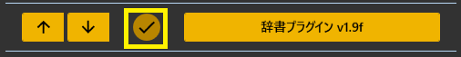
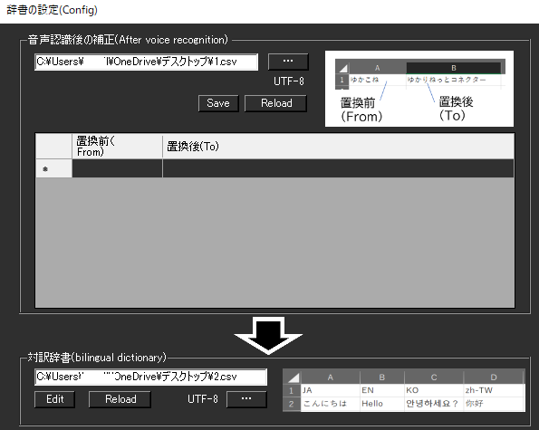
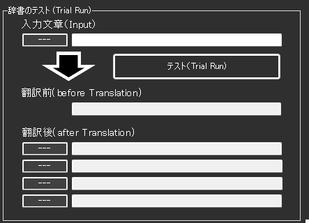
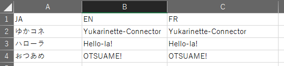
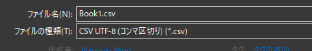
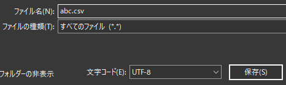
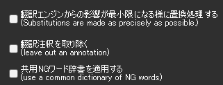

!!! Info "前提条件"
    * なし

## このプラグインで出来ること

* 認識後の文字を強制的に置き換えることができます


##　有効化



* プラグインを使うチェックをONにしてください。

## 設定

#### 母国語側の辞書



|設定|意味|
|:--|:---|
|置換前|字幕として表示されている「置き換えたい言葉」を指定します|
|置換後|その言葉の代わりに表示したいこと言葉をしています|

#### 翻訳時の辞書


|設定|意味|
|:--|:---|
|対訳辞書|対訳辞書ファイルを指定します。|

### 対訳辞書の作り方

!!! Info "編集方法"
    * Excel もしくは メモ帳で実施します。
    * １列目に言語コード、２列目以降に対訳データをいれます

=== "Case1:Excelの場合"

    

    1. Excelでデータを作ります。

    2. CSVファイルとして保存します。

    

=== "Case2:メモ帳の場合"

    1. 下記のようなファイルを作ります。

    ``` 
    JA,EN,FR
    ゆかコネ,Yukarinette-Connector,Yukarinette-Connector
    ハローラ,Hello-la!,Hello-la!
    おつあめ,OTSUAME!,OTSUAME!
    ```
    2. CSV（UTF8エンコード)で保存します。

    

##　テスト


* テストしたい文章をいれて、テストボタンを押します
* どのように置き換わるかが表示されます。

## オプション



|設定|意味|
|:--|:---|
|影響を最小限に| 翻訳時に置換ミスしにくいように処理します |
|注訳を取り除く| DeepLのカッコ表記を取り除きます |

## 使うとき

1. 音声認識と同時に置換されます。
