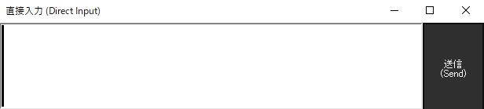

!!! Info "前提条件"
    * 特になし

## このプラグインで出来ること

* **キーボードによる手動入力**: マイクが使えない環境でもテキスト入力が可能
* **音声認識の補完**: うまく認識されない単語を手入力で補完
* **日本語IME完全対応**: ひらがな・カタカナ・漢字変換に対応
* **フローティング入力ウィンドウ**: 他のアプリケーション上で使える独立ウィンドウ
* **最前面表示機能**: 配信中でも常に見えるウィンドウ配置
* **大きな文字表示**: 24ptフォントで読みやすい表示
* **話者名管理**: 複数の話者を管理・切り替え可能

!!! Info "こういう時に使おう"
    * **音声認識が困難な環境**: 騒音の多い場所、マイクトラブル時
    * **正確なテキスト入力**: 専門用語、固有名詞、数字などの確実な入力
    * **翻訳の修正**: 音声認識結果を手動で修正してから翻訳
    * **配信での補助**: 視聴者向けのコメント手入力

##　有効化


* プラグインを使うチェックをONにしてください。

## 設定と使い方



### 基本的な使い方

1. **プラグインを有効化**すると入力ウィンドウが表示される
2. **テキストボックスに文字を入力**（日本語IME対応）
3. **送信方法を選択**:
   - **Enterキー**: キーボードのEnterでテキスト送信
   - **送信ボタン**: マウスクリックでテキスト送信
4. **話者名リストから発言者を選択**（必要に応じて）

### ウィンドウのカスタマイズ
- **ウィンドウサイズ変更**: 角をドラッグしてサイズ調整
- **最前面表示**: 右クリック→「最前面（&Top most）」で常に前面表示
- **フォントサイズ**: ウィンドウサイズに連動して自動調整（24pt基準）

### 入力ウィンドウの機能

|機能|説明|
|:--|:---|
|入力エリア|テキスト入力|
|送信ボタン|手動でテキストを送信|
|右クリックメニュー|「最前面（&Top most）」の切り替え|
|名前リスト|ユーザ名の管理（5秒間隔で更新）|

## 実用的な活用例

### 配信でのコメント入力
```
場面: ライブ配信中にマイクトラブル発生
対応: DirectInputでコメント手入力
設定: 最前面表示ON、大きなウィンドウサイズ
結果: 視聴者に状況説明を継続
```

### 専門用語の正確な入力
```
場面: 技術的な内容で専門用語が多い
対応: 音声認識で大まかに入力→DirectInputで専門用語修正
設定: 通常ウィンドウサイズ
結果: 正確なテキスト出力
```

### 多言語対応での補助
```
場面: 外国語の固有名詞が音声認識されない
対応: DirectInputで正確なスペル入力
設定: IME切り替えで外国語入力
結果: 正確な翻訳結果を得られる
```

## よくある問題と解決方法

### 入力に関する問題

| 症状 | 原因 | 解決方法 |
|:---|:---|:---|
| **日本語が入力できない** | IMEが無効 | Windows IME設定確認・切り替え |
| **文字が小さくて見えない** | ウィンドウサイズが小さい | ウィンドウを大きくドラッグ |
| **Enterで送信されない** | フォーカス不具合 | テキストボックスをクリック |

### ウィンドウ表示の問題

| 症状 | 原因 | 解決方法 |
|:---|:---|:---|
| **ウィンドウが見つからない** | 最小化・画面外移動 | タスクバーから復元 |
| **最前面表示が効かない** | 他のアプリが優先 | 右クリック→TopMost再設定 |
| **ウィンドウが小さすぎる** | 初期サイズ問題 | 角をドラッグしてサイズ調整 |

### 送信に関する問題

| 症状 | 原因 | 解決方法 |
|:---|:---|:---|
| **テキストが送信されない** | プラグイン無効状態 | プラグイン有効化を確認 |
| **文字化けする** | 文字コード問題 | IME設定・Windows地域設定確認 |
| **空白が送信される** | 入力欄が空 | テキスト入力後に送信 |

## 設定確認チェックリスト

### 基本設定
- [ ] DirectInputプラグインが有効になっている
- [ ] 入力ウィンドウが表示されている
- [ ] Windows IMEが正常動作している

### 表示設定  
- [ ] ウィンドウサイズが適切（文字が読める大きさ）
- [ ] 最前面表示が必要に応じて設定されている
- [ ] 他のアプリケーションと重ならない位置に配置

### 入力設定
- [ ] テキストボックスにフォーカスがある
- [ ] IME状態が入力言語に適している
- [ ] 話者名が適切に選択されている（使用する場合）

### 話者管理機能
|機能|詳細|
|:--|:---|
|話者リスト|5秒間隔での自動更新|
|話者選択|ドロップダウン形式での選択|
|話者名連携|ゆかコネ本体の話者名システムと連動|
|デフォルト話者|設定による初期話者の指定|