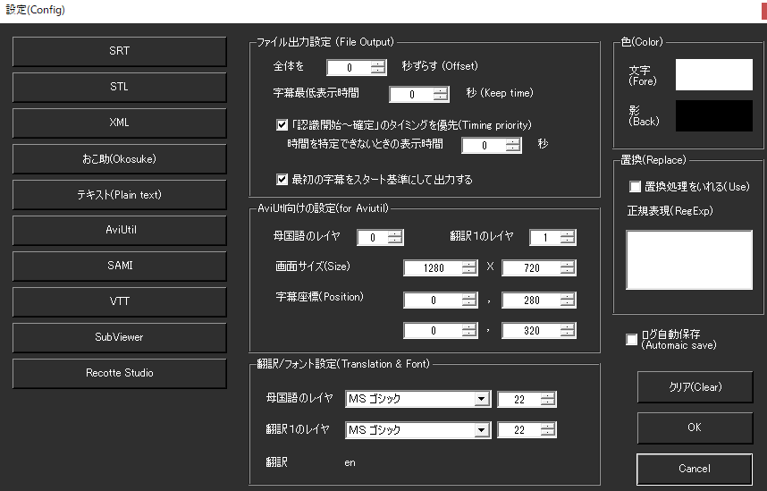

!!! Info "前提条件"
    * なし

## このプラグインで出来ること

* 後編集工程に字幕を持っていくことができます。
* 12種類の字幕フォーマットに対応（SRT、STL、XML、Okosuke、AviUtl、SAMI、VTT等）
* 高度なタイミング制御とオフセット調整
* 動画編集ツールとの直接連携
* リアルタイム字幕データ収集と自動保存
* 正規表現による高度な文字置換機能

##　有効化

* プラグインを使うチェックをONにしてください。

## 設定

* ファイル出力設定

|設定|意味|
|:--|:---|
|全体オフセット|全体的に時間をずらします|
|最低表示時間|最低限表示する時間を指定します。この時間を守るように調整します|
|認識タイミングを優先|発話開始時間を表示開始時間とします|
|時間が特定できないとき|認識開始が判断できないときに何秒表示するか指示します|
|最初の字幕を基準に|最初の話始めを``00:00:00``として計算します|

* AviUtil向けの設定

|設定|意味|
|:--|:---|
|母国語のレイヤ|字幕を転送するレイヤNoを指示します|
|外国語のレイヤ|字幕を転送するレイヤNoを指示します|
|画面サイズ|出力するファイルが想定する画面サイズをきめます|
|字幕座標|字幕を出力する位置を決めます|

* フォント設定、色設定
    AviUtilなどサイズ指示できる出力に関して使う文字設定を指示します

* 置換処理
    正規表現で条件に当てはまるときに文字置換します。

* ログ自動保存
    ログフォルダに自動的に字幕データを保存します

!!! Info "翻訳について"
    * 翻訳１の設定が採用されます。

## サポート出力フォーマット

### 対応形式一覧（12種類）

| フォーマット | 用途 | 特徴 |
|:-----------|:----|:-----|
| SRT | SubRip Subtitle | 最も一般的な字幕形式 |
| STL | DVD Studio Pro | DVDオーサリング用 |
| XML | Generic XML | 汎用XML字幕データ |
| Okosuke (OXK) | 日本の字幕ツール | 日本語字幕制作に特化 |
| Plain Text | プレーンテキスト | シンプルなテキスト出力 |
| AviUtl | 日本の動画編集ソフト | レイヤー対応の詳細設定 |
| SAMI | Microsoft SAMI | Windows Media Player対応 |
| VTT | WebVTT | Web動画字幕形式 |
| SubViewer | SubViewer形式 | 一部の動画プレイヤー対応 |
| Recotte Studio | 画面録画ソフト | 画面録画時の字幕 |
| SRV3 | 字幕フォーマット | 特定アプリケーション用 |
| YMM4 | Yukkuri Movie Maker 4 | ゆっくり動画制作ツール |

### 詳細設定項目

#### タイミング制御
| 設定項目 | 範囲 | 説明 |
|:--------|:-----|:-----|
| 全体オフセット | -1000～+1000秒 | 全字幕の時間調整 |
| 最低表示時間 | 可変 | 字幕の最短表示時間 |
| 不明時表示時間 | 可変 | タイミング不明時のデフォルト |
| ゼロオフセット出力 | ON/OFF | 最初の字幕を基準時間とする |

#### 動画編集連携（AviUtl等）
| 設定項目 | デフォルト | 説明 |
|:--------|:----------|:-----|
| 画面解像度 | 1280x720 | 出力対象の画面サイズ |
| 字幕座標（母国語） | 設定可能 | X,Y座標の個別設定 |
| 字幕座標（翻訳） | 設定可能 | 翻訳テキストの位置 |
| レイヤー番号 | 設定可能 | マルチトラック編集対応 |
| フォント設定 | システム検出 | 利用可能フォント自動検出 |
| 前景色・影色 | カスタム | 色の個別設定 |

### 高度な機能

#### 文字処理オプション
* **ピリオド除去**: 出力テキストからピリオドを自動削除
* **正規表現置換**: 複雑なパターンマッチング置換
* **多言語対応**: 母国語＋翻訳1-4の同時出力

#### 自動化機能
* **リアルタイムデータ収集**: 音声認識と翻訳の自動キャプチャ
* **自動保存**: プラグイン無効化時の自動エクスポート
* **履歴管理**: 過去の出力設定の保持

## 使うとき

1. プラグインをONにした状態で、音声認識を始めます。
1. 発話がおわったら、出力設定を調整します
1. 出力したい形式のボタンをおしてデータを保存します。

