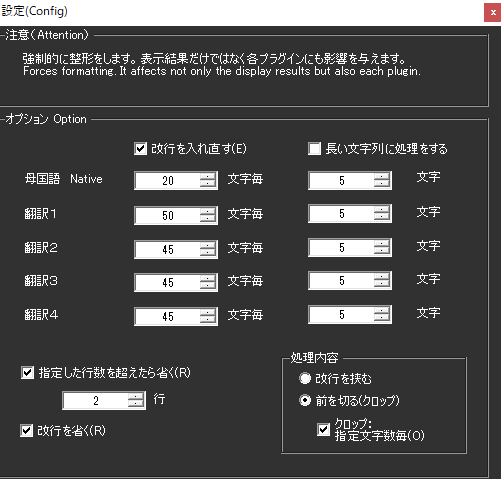

!!! Info "前提条件"
    * なし

## このプラグインで出来ること

* 認識後の文字を強制的に整形することができます
* 多言語対応の文字数制限とクロッピング
* 高度な行数制御と履歴表示
* Ruby記法の自動HTML変換
* リアルタイム会話履歴管理
* 複数翻訳レイヤーの個別制御

##　有効化

* プラグインを使うチェックをONにしてください。

## 設定

|設定|意味|
|:--|:---|
|改行を入れなおす|文字数毎に改行を入れます|
|長い文字列に処理をする|指定した文字列を超えた場合にクロップ処理をします|
|指定した行数を超えたら省く|処理した結果指定行数を超えたら、末尾の「指定した行数」を表示します|
|改行を省く|処理を始める前に、最初に改行を省きます|
|処理内容|条件に当てはまる場合に改行を入れるか、省く（クロップ）するかを選びます|

## 詳細機能

### 文字数制限（多言語対応）

各言語レイヤーごとに個別の文字数制限を設定可能：

| 対象 | 範囲 | 説明 |
|:----|:-----|:-----|
| 母国語 | 1-300文字 | 音声認識の原文 |
| 翻訳1 | 1-300文字 | 第1翻訳言語 |
| 翻訳2 | 1-300文字 | 第2翻訳言語 |
| 翻訳3 | 1-300文字 | 第3翻訳言語 |
| 翻訳4 | 1-300文字 | 第4翻訳言語 |

### 処理方式の詳細

#### クロッピング方式
1. **先頭クロップ**: 文字数超過時に先頭から削除し「…」を付加
2. **ブロック単位**: 指定文字数でブロック分割してクロップ
3. **改行挿入**: 指定文字数で自動改行を挿入

#### 行数制御
- **最大行数設定**: 1-300行まで設定可能
- **履歴表示**: 過去の会話も含めて行数制御
- **文脈保持**: 会話の流れを保持しながら表示制限

## 使うとき

1. 音声認識と同時に置換されます。
