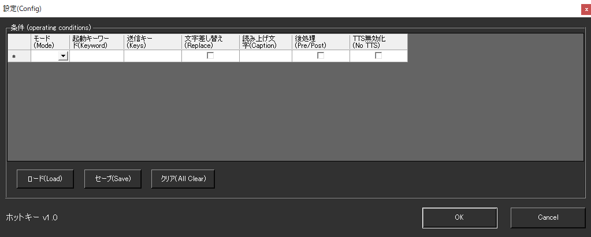

!!! Info "前提条件"
    * ゆかコネNEO v2.0より使用可能

## このプラグインで出来ること

* 言葉に反応してキーボード信号を送出できます
* キーをうまく使うと、モーションソフトなどに表情信号が送れます

##　有効化

* プラグインを使うチェックをONにしてください。

## 設定

|設定|意味|
|:--|:---|
|モード|一致条件を決めます|
|起動ワード|条件（発火条件）を決めます|
|送付キー|キーの組み合わせを指定します|
|文字差し替え|再生したあと、文字を差し替えます。 （字幕や後続のプラグインに渡す文字が差し替えられます)|
|読み上げ文字|差し替える文字を指定します。|
|後処理|チェックを打つと、字幕を出してから処理をします|
|TTS無効化|この条件に当てはまった場合、読み上げプラグインで読み上げ動作をしません|

!!! Info "送付キー"
    * Microsoftの[キー表現](https://docs.microsoft.com/ja-jp/dotnet/api/system.windows.forms.sendkeys.send?view=windowsdesktop-6.0)に従ってください。
    * キーによってはうまくいかないものがあります。

## 記述例

|表記      | 意味          |
|:---------|:--------------|
|{Enter}   |改行キー       |
|{F1}      |F1キー         |
|+{F4}     |Shift+F4キー   |
|^C        |Ctrl+Cキー     |
|%F        |Alt+Fキー      |
|{f 4}     |Fキーを4連打   |
|+(EC)     |Shift押しながらE,Cを押す  |

## 使うとき

1. 音声認識をすれば自動的に処理されます。

## 特性等

* エンターキーなどを扱う場合は、意図しない決定が起こる場合があるので使い方に気を付けて下さい。
