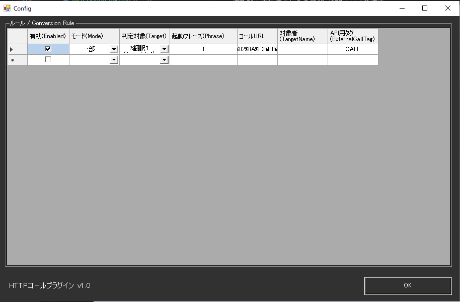

!!! Info "前提条件"
    * HTTPで呼び出されてつかえる機能（相手）が必要です

## このプラグインで出来ること

* 特定の条件でHTTPの通信を呼び出すことができます。
* CSV形式での柔軟なルール管理
* URL内での動的変数置換（テキスト・言語・話者情報）
* 外部APIからのプログラマティック実行
* 高度なセキュリティ機能（TLS 1.2、プロキシ対応）
* 複数のマッチングモード（完全一致・部分一致）

## 有効化


* プラグインを使うチェックをONにしてください。

## 設定



|設定|意味|
|:--|:---|
|ルール|音声認識文に特定の文字列を含む場合は、指定したアドレスにデータを送ります|

## ルール

* ルールは、条件に一致したときにそのデータを送付することができる「仕掛け」です

|設定|意味|
|:--|:---|
|有効(Enabled)|この条件を有効化します|
|モード(Mode)|条件の判断モードを指定します|
|対象|対象にする言語を決めます（母国語、翻訳１～４）|
|起動フレーズ|判断に使う起動キーワードです|
|アドレス|HTTPコールするときの送付先です (httpやhttpsで始まるアドレスになります) |
|対象者|話者名に指定文字が含まれているときに反応します。空欄の場合は全員が対象です|
|APIタグ|APIから呼び出すときにつかうタグ名です|

!!! Info "パラメータの記述"
    * 発話がきっかけで呼び出される場合は、URLの中に下記パラメータが使えます

    |パラメータ|意味|
    |:--------|:---|
    |{text0}|母国語（文）|
    |{text1}|翻訳１（文）|
    |{text2}|翻訳２（文）|
    |{text3}|翻訳３（文）|
    |{text4}|翻訳４（文）|
    |{lang0}|母国語（言語名）|
    |{lang1}|翻訳１（言語名）|
    |{lang2}|翻訳２（言語名）|
    |{lang3}|翻訳３（言語名）|
    |{lang4}|翻訳４（言語名）|
    |{talker}|発話者名|

!!! Tips "URLの設定例"
    * たとえば、下記のような設定をすると、条件一致時に棒読みちゃんが読み上げます
    ```http://localhost:50080/talk?text={talker}さん、ゆっくりしていってね！```

!!! Tips "URLの設定例"
    * たとえば、下記のような設定をすると、[テロップアシスタント](https://machanbazaar.com/telop-assistants/)をつかって、[プレイバック](https://machanbazaar.com/stream-deck-control/)するなどができます。
    ```http://127.0.0.1:15501/start_playback?ago=0```

## 高度な機能

### ルール管理インターフェース

#### データグリッド機能
* **7列の詳細設定**: 有効/無効、モード、判定対象、キーワード、URL、対象者、APIタグ
* **コンテキストメニュー**:
  - 行の上/下に挿入（Alt+Up/Down）
  - 行の交換（Ctrl+Up/Down） 
  - CSVファイルからのインポート
* **キーボードナビゲーション**: フル対応の表形式編集

#### CSVファイル連携
* **形式**: カンマ区切り値（CSV）での設定保存・読み込み
* **文字エンコーディング**: UTF-8対応
* **外部編集**: Excel等での一括編集が可能

### 判定モード詳細

| モード | 説明 | 使用例 |
|:------|:-----|:-------|
| 完全 | テキストが完全に一致 | 「こんにちは」→完全一致時のみ実行 |
| 一部 | テキストが含まれる | 「こんにちは」→「こんにちは、みなさん」でも実行 |


### トラブルシューティング

#### よくある問題
* **HTTP呼び出しが失敗する**:
  - URLが正しく設定されているか確認
  - ファイアウォール設定をチェック
  - プロキシ環境の場合は設定を確認

* **変数が置換されない**:
  - URLに正しい変数記法（{text0}等）が使用されているか確認
  - 対象言語が正しく設定されているか確認

* **ルールが動作しない**:
  - 「有効」チェックボックスがONになっているか確認
  - マッチングモードが適切に設定されているか確認
  - 対象者フィルターが設定されている場合、話者名が一致しているか確認


