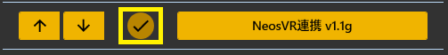
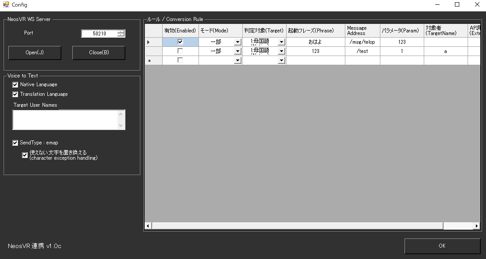

!!! Info "前提条件"
    * [NeosVR](https://neos.com/)が動作することが必要です
    * この機能単品では機能しません。ワールドかアバターにギミックが必要です。

## このプラグインで出来ること

* NeosVR内に音声認識結果、翻訳結果、トリガー信号を出すことができます。
* WebSocketサーバーによるリアルタイム通信
* JSON・EMAPフォーマット両方対応
* 高度なルールベース自動化システム
* 自動ポート選択機能（30211-30410）
* パラメータ型自動検出（bool, int, float, hex, string）
* 外部API制御対応

##　有効化



* プラグインを使うチェックをONにしてください。

## 設定



|設定|意味|
|:--|:---|
|Port|NeosVRと接続する通信ポート番号を指定します。デフォルトは　``50210`` です。|
|Native Language|母国語をNeosVRに送ります|
|Translation Language|翻訳文をNeosVRに送ります|
|Target User Name|送信は、このゆかコネ利用者に限定します|
|SendType:emap|NeosVR用のフォーマットに変換して送ります。|
|使えない文字を置き換える|NeosVR emapフォーマットで表現できない文字を"_"に置き換えます|

!!! Info "字幕の送付"
    * データは ``translation.1.text`` のようなキー名で送られます。
    
!!! Info "VRChatテキスト送付"
    * VRChat最新ベータ版でOSC経由のチャットがサポートされています。
    * ゆかコネNEO v2.0から、この送付に対応します。
    * 翻訳送付については、翻訳１を採用します

## ルール

* ルールは、条件に一致したときにそのデータを送付することができる「仕掛け」です
* 大半の設定はVRChat OSCの設定が使いまわしできます。

|設定|意味|
|:--|:---|
|有効(Enabled)|この条件を有効化します|
|モード(Mode)|条件の判断モードを指定します|
|対象|対象にする言語を決めます（母国語、翻訳１～４）|
|起動フレーズ|判断に使う起動キーワードです|
|Message Address|NeoSVRに送るための送付先です 例）``avater.eye.angle.x`` |
|パラメータ|渡すパラメータを指定します。 true/false、 0x00～0xff、0.0～ 、文字列 を指定できます。|
|対象者|話者名に指定文字が含まれているときに反応します。空欄の場合は全員が対象です|
|APIタグ|APIから呼び出すときにつかうタグ名です|

## 高度な機能

### WebSocketサーバー詳細

#### 通信仕様
* **プロトコル**: WebSocket (Watson WebSocket ライブラリ)
* **バインド**: localhost/127.0.0.1 (セキュリティ考慮)
* **デフォルトポート**: 50210
* **自動ポート選択**: 30211-30410の範囲で利用可能ポートを検索

#### 接続管理
* **クライアント管理**: リアルタイム接続/切断の検出
* **接続状態表示**: アクティブな接続の可視化
* **レジストリ保存**: Windows レジストリでポート情報保持

### ルールシステム詳細

#### 8パラメータ設定システム
| 番号 | パラメータ名 | 説明 | 例 |
|:-----|:------------|:-----|:---|
| 1 | Enabled | 有効/無効状態 | true/false |
| 2 | Mode | マッチモード | Complete/Partial |
| 3 | Target | 対象言語 | Native/Translation1-4 |
| 4 | Phrase | 起動フレーズ | "笑顔", "ウィンク" |
| 5 | Address | メッセージアドレス | "avatar.eye.wink" |
| 6 | Parameter | 送信値 | true, 1.5, "hello" |
| 7 | TargetName | 対象話者 | 特定ユーザーのみ |
| 8 | ExternalTag | API用タグ | 外部呼び出し識別子 |

#### パラメータ型自動検出
| 入力例 | 検出型 | NeosVRでの型 |
|:-------|:-------|:------------|
| `true`, `false` | Boolean | bool |
| `123`, `-456` | Integer | int |
| `1.5`, `3.14` | Float | float |
| `0xFF`, `0x20` | Hexadecimal | int |
| `"hello"` | String | string |

### CSV ルール管理

#### ファイル形式
* **エンコーディング**: UTF-8
* **パース**: Microsoft.VisualBasic.FileIO.TextFieldParser
* **リアルタイム読込**: ファイル変更の動的読み込み

```csv
"true","Complete","Native","笑顔","avatar.face.smile","true","","smile_trigger"
"true","Partial","Translation1","sad","avatar.face.sad","true","","sad_trigger"
```

#### パフォーマンス最適化
* **非同期処理**: Task ベースの非同期送信
* **文字置換**: 最適化された文字変換処理
* **メモリ管理**: 効率的なクライアント管理

#### レジストリ統合
* **保存パス**: `Software\YukarinetteConnectorNeo\NeosServer\`
* **保存内容**: ポート番号情報
* **用途**: 他のアプリケーションとの連携

### 実用例

#### 表情制御
```csv
"true","Complete","Native","笑顔","avatar.face.smile","true","","smile"
"true","Complete","Native","悲しい","avatar.face.sad","true","","sad"
"true","Complete","Native","驚き","avatar.face.surprise","true","","surprise"
```

#### アニメーション制御
```csv
"true","Partial","Translation1","wave","avatar.gesture.wave","1.0","","wave_anim"
"true","Partial","Translation1","dance","avatar.animation.dance","true","","dance_anim"
```

#### パラメータ調整
```csv
"true","Complete","Native","音量上げて","avatar.voice.volume","0.8","","vol_up"
"true","Complete","Native","透明","avatar.visibility","0.3","","transparent"
```

### トラブルシューティング

#### 接続できない
* **ポート確認**: 他のアプリケーションによるポート使用
* **ファイアウォール**: Windows ファイアウォールの設定
* **NeosVR側**: 接続ツールの正しい設定

#### データが送信されない
* **ルール設定**: CSV ルールの文法確認
* **アドレス**: NeosVR 側での正しいアドレス設定
* **型変換**: パラメータ型の適合性確認

## 使い方
1. NeosVRを起動します
2. Openをおして通信を開始します
3. NeosVR側の接続ツールをつかってつなぎます。
