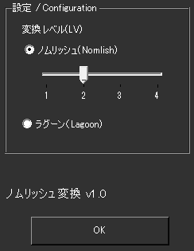

!!! Info "前提条件"
    * なし

## このプラグインで出来ること

* 認識後の文字を強制的にノムリッシュ置き換えることができます
* 2つの変換モード（ノムリッシュ・ラグーン）
* 4段階の変換レベル制御
* リアルタイムAPIベース変換

!!! note "この置換機能について"
    * [ノムリッシュ変換](https://racing-lagoon.info/nomu/translate.php)のAPIを用いて実現しています。

## ノムリッシュ変換プラグインができることは

* ノムリッシュ語とは、ファイナルファンタジー風の口調・用語で語られた文章のことを指します。このプラグインは、入力された文章をノムリッシュ語や、「ゲームレーシング」風のラグーン語に変換します。

##　有効化

* プラグインを使うチェックをONにしてください。

## 設定

|設定|意味|
|:--|:---|
|変換レベル|変換内容をきめます（1-4の段階設定）|
|変換モード|ノムリッシュ/ラグーンモードの選択|

## 詳細機能

### 変換モード

#### ノムリッシュモード（デフォルト）
* **特徴**: ファイナルファンタジー風の口調・用語変換
* **例**: 「こんにちは」→「挨拶をするのだ」
* **用途**: RPG風の演出、配信エンターテイメント

#### ラグーンモード  
* **特徴**: 「レーシングラグーン」風の口調変換
* **例**: より独特なゲーム用語への変換
* **用途**: 特殊な演出効果、個性的な表現

### 変換レベル制御

| レベル | 変換強度 | 説明 |
|:------|:---------|:-----|
| 1 | 軽微 | 基本的な語尾変換のみ |
| 2 | 標準 | バランスの取れた変換（デフォルト）|
| 3 | 強化 | 積極的な用語置換 |
| 4 | 最大 | 最も強力な変換処理 |

## 制約・仕様

* ノムリッシュ変換ＡＰＩは日本語にのみ変換されます。母国語や変換先に日本語がない場合は変換されません。
* ノムリッシュ変換ＡＰＩが混んでいて動かない場合は変換できません。
* 変換には少々待ち時間がかかることがあります。
* 他者作成のＡＰＩを使用させていただいております。予告なくサービスが終了することがあります。

## 使うとき

* 音声認識と同時に置換されます。
* わんコメと連携している場合には、わんコメ受信結果にも適用されます。読み上げプラグインもONにすることで、ノムリッシュ変換後の文章を読み上げさせることができます。