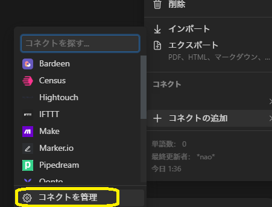
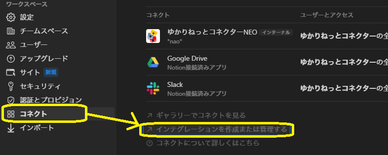
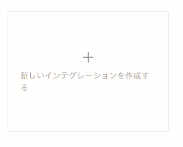
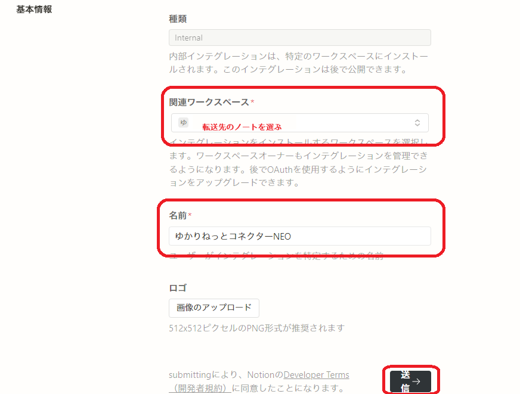
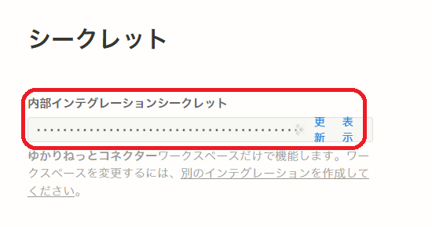
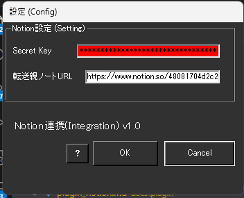
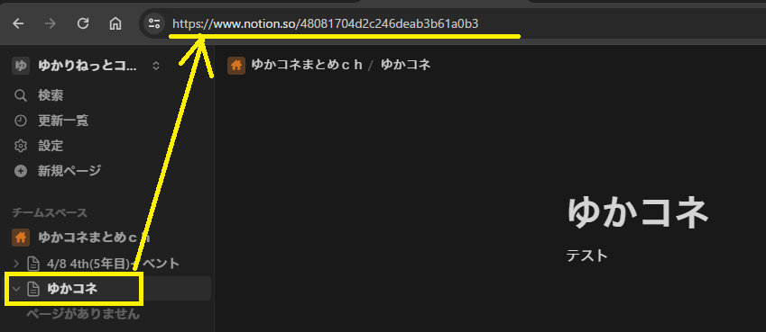

!!! Info "前提条件"
    * このプラグインを使うには Notion アカウントが必要です。

## このプラグインで出来ること

* 音声認識結果をNotionページに転送することが出来ます。
* 転送結果に対してNotion AIをつかえば、配信内容のダイジェスト文が作れます。

##　有効化

* プラグインを使うチェックをONにしてください。

## Notion側の設定

* 「コネクトを管理」を選びます

* 「インテグレーションを作成または管理」を選びます

* 「新しいインテグレーション」を選びます

* 「転送先」を選び、設定に名前をつけます

* シークレットが表示されたら、値をコピーしておきます

## 設定

|設定|意味|
|:--|:---|
|Secret Key|先程のNotionシークレットキーをいれます。|
|転送先親ノートURL|親となるノートを指定します|

ノートに入れるURLは、チームスペース配下のノートを表示したときのURLをいれてください。

## 具体的な使い方

* 会話がはじまったら、自動的にノートができて追記されていきます

!!! Warning "Notion APIについて"
    * APIアクセス制限にひっかかると、転送が不完全になることがあります
    * 転送しながらノートの加工も可能ですが、行を消したときにUDトークで編集された結果などは反映されないことがあります。