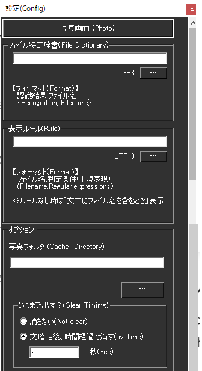

!!! Info "前提条件"
    * なし

## このプラグインで出来ること

* 指定した単語を含んでいたら、写真を表示します

##　有効化


* プラグインを使うチェックをONにしてください。

## 動作の仕組み

* 認識の基準は表示ルールで決めます。
* 表示ルールがなければ、ファイル名と同じ言葉を検出したら表示します

!!! Note "扱える写真の形式"
    * PNG
    * JPEG
    * BMP
    * GIF
    * そのほかにも対応しているものが若干あります

## 設定



|設定|意味|
|:--|:---|
|ファイル特定辞書|反応する言葉とファイルの組み合わせを記載します|
|表示ルール|表示ルールを決めます|
|写真フォルダ|写真が置いてある場所を決めます|


### ファイル特定辞書の作り方

!!! Info "編集方法"
    * Excel もしくは メモ帳で実施します。

=== "Case1:Excelの場合"

    ||A|B|
    |:-|:-|:-|
    |1|おはよう|goodmorning.png|
    
    1. Excelでデータを作ります。

    2. CSVファイルとして保存します。

    
    
=== "Case2:メモ帳の場合"

    1. 下記のようなファイルを作ります。

    ``` js
    おはよう,goodmorning.png
    ```
    2. CSV（UTF8エンコード)で保存します。

    


### ルールファイルの作り方

!!! Info "編集方法"
    * Excel もしくは メモ帳で実施します。

=== "Case1:Excelの場合"

    ||A|B|
    |:-|:-|:-|
    |1|goodmorning.png|[^0-9]|

    1. Excelでデータを作ります。

    2. CSVファイルとして保存します。

    
    
=== "Case2:メモ帳の場合"

    1. 下記のようなファイルを作ります。

    ``` js
    goodmorning.png.[^0-9]
    ```
    2. CSV（UTF8エンコード)で保存します。

    


## 使い方
1. 音声認識させると自動的に処理され、写真表示画面に読み込まれます。

