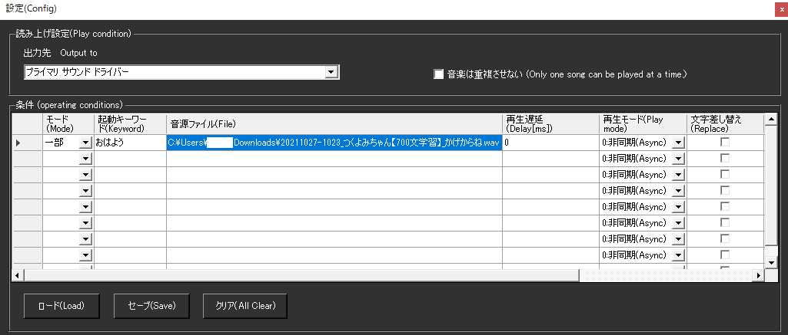

!!! Info "前提条件"
    * なし

## このプラグインで出来ること

* 言葉に反応してサウンドファイルを再生できます。
* WASAPI/ASIOによる高品質・低遅延音声出力
* PlayVoiceプラグインとの統合音声管理
* 複数出力デバイスの自動検出・選択
* プロオーディオ向けASIO対応
* 多言語インターフェース対応

## 有効化


* プラグインを使うチェックをONにしてください。

## 設定



|設定|意味|
|:--|:---|
|出力先|どの音源に音声を流すかを決めます|
|音楽は重複させない|前回条件成立時の音源が再生中に条件成立した場合、前の音源を止めます|
|モード|一致条件を決めます|
|起動ワード|条件（発火条件）を決めます|
|音源ファイル|再生する音源を指定します|
|再生遅延|条件一致後、どれぐらい再生を遅らせるか指定します|
|再生モード|再生が終わるまで動作をとめるか、並走するかを決めます|
|文字差し替え|再生したあと、文字を差し替えます。<br>（字幕や後続のプラグインに渡す文字が差し替えられます)|
|読み上げ文字|差し替える文字を指定します。|
|後処理|チェックを打つと、字幕を出してから処理をします|
|TTS無効化|この条件に当てはまった場合、読み上げプラグインで読み上げ動作をしません|

!!! Info "対応メディア"
    * MP3もしくはWave形式に対応しています。
    * コーデックによっては再生がうまくいかないものがあります。
    * Waveの場合は、44.1KHz 16bit 2ch を推奨します

## 使うとき

1. 音声認識をすれば自動的に再生されます。

## 高度な機能

### 高品質音声出力システム

#### WASAPI対応
* **低遅延出力**: Windowsの高性能音声API使用
* **高音質**: 44.1kHz以上の高サンプリングレート対応
* **排他モード**: 他のアプリケーションからの影響を最小化
* **自動デバイス選択**: 最適な出力デバイスの自動検出

#### ASIO対応
* **プロオーディオ**: プロ用音声インターフェース対応
* **極低遅延**: ハードウェア直結による最小遅延
* **多チャンネル**: 複数チャンネル出力対応
* **スタジオ品質**: 放送・録音スタジオレベルの音質

### PlayVoice統合管理

#### 連携システム
* **PlayEngine連携**: 読み上げプラグインとの自動連携
* **統合音声制御**: 音声合成と効果音の統一管理
* **競合回避**: 複数音声の適切な制御

#### soundDirectlyモード
* **直接再生**: PlayEngineを経由しない高速再生
* **軽量動作**: システムリソースの効率的使用
* **独立制御**: 読み上げと独立した音声制御

### 複数デバイス対応

#### 自動検出システム
* **DirectSound**: 標準的な音声出力
* **WASAPI**: Windows高性能音声API
* **ASIO**: プロオーディオインターフェース
* **デバイス情報**: 利用可能デバイスの詳細情報表示

#### 出力品質設定
| 出力方式 | 遅延 | 品質 | 用途 |
|:---------|:-----|:-----|:-----|
| DirectSound | 中程度 | 標準 | 一般用途 |
| WASAPI | 低 | 高品質 | ゲーミング・配信 |
| ASIO | 極低 | スタジオ級 | プロオーディオ |

### 高度な設定オプション

#### 音声処理設定
* **レイテンシ調整**: 再生前・再生後の遅延制御
* **バッファサイズ**: 音声バッファの最適化
* **サンプリングレート**: 出力品質の詳細制御

#### システム統合
* **プロキシ対応**: Windows設定からの自動プロキシ検出
* **多言語UI**: 7言語対応のインターフェース
* **リソース管理**: メモリ・CPU使用量の最適化

### 技術実装詳細

#### アーキテクチャ
```csharp
// 出力デバイス自動選択
if (AsioAvailable()) {
    UseAsioOutput();
} else if (WasapiAvailable()) {
    UseWasapiOutput();
} else {
    UseDirectSoundOutput();
}
```

### 実用例

#### 配信・実況での活用
```
キーワード: "ありがとう" → thankyou.wav (WASAPI出力)
キーワード: "すごい" → amazing.mp3 (ASIO出力)
```

#### プロオーディオ環境
- ASIO対応音声インターフェースでの超低遅延再生
- 複数チャンネルでの効果音分散
- スタジオモニタリング環境での利用

### トラブルシューティング

#### ASIO関連
* **ドライバー確認**: ASIO対応音声インターフェースの接続確認
* **排他制御**: 他のASIOアプリケーションとの競合回避
* **設定確認**: ASIO制御パネルでの適切な設定

#### WASAPI関連
* **排他モード**: 他のアプリケーションによる音声デバイス使用状況確認
* **サンプリングレート**: デバイス対応レートとの一致確認
* **権限設定**: Windowsオーディオサービスの権限確認

#### 一般的な問題
* **コーデック**: 非対応音声形式での再生失敗
* **ファイルパス**: 音声ファイルの存在・アクセス権限確認
* **デバイス競合**: 複数アプリケーションでの音声デバイス競合

## 特性等

* 上から順番に条件判定します。
* 条件が一致したら、その行で判断を終了します。

