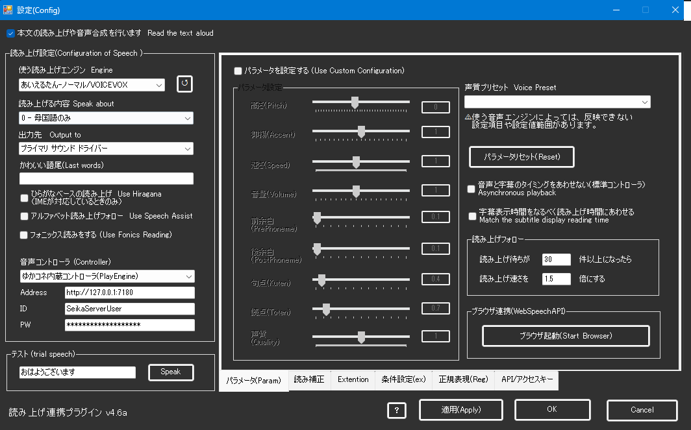
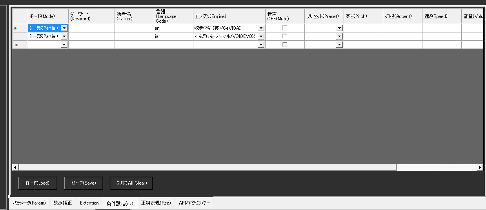
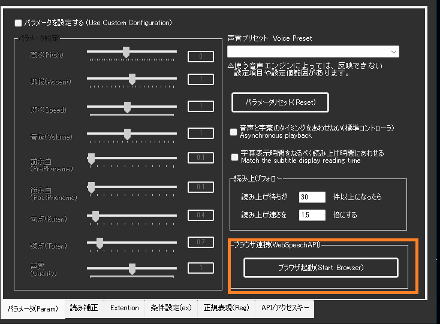
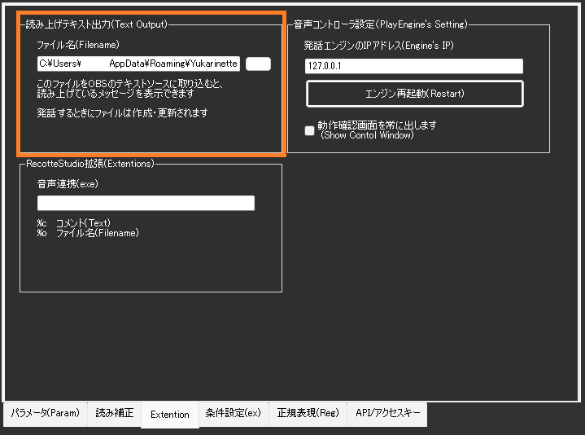

!!! Info "前提条件"
    * つかいたい音声ソフトウェアがインストールされていること
    * 音声ソフトウェアが正しく発声できる状態であること
    * つかう音声ソフトウェアが立ち上がっていること

## このプラグインで出来ること

* 各種音声生成ソフトウェアをつかって音声認識結果を読み上げできます。

## 対応している音源
* A.I.Voice (日、英、中)
* AITalk3
* VOICEROID ＋
* VOICEROID2 (64bit)
* ガイノイドトーク
* 音街ウナトーク
* CeVIO CS7
* CeVIO AI (日、英)
* SAPI5
* VOICEVOX
* COEIROINK
* LMROID
* SHAREVOX
* CoeFont(Enterprise API)
* ブラウザ連携

##　有効化


* プラグインを使うチェックをONにしてください。

## 設定



|設定|意味|
|:--|:---|
|使う読み上げエンジン|・発声エンジンを決定します。<br>・状況により、使えないものが表示されるケースがあります|
|読み上げる内容|何を読み上げさせるか指示します|
|出力先|どのスピーカー出力に音を出すか指定します。|
|かわいい語尾補正|認識した言葉の最後につける言葉を指定します|
|ひらがなベースで読み上げ|・IME辞書をつかって漢字をすべてひらがなに変換して渡します。<br>・UDトーク併用時は認識時のひらがなに直します|
|アルファベット読み上げ|・英語が読めない音源では、それっぽい発音に置き換えます。<br>正しく発音できないこともあります|
|CoeFontの設定| CoeFontの仕様変更により、<br>```残念ながらCoeFont社の仕様変更によりCoeFont企業契約者以外はご利用いただけなくなりました```|
|パラメータを設定|発話に関する調整をします。音源によっては反映できない項目もあります|

## 使うとき

1. 音源を立ち上げます。
1. ゆかりねっとコネクターNEOを立ち上げます。
1. ゆかりねっとコネクターNEOで音声認識をしましょう。
1. 文章が確定すると同時に読み上げが行われます。

## 注意点

!!! Tips "負荷が上がる場合があります"
    * VOICEVOXなど、GPUを使うソフトウェアの場合、PCに負荷がかかる場合があります

!!! Warning  "音声ソフトウェアがサポートする声が使えない場合があります"
    * 起動時にVOICEVOXなどへ問い合わせ通信をしているため、後からVOICEVOXを起動すると音源が表示されない場合があります。

!!! Success "使用中はバックグラウンドプロセスが立ち上がります"
    * 音源の制御をおこなう関係上、playengine.exe という発話管理プログラムが裏で起動します。
    * PlayEngineは32bit版、64bit版の２つがあり、最大それぞれ１つずつ（合計２つ）が起動します。

!!! Warning  "音源を標準のフォルダ以外に導入すると動かない場合があります"
    * AIVoiceなどは、インストールフォルダを変更すると連動できないことがあります。

## 条件変更

* 文章の特徴に応じて、発話パラメータを変更できます。


### 判断条件の設定
|項目           |意味                      |
|---------------------|------------------------------------|
|モード          |判断方法を設定します。  <br>・無効にするとその行は処理しません<br>・一部にすると話者・キーワードが一部一致すれば適用<br>・完全を選ぶとキーワード、話者が一致するときのみ<br>・キーワード・話者は空欄の場合は判断しません　　　 |
|キーワード      |文章に対しての判断条件します|
|話者名        |話者名に対しての判断条件します|
|言語名        |発話しようとしている言語に対する条件です。<br>・地域コードで指定します。(ja/en/zhなど)|

### 適用内容の設定
|項目           |意味                          |
|---------------------|-----------------------------------------|
|エンジン      |適用する音声エンジンのを設定します。|
|音声OFF      |発話をスキップします。             |
|プリセット      |既定のパラメータを適用します。|
|高さ　　　　　　      |声のピッチを数字で指定します<br>・指定範囲はエンジンによって異なります。<br>・|パラメータタブを参考に数値を決めてみましょう|
|抑揚         |声の抑揚を数字で指定します<br>・指定範囲はエンジンによって異なります。<br>・|パラメータタブを参考に数値を決めてみましょう|
|速さ　　　　　　      |声の速さを数字で指定します<br>・指定範囲はエンジンによって異なります。<br>・|パラメータタブを参考に数値を決めてみましょう<br>・遅くしすぎると音声が著しく劣化することがあります|
|音量　　　　　　     |声量を数字で指定します<br>・指定範囲はエンジンによって異なります。<br>・|パラメータタブを参考に数値を決めてみましょう|
|声質        |声の声質を数字で指定します<br>・指定範囲はエンジンによって異なります。<br>・|パラメータタブを参考に数値を決めてみましょう|
|基本設定に反映 |このチェックがONの場合、通常つかわれる設定に反映します。<br>（つまり、その後発話で採用される設定が書き換わることになります|


## ブラウザ連携

* 従来通り、ブラウザがサポートする機械音声を使うことができます。
* ブラウザを起動して音声を選ぶと、ブラウザ経由で声が再生されます。


## 読み上げしている文章の取り込み

* 今読み上げ指示している文章をテキストに吐き出します。
* OBS Studio のテキストソースで参照することで、リアルタイム表示ができます。



